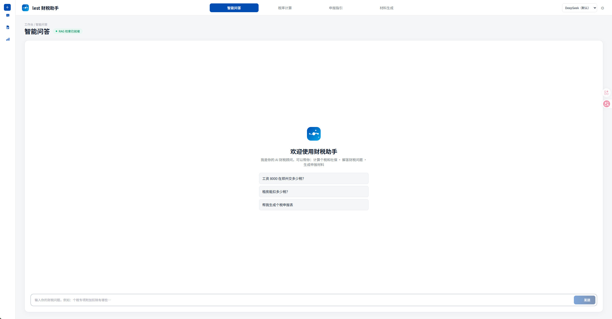
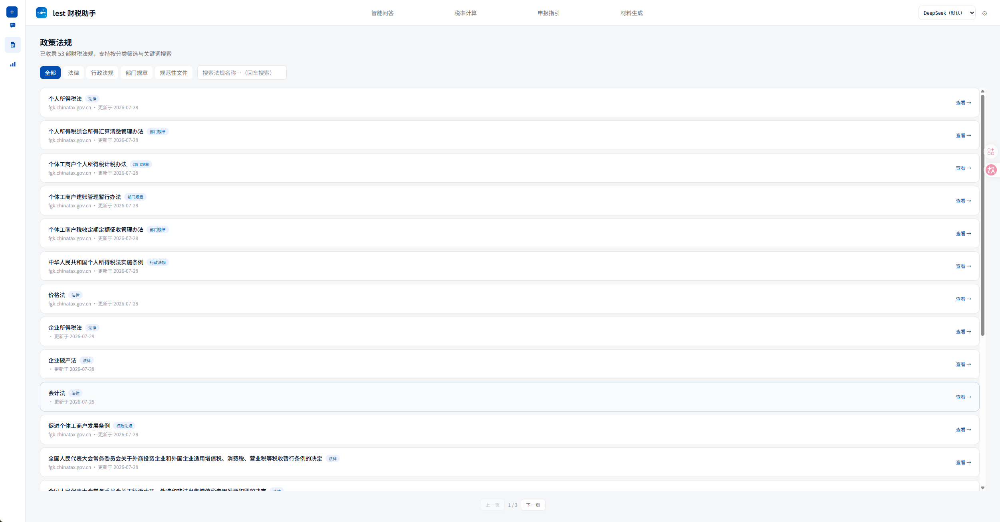
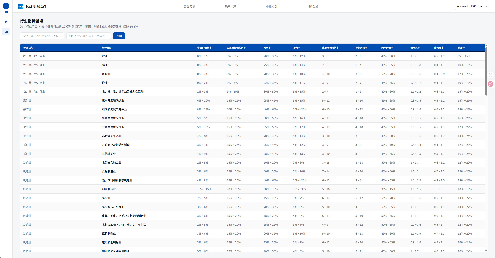
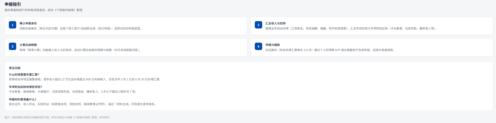
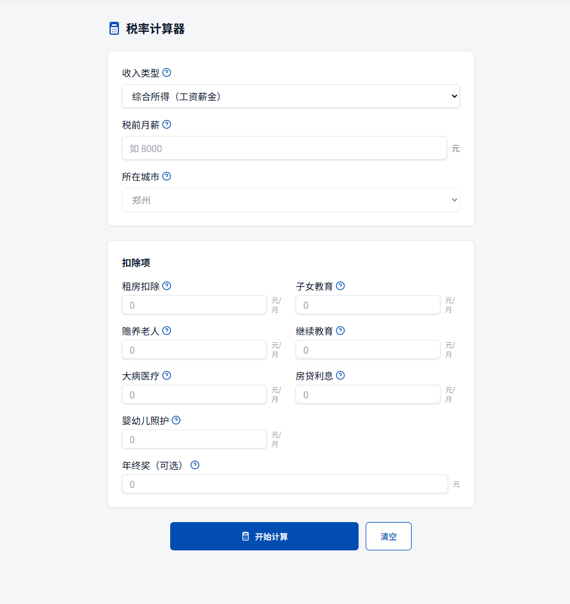
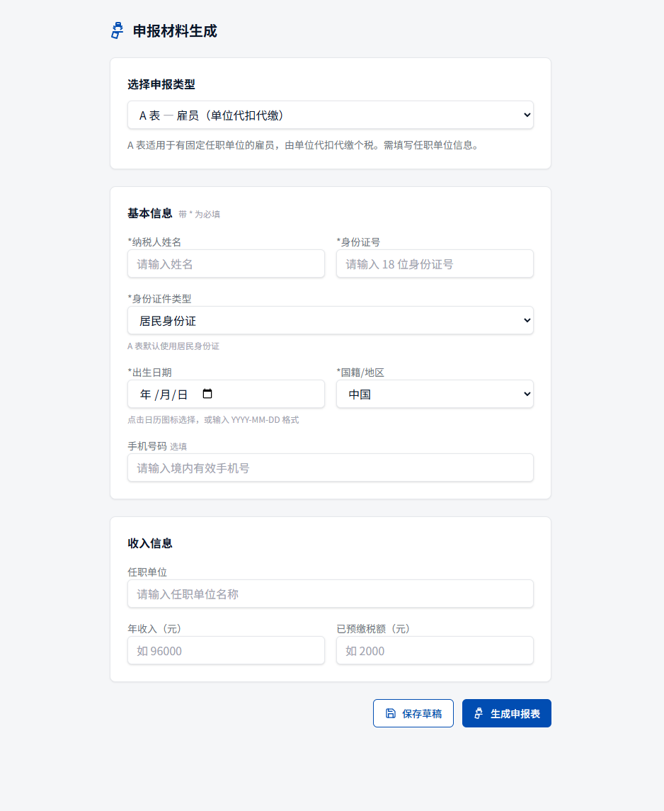
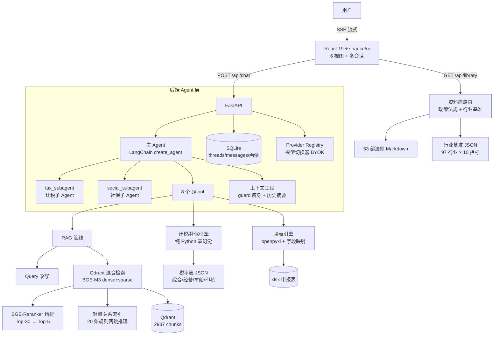

# 财税助手 — Finance RAG Agent

> 面向零财务基础大众的 AI 财税助手：自然语言对话，替代复杂税务软件。让每个人都能 **看懂自己的税、算对自己的钱、填对申报表**。

[](https://www.python.org/)
[](https://fastapi.tiangolo.com/)
[](https://react.dev/)
[](https://www.langchain.com/)
[](https://qdrant.tech/)
[](LICENSE)

一套自建的 **RAG + Agent + 上下文工程 + Multi-Agent** 全链路方案：DeepSeek 负责理解与调度，税率计算走纯代码引擎（零幻觉），法律知识来自税总法规库清洗后的 115+ 份文档。

## 界面预览

| 智能问答 | 政策法规 | 行业基准 |
| :---: | :---: | :---: |
|  |  |  |
| RAG + 工具调用 + 法规溯源 | 53 部法规分类筛选 / 关键词搜索 / 正文 HTML | 97 行业 × 10 财务指标 |
| **申报指引** | **税率计算** | **申报材料生成** |
|  |  |  |
| 4 步流程 + FAQ 速查 | 分步推导 + 法规溯源 | A 表 / B 表字段映射自动填表 |

---

## 特性

- **智能问答**：自然语言提问财税问题，四层分层召回 + 法规溯源，回答附文号出处；AI 机器人头像 + 流式逐字输出
- **税率计算**：个税（工资/劳务/稿酬/经营所得）、年终奖择优、社保公积金，全部分步推导
- **申报材料生成**：A 表（雇员）/ B 表（个体户）字段映射自动填表，一键导出 xlsx
- **资料库**：53 部财税法规（分类筛选/关键词搜索/正文 HTML 渲染）+ 行业基准（97 细分行业 × 10 项指标，税负率/利润率对照）
- **多会话管理**：侧边栏会话列表（新建/切换/删除），localStorage + SQLite 双端持久化，刷新不丢历史
- **上下文工程**：工具返回提取式瘦身 + 历史自动摘要（trigger 40K），长对话不爆窗
- **防注入**：纵深防御——三层标签隔离（`<user_input>`/`<context>`/`<tool_result>`）+ 前置安全声明 + Canary 探针 + 输出侧审计
- **Multi-Agent**：计税/社保双子 Agent 自治调度，`AGENT_MODE` 一键回退
- **轻量知识图谱**：20 条关联规则 JSON 驱动，两跳推理，零数据库依赖
- **模型切换器**：顶栏一键切换模型，设置页自填 API Key 接入 DeepSeek/千问/Kimi/GLM/OpenAI 等任意 OpenAI 兼容端点（BYOK，后端转发保留 Agent 全链路）
- **设计稿落地 UI**：暖白底 + 深蓝主色体系，顶栏 4 tab 导航 + 侧边栏会话/资料库双区 + 星轨渐变 Logo + 圆润图标，动效克制
- **评测驱动迭代**：检索/工具/生成/多 Agent/防注入 五层评测闭环，Recall@5 = 85%（详见[评测体系](#评测体系2026-09-现状如实口径)与已知局限）

---

## 架构总览



---

## 检索链路（四层分层召回）

```
用户提问 → Query 改写（口语→术语映射）
        → Layer 1 元数据预过滤（relevance_tier 分层）
        → Layer 2 BGE-M3 双向量编码（稠密 1024d + 稀疏词汇）
        →      Qdrant 混合检索（RRF 融合 → Top-30）
        → Layer 3 BGE-Reranker-v2-m3 精排 → Top-5
        → Layer 4 轻量关系索引二次检索（两跳推理）
        → 拼接上下文 + System Prompt
        → DeepSeek 流式输出（SSE）
```

## Agent 工具集（8 个 @tool + 双子 Agent）

| 工具 | 功能 |
|------|------|
| `search_knowledge` | RAG 知识库检索（三层分层召回 + 关系图谱扩展） |
| `calculate_income_tax` | 综合所得个税计算（工资/劳务/稿酬 + 年终奖择优） |
| `calculate_business_income_tax` | 经营所得个税计算（个体户，5%-35% 五级超额累进） |
| `query_social_insurance` | 社保+公积金计算（郑州，灵活就业/职工双模式） |
| `fill_tax_form` | 申报表自动填写（A 表/B 表），字段映射 + openpyxl 导出 xlsx |
| `filing_guide` | 申报流程指引（个税 APP 汇算清缴/个体户季度申报） |
| `get_user_context` | 对话上下文记忆（城市/收入/扣除项/亏损，跨轮复用） |
| `update_user_context` | 保存用户上下文信息 |

**Multi-Agent 化**（`AGENT_MODE=multi`，默认）：计税/社保升级为独立子 Agent（Tool-as-Subagent，无状态全局单例），领域隔离降低 prompt 相互污染；`AGENT_MODE=tools` 一键回退纯工具形态。详见 [Multi-Agent 集成设计文档](docs/财务RAG-Multi-Agent 集成设计文档.md)。

## 上下文工程

| 模块 | 说明 |
|------|------|
| `context/guard.py` | 工具返回提取式压缩（必保数字/文号/百分比），替换 `content[:800]` 硬截断 |
| `context/history_summarizer.py` | 历史自动摘要（trigger 40K / keep 20），清单式 prompt 画像字段必保 |
| `context/trace.py` | 自建 JSONL 轻量 trace（每轮工具调用/token/耗时，锁保护单写），离线可控不依赖 LangSmith |
| 画像前置注入 | 用户画像序列为首条 system 消息（`<user_profile>` 标签），prefix caching 友好，主 Agent 无需再调 `get_user_context` |
| SSE `context` 事件 | 摘要发生时前端提示"较早的对话已归档" |

设计详见 [Context Engineering 集成设计文档](docs/财务RAG-Context Engineering 集成设计文档.md)。

---

## 评测体系（2026-09 现状如实口径）

| 层级 | 评测集 | 结果 |
|------|--------|------|
| 检索层 | 60 条 query × 12 类（报告 08-05） | Recall@5 = **85%**，MRR 0.84，NDCG@5 0.76；Precision@5 = 0.27（top-5 约 73% 为非目标文档） |
| 工具层 | 26 条主 Agent 路由（含 2 对重复 query） | 期望工具召回 **26/26 = 100%**（判定口径：期望 ⊆ 实际，不惩罚多余调用） |
| 生成层 | 4 长对话场景（08-04，LLM-as-judge） | 忠实度 100% / 事件触发率 100%；probe 关键字段保留率 91.7%（s1 场景丢失 2 字段） |
| 多 Agent 层 | 主层对拍 8 条 + 子层 10 条 | 通过（仅控制台输出，暂无报告文件；判定含"暂放行"放宽分支） |
| 防注入 | 10 条（08-12 首测 8/10，09-05 修复后 v2 复测） | **10/10**（确定性检查口径：canary 泄露/画像写入/judge 行为；LLM judge 未启用） |

**已知局限（2026-08-13 审计确认）**：评测集与调优同源——`embed_and_upsert.py` 的关键词注入/权重覆盖直接作用于旧评测失败用例，存在过拟合风险，正式指标需换 held-out 集验证；检索匹配为子串包含口径；LLM-as-judge 与 Agent 使用同一模型；run_all 汇总会读取磁盘旧报告，各层报告日期不一致。迭代方式：**先跑通 → 建 bad case 评测 → 诊断根因 → 修复 → 重测**（RAG Recall@5 从 67.5% 优化至 85%，经历 8 轮迭代）。

---

## 快速开始

### 本地开发

```bash
# 0. 安装依赖（Python 3.11+；国内建议先 export HF_ENDPOINT=https://hf-mirror.com）
pip install -r requirements.txt

# 1. 配置 API Key
echo 'DEEPSEEK_API_KEY=sk-xxxx' > backend/.env

# 2. 启动 Qdrant（需要 Docker Desktop）
docker compose -f docker-compose.qdrant.yml up -d

# 3. 向量化入库（首次 ~15min GPU / ~1h CPU）
#    分块数据已包含在仓库 rag-data/chunks.jsonl（向量库重建唯一输入），无需另行下载
cd scripts && python embed_and_upsert.py

# 4. 启动后端（http://localhost:8000，含 SSE 流式接口）
cd backend
python -m uvicorn main:app --host 0.0.0.0 --port 8000

# 5. 启动前端（http://localhost:5173）
cd frontend
npm install && npm run dev
```

> **资料库接口**：`/api/library/*`（政策法规/行业基准）依赖 `markdown` 库（`pip install -r requirements.txt` 已含），纯文件读取秒回，无需 Qdrant。
> **无 GPU 用户**：设置环境变量 `EMBEDDING_DEVICE=cpu`，BGE-M3 自动回退 CPU（稍慢但可用）。
> **国内用户**：设置 `HF_ENDPOINT=https://hf-mirror.com` 加速模型下载。

### 运行评测

```bash
cd backend
python eval/run_all.py          # 一键三层评测（检索 + 工具 + 生成，聚合报告）
python eval/eval.py             # 检索层：60 条 query，recall@5 / MRR / NDCG
python eval/eval.py -v          # 逐条打印详情
python eval/eval.py --category 个税  # 按分类评测
python eval/agent_eval.py       # 工具层：主 Agent 路由 26 条
python eval/multi_agent_eval.py # 多 Agent 双层评测
python eval/run_all.py --injection  # 三层之外加跑防注入层（10 条，需 DEEPSEEK_API_KEY）
python eval/injection_eval.py   # 防注入单独评测
```

---

## 项目结构

```
├── backend/
│   ├── agent/           # Agent 大脑（create_agent + prompts + 历史摘要 middleware）
│   ├── context/         # 上下文工程（guard 瘦身 + history_summarizer + trace）
│   ├── rag/             # RAG 检索引擎（retriever + query_rewriter）
│   ├── routers/         # FastAPI 路由（chat/tax/social/form/library，SSE 8 种事件）
│   ├── services/        # 计税/社保/资料库引擎（纯 Python，零幻觉）
│   ├── storage/         # SQLite 持久化（threads/messages/user_contexts 三表）
│   ├── tools/           # 8 个 @tool + subagents.py 双子 Agent
│   ├── eval/            # 评测（eval / agent_eval / multi_agent_eval / context_eval / injection_eval）
│   └── tests/           # pytest 单元测试（计税/社保引擎）
├── frontend/
│   └── src/
│       ├── components/chat/        # 对话视图（SSE 流式 + 结果卡片 + 溯源 + AI 机器人头像）
│       ├── components/calculator/  # 税率计算器（分步明细）
│       ├── components/form/        # 申报材料生成（A 表/B 表）
│       ├── components/guide/       # 申报指引（静态指引页）
│       ├── components/library/     # 资料库（政策法规列表/正文 + 行业基准）
│       ├── components/layout/      # 布局（Sidebar 会话区/资料库区 + TopBar 4 tab）
│       └── hooks/useChat.ts        # 多会话管理（localStorage 持久化 + 历史回显）
├── rag-data/
│   ├── processed/national/rates/   # JSON 税率表 + 行业基准（97 行业 × 10 指标）
│   ├── processed/national/tax_law/ # 53 部法规 Markdown（YAML frontmatter）
│   ├── processed/national/templates/ # 申报表字段映射
│   └── processed/cities/zhengzhou/ # 郑州社保+公积金数据
├── scripts/            # 数据工具链（清洗/切分/向量化/评测）
└── docs/               # 工程文档
    └── 主题文档/        # 按主题重组的 6 份设计文档（PRD/前端/后端/架构/数据/开发指南）
```

---

## 技术栈

| 层级 | 选型 |
|------|------|
| LLM | DeepSeek（`deepseek-v4-flash`），LangChain `create_agent`，流式 SSE；支持用户自配任意 OpenAI 兼容模型（模型切换器） |
| Embedding | BGE-M3（FlagEmbedding），稠密 1024d + 稀疏双向量，GPU/CPU 自动切换 |
| 向量库 | Qdrant，原生混合检索（RRF 融合） |
| 重排器 | BGE-Reranker-v2-m3，双阶段检索 |
| 后端 | FastAPI + Python 3.11+（CI 基线 3.11）+ StreamingResponse |
| 前端 | React 19 + TypeScript + shadcn/ui + Tailwind CSS |
| 知识图谱 | 轻量 JSON 关系索引（20 条规则，两跳推理） |
| 持久化 | SQLite 标准库（threads/messages/user_contexts，可平滑迁 MongoDB） |
| 资料库 | 53 部法规 Markdown（MarkItDown 清洗 + markdown 转 HTML）+ 97 行业基准 JSON |

## 核心设计决策

- **准确性优先于速度**：财税场景错不起
- **金额计算不走 LLM**：税率/社保全部 JSON + Python 公式，零幻觉
- **语义边界切分**：税法按 `### 第X条`、问答按 `## 问句` 切分，不硬按字符数（800/80 窗口 + 15% 重叠）
- **先跑通再评测收敛**：建 bad case 评测集，逐轮优化避免过拟合
- **AI 嵌入 vs AI 原生**：核心逻辑代码化，AI 负责调度和理解层
- **评测驱动落地**：每个新模块（上下文工程/Multi-Agent）先设计验收指标，再编码、再评测闭环

---

## 文档

### 主题文档（按主题重组，2026-08-06）

| 文档 | 说明 |
|------|------|
| [产品需求文档（PRD）](docs/主题文档/财务RAG-产品需求文档(PRD).md) | 产品定位、用户画像、MVP 功能矩阵、四大功能需求、B 表专项、交互/非功能需求 |
| [前端设计文档](docs/主题文档/财务RAG-前端设计文档.md) | 技术栈、组件树、CSS 设计令牌、六视图、SSE 消费、TS 类型契约、联调验收 |
| [后端设计文档](docs/主题文档/财务RAG-后端设计文档.md) | 模块划分、计算引擎、四层检索、双子 Agent、上下文工程、SQLite 持久化、API 清单 |
| [技术架构文档](docs/主题文档/财务RAG-技术架构文档.md) | 总体架构、技术选型决策表、四层召回、Agent/上下文/评测架构、接口契约、Roadmap |
| [数据与资料设计文档](docs/主题文档/财务RAG-数据与资料设计文档.md) | 7 大知识域、70 项采集清单、数据资产、目录规范、工具链、结构化 JSON schema |
| [开发指南与编码规范](docs/主题文档/财务RAG-开发指南与编码规范.md) | 编码规范、CSS 令牌、Agent 工具开发规则、AI 编码上下文方法论、7 步开发路线 |

### 详细设计文档（演进过程）

| 文档 | 说明 |
|------|------|
| [技术架构与 Agent 方案](docs/财务RAG-技术架构与Agent方案.md) | 技术栈选型、检索链路、Agent 工具设计（主题文档前身） |
| [Multi-Agent 集成设计](docs/财务RAG-Multi-Agent 集成设计文档.md) | 双子 Agent 架构、降级机制、绕过检测 |
| [Context Engineering 集成设计](docs/财务RAG-Context Engineering 集成设计文档.md) | 上下文工程 v2.0 设计 |
| [开发踩坑记录](docs/财务RAG-开发踩坑记录.md) | 从 RAG 优化到 Multi-Agent 的完整踩坑史（已并入评测与质量文档 §9） |
| [后端开发路线图](docs/财务RAG-后端开发路线图.md) | 7 步开发路线（已并入开发指南 §6） |
| [设计稿落地实施规划](docs/财务RAG-设计稿落地实施规划.md) | **最新**：UI 设计稿 → 前后端改造唯一蓝图（顶栏 tab / 侧边栏重构 / 资料库接口），决策全定案、前后端已实施完成 |
| [资料库接口前端联调文档](docs/财务RAG-资料库接口-前端联调文档.md) | 资料库 4 接口联调契约（验收命令 + TS 类型 + 真实数据结构） |
| [工程收尾待办清单](docs/财务RAG-工程收尾待办清单.md) | 后续计划（MCP 封装 ✅ / 评测自动化 ✅ / 用户上下文持久化 ✅ / 设计稿落地 ✅） |
| [SECURITY.md](SECURITY.md) / [CONTRIBUTING.md](CONTRIBUTING.md) | 安全政策（密钥管理/防注入/已知限制）与贡献指南（提交规范/测试要求） |

## Roadmap

- [x] MCP Server 封装（tax-calc：个税/经营所得/社保 3 工具，WorkBuddy 宿主实测通过）
- [x] 评测集扩展 40 → 60 条 + 一键评测（run_all.py，Recall@5 = 85%）
- [x] 用户上下文持久化（SQLite + 自建消息表 + 历史回显，已实施）
- [x] 设计稿落地（顶栏 tab 导航 / 侧边栏重构 / 折叠态图标 / 资料库接口 + 3 新视图，已实施并联调通过）
- [x] 轻量可观测性与输出侧审计（自建 JSONL trace / canary 探针 / 危险工具调用告警）
- [ ] 更多城市扩展（架构已预留 `cities/`，新城市只需 JSON 配置）
- [ ] PDF 上传解析、小程序端

## License

MIT
