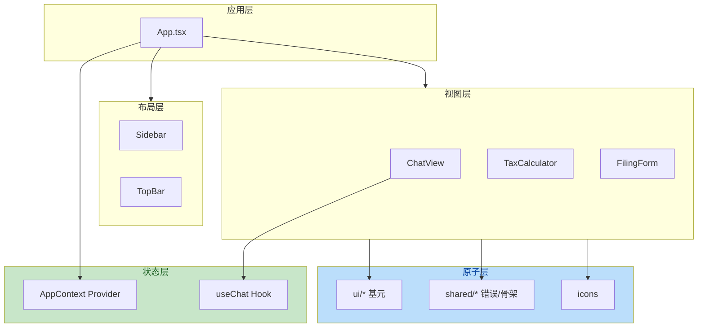
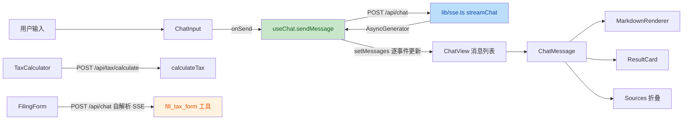
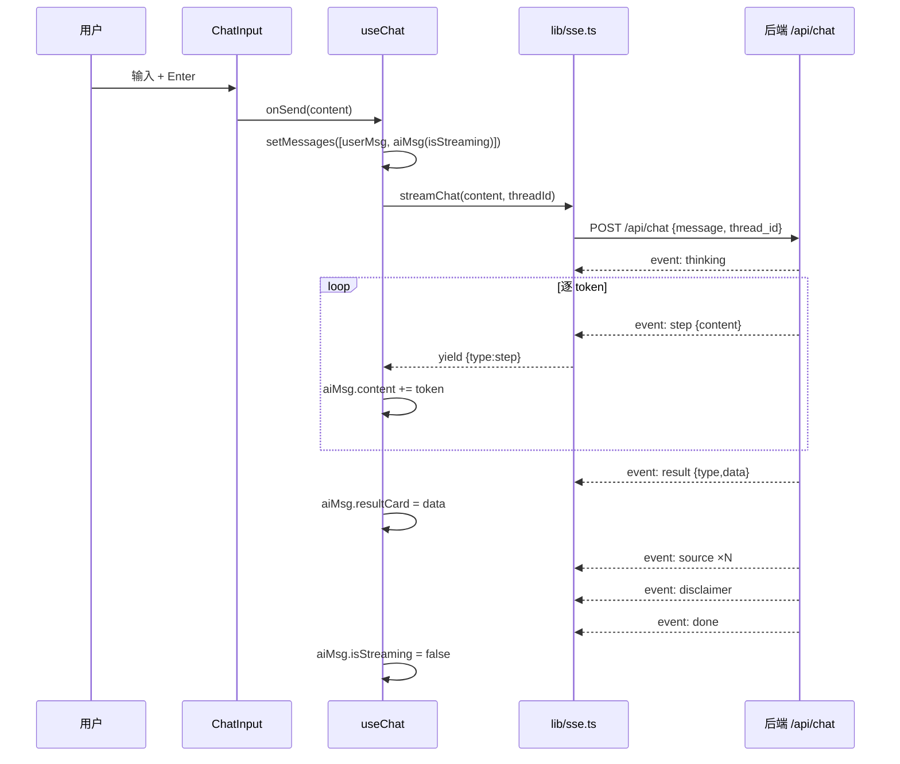

# 财务 RAG Agent · 前端设计文档

> **文档类型**：前端主题重组文档 | **重组日期**：2026-08-06 | **项目**：毕设
> **重组范围**：将 docs 目录下 12 份来源文档中的「前端设计/开发」相关内容**全部提取并打散重排**，组织为一份自洽的前端设计文档。**内容全量保留，非摘要**——来源中的每一个表格、每一段代码、每一个 CSS 令牌、每一个组件规范、每一条审查结论均已收录。同一信息多份来源重复时保留最完整一份，其余合并。
> **12 份来源**：
> 1. `财务RAG-UI设计方案.md`（规范主源：设计令牌/布局/组件/交互）
> 2. `财务RAG-开发注意事项.md`（CSS 令牌/组件样式/SSE 模板）
> 3. `前端开发-完整代码生成包.md`（18 章节，最全编码上下文）
> 4. `前端开发-AI编程Prompt.md`（精简版，无图标规范）
> 5. `财务RAG-AI提示词工程文档-v1.0.md`（早期分章节版本）
> 6. `图标生成清单.md`（16 枚图标生成）
> 7. `财务RAG-前端代码审查报告.md`（16 项问题与修复记录）
> 8. `财务RAG-前端改造实施清单.md`（任务 A/B/C）
> 9. `财务RAG-设计稿落地与前端改造清单.md`（差距对照）
> 10. `财务RAG-设计稿落地实施规划.md`（10 项产品决策定案）
> 11. `财务RAG-资料库接口-前端联调文档.md`（4 接口联调）
> 12. `财务RAG-前后端对照表.md`（SSE 事件、请求流程）

---

## 1. 技术栈与工程约束

### 1.1 技术栈（不可偏离）

> 来源：`前端开发-完整代码生成包.md` §1（最完整版，整合 `前端开发-AI编程Prompt.md` §0.1 与 `财务RAG-AI提示词工程文档-v1.0.md` §1）

```yaml
框架: React 18+ (TypeScript)
构建: Vite
UI库: shadcn/ui（最新版）
样式: Tailwind CSS v4
图标: SVG（17 枚项目 SVG，存放于 F:\lest\frontend\public\icons\）+ lucide-react（可选补充）
状态: React Context + useReducer，不引入 Redux/Zustand
SSE: fetch + ReadableStream（不用 EventSource，因为要 POST）
SVG 处理: vite-plugin-svgr（必需），用 ?react 导入
Markdown: react-markdown + remark-gfm（GFM 表格/删除线/任务列表）
```

> 项目一句话定位（来源：`前端开发-完整代码生成包.md` §0）：**财税助手** — 面向零财务基础大众的 AI 财税问答 Web 应用。MVP 三个视图：智能对话 / 税率计算 / 申报材料生成。**仅桌面端**（≥768px）。2026-08-06 设计稿落地后扩展为六视图（新增 guide / documents / benchmark）。
>
> 图标格式：20 枚 SVG 图标（17 功能 SVG + 3 Favicon PNG） + 1 枚 favicon.svg，存放于 `F:\lest\frontend\public\icons\`。

### 1.2 实际落地依赖与版本

> 来源：`财务RAG-前端代码审查报告.md` §2.1（2026-07-31 全量源码核对）

| 类别 | 依赖 | 版本 | 实际使用情况 |
|------|------|------|--------------|
| 框架 | react / react-dom | ^19.2.7 | ✅ 使用 |
| 构建 | vite | ^8.1.1 | ✅ 使用 |
| 语言 | typescript | ~6.0.2 | ✅ 使用 |
| 样式 | tailwindcss / @tailwindcss/vite | ^4.3.3 | ✅ 使用 |
| Markdown | react-markdown / remark-gfm | ^10.1.0 / ^4.0.1 | ✅ 使用 |
| 类名合并 | clsx / tailwind-merge / class-variance-authority | ^2.1.1 / ^3.6.0 / ^0.7.1 | ✅ 使用 |
| Radix | @radix-ui/react-slot | ^1.3.3 | ✅ Button 使用 |
| Radix | @radix-ui/react-tooltip | ^1.2.16 | ✅ Tooltip 使用 |
| Radix | **@radix-ui/react-select** | ^2.3.7 | ❌ **未使用**（见 P-06） |
| 图标 | **lucide-react** | ^1.27.0 | ❌ **未使用**（见 P-06） |
| 图标 | vite-plugin-svgr | ^5.2.0 | ✅ 自定义 SVG 使用 |
| Lint | oxlint | ^1.71.0 | ✅ 使用 |

> **观察**：技术栈版本非常前沿（React 19 / TS 6 / Vite 8 / Tailwind 4），且与 `前端开发-AI编程Prompt.md` 中"React 18 + TypeScript"的约束存在偏差（已升级到 19）。图标方案从设计文档规定的 `lucide-react` 改为 `vite-plugin-svgr` 自定义 SVG，导致 `lucide-react` 成为僵尸依赖（P-06 已修复移除）。

### 1.3 安装依赖

> 来源：`前端开发-完整代码生成包.md` §1.1（整合 `前端开发-AI编程Prompt.md` §0.1、`财务RAG-AI提示词工程文档-v1.0.md` §1 的初始化命令）

在 `F:\lest\` 目录下执行：

```bash
cd F:\lest
npm create vite@latest frontend -- --template react-ts
cd F:\lest\frontend
npx shadcn@latest init -d
npx shadcn@latest add button input select card textarea tooltip dialog
npm install lucide-react react-markdown remark-gfm @radix-ui/react-tooltip
npm install -D vite-plugin-svgr
```

> **备注**（来源：`前端开发-AI编程Prompt.md` §0.1 早期初始化无 tooltip/dialog、无 react-markdown/remark-gfm；`财务RAG-AI提示词工程文档-v1.0.md` §1 同。此处以最完整的 `完整代码生成包` 版为准。）
>
> shadcn/ui 组件至少需要：`button input select card textarea tooltip dialog`，其余按需（来源：`前端开发-完整代码生成包.md` 附录 A）。

### 1.4 vite-plugin-svgr 配置（处理 SVG 导入）

> 来源：`前端开发-完整代码生成包.md` §1.2

文件 `F:\lest\frontend\vite.config.ts`：

```ts
import { defineConfig } from 'vite';
import react from '@vitejs/plugin-react';
import svgr from 'vite-plugin-svgr';
import path from 'path';

export default defineConfig({
  plugins: [
    react(),
    svgr({ svgrOptions: { svgo: true, titleProp: true } })
  ],
  resolve: {
    alias: {
      '@': path.resolve(__dirname, './src'),
      '@icons': path.resolve(__dirname, './public/icons'),
    },
  },
  server: {
    proxy: { '/api': 'http://localhost:8000' }
  }
});
```

> **注意**（关键）：SVG 导入路径必须用 `@icons/xxx.svg?react`（Vite 别名），**不能用** `/icons/xxx.svg?react`（构建时解析到文件系统根目录会报 ENOENT）。
>
> **实际落地补充**（来源：`财务RAG-前端代码审查报告.md` §2.2）：vite.config.ts 配置合理——路径别名 `@ → ./src`、`@icons → ./public/icons`，与 `tsconfig.app.json` 的 `paths` 一致；开发代理 `/api → http://localhost:8000`；插件 `react()` + `tailwindcss()` + `svgr({ svgo: true, titleProp: true })`，SVG 图标经 SVGO 压缩并支持 `title` 无障碍属性。
>
> 简化版 Vite 代理配置（来源：`前端开发-AI编程Prompt.md` §0.3 / `财务RAG-前后端对照表.md` §六）：
> ```typescript
> // vite.config.ts
> export default defineConfig({
>   server: { proxy: { '/api': 'http://localhost:8000' } }
> })
> ```

`tsconfig.app.json` 中增加 types 和路径别名：

```json
{
  "compilerOptions": {
    "types": ["vite/client", "vite-plugin-svgr/client"],
    "paths": { "@/*": ["./src/*"], "@icons/*": ["./public/icons/*"] }
  }
}
```

> **TS 严格度**（来源：`财务RAG-前端代码审查报告.md` §2.3）：启用 `noUnusedLocals` / `noUnusedParameters` / `noFallthroughCasesInSwitch`；`verbatimModuleSyntax: true` 强制 type-only import；`erasableSyntaxOnly: true` 禁止运行时语义的 TS 语法（如 enum）。
>
> **遗憾**：尽管启用了未使用变量检查，但因 `card.tsx` / `textarea.tsx` 自身导出符号未在别处 import，TS 不会报错（它们是模块内定义且导出，属"可能被外部使用"），lint 也不拦截，故死代码得以留存。

### 1.5 端口与代理

> 来源：`前端开发-完整代码生成包.md` §15、`财务RAG-前后端对照表.md` §六

```
开发环境：
  前端 Vite Dev Server :5173
  后端 FastAPI         :8000
  Qdrant Dashboard     :6333
```

前端代码中所有 API 请求使用相对路径 `/api/*`，由 Vite 代理（配置在 `F:\lest\frontend\vite.config.ts`）转发到 `localhost:8000`，无需 CORS 配置。

### 1.6 MVP 桌面端约束与移动端预留

> 来源：`财务RAG-UI设计方案.md` §七、`财务RAG-开发注意事项.md` §2.2、`财务RAG-AI提示词工程文档-v1.0.md` §11

> ⚠️ **MVP 仅开发桌面端（≥768px）**，移动端列入 Phase 2。布局最小宽度 `min-width: 768px`。

```css
.app-container { min-width: 768px; }
```

未来移动端预留方案（`财务RAG-UI设计方案.md` / `财务RAG-AI提示词工程文档-v1.0.md`）：
- <768px 时导航改底部 Tab Bar（💬📊📄）
- 表单扣除项默认折叠
- 消息气泡放宽至 85%

### 1.7 给 AI 编码助手的开头 Prompt

> 来源：`前端开发-完整代码生成包.md` §18（最完整版；`财务RAG-AI提示词工程文档-v1.0.md`「AI 编码提示」为其简版，合并于此）

```
你是一个 React + TypeScript 前端开发专家。

项目背景：财税助手 Web 应用
项目根目录：F:\lest\frontend\
图标目录：F:\lest\frontend\public\icons\（17 个 SVG + 3 Favicon PNG + favicon.svg，共 21 个文件）
权威图标清单：F:\lest\frontend\public\icons\README.md

请严格按照以下规范生成代码：
- 框架：Vite + React 18 + TypeScript
- UI 库：shadcn/ui + Tailwind CSS v4
- SVG 处理：vite-plugin-svgr（必需），用 ?react 导入
- 图标：项目自有 17 枚 SVG + 3 PNG favicon + favicon.svg，不引入额外图标库（lucide-react 可选）
- 状态管理：React Context + useReducer
- 设计令牌：见 CSS Variables（§3），写入 F:\lest\frontend\src\index.css
- 组件规范：见"关键组件规范"章节（§6）
- SSE 通信：使用 fetch + ReadableStream（不用 EventSource）
- 无障碍：WCAG AA 标准（§10）

生成代码时：
1. 每个文件写入 §2 文件树中对应的绝对路径
2. import 使用 @/ 别名（vite config 已配 @ → src/）
3. 所有颜色用 CSS 变量，不硬编码 #014DB2 等
4. 仅桌面端（≥768px），不要写移动端样式
5. 图标全部用 SVG（方式 A：`import XxxSvg from '@icons/icon-xxx.svg?react'`），Favicon 4 个按 §9.6 配置。**路径必须用 `@icons/` 别名，不能用 `/icons/`**
6. 所有组件必须实现 loading / error / empty 三种状态
7. AI 回复内容必须用 `<MarkdownRenderer />` 渲染（react-markdown + remark-gfm），不能纯文本

项目图标文件清单（已存在于 F:\lest\frontend\public\icons\）：
SVG（17）：logo.svg, icon-chat.svg, icon-calculator.svg, icon-document.svg, icon-help.svg,
        icon-warning.svg, icon-location.svg, icon-loading.svg, icon-send.svg, icon-confirm.svg,
        icon-edit.svg, icon-retry.svg, icon-save.svg, icon-generate.svg, icon-download.svg,
        icon-blank-doc.svg, favicon.svg
PNG Favicon（3）：favicon-16.png, favicon-32.png, favicon-180.png

完整规范文档：[复制粘贴第 1-10 章全部内容]
```

> **早期简版 Prompt**（来源：`财务RAG-AI提示词工程文档-v1.0.md`「AI 编码提示」，无图标规范）：

```
你是一个 React + TypeScript 前端开发专家。请严格按照以下规范生成代码：

- 框架：Vite + React 18 + TypeScript
- UI 库：shadcn/ui + Tailwind CSS v4
- 图标：lucide-react
- 状态管理：React Context + useReducer
- 设计令牌：见附录 CSS 变量
- 组件规范：见"关键组件规范"章节
- SSE 通信：使用 fetch + ReadableStream（不用 EventSource）
- 无障碍：WCAG AA 标准

生成代码时，文件名和目录结构严格遵循"组件文件树"章节。
```

### 1.8 移动端适配

> 来源：`财务RAG-AI提示词工程文档-v1.0.md` §11

> ⚠️ **MVP 仅开发桌面端（≥768px）**。移动端列入 Phase 2，当前阶段不需要编写移动端样式或组件。

```css
/* MVP 最低宽度约束 */
.app-container { min-width: 768px; }
```

如未来扩展到移动端，预留方案：
- <768px 时导航改底部 Tab Bar
- 表单扣除项默认折叠
- 消息气泡放宽至 85%

---

## 2. 目录结构与组件树

### 2.1 组件文件树（严格按此结构创建）

> 来源：`前端开发-完整代码生成包.md` §5（最完整版，含 2026-08-06 设计稿落地的 guide/library 目录）

```
F:\lest\frontend\src\
├── App.tsx                                      # 根组件
├── main.tsx                                     # 入口
├── index.css                                    # CSS 令牌 + Tailwind
├── components\
│   ├── layout\
│   │   ├── Sidebar.tsx                          # 左侧栏（64px 折叠 → hover 300px；会话区 + 资料库区）
│   │   └── TopBar.tsx                           # 顶部栏（48px；中部 4 功能 tab，无操作按钮——新建会话在左侧会话栏）
│   ├── chat\
│   │   ├── ChatView.tsx                         # 对话视图容器
│   │   ├── ChatMessage.tsx                      # 单条消息（气泡 + 步骤 + 卡片）
│   │   ├── ChatInput.tsx                        # 底部输入框
│   │   ├── WelcomeScreen.tsx                    # 空态欢迎页
│   │   ├── ResultCard.tsx                       # 计算结果卡片
│   │   └── MarkdownRenderer.tsx                 # Markdown 渲染器（react-markdown + remark-gfm）
│   ├── calculator\
│   │   └── TaxCalculator.tsx                    # 税率计算器
│   ├── form\
│   │   └── FilingForm.tsx                       # 申报表单（材料生成）
│   ├── guide\
│   │   └── GuideView.tsx                        # 申报指引静态页（2026-08-06 新增；渲染《个税操作指南.md》）
│   ├── library\
│   │   ├── DocumentsView.tsx                    # 政策法规列表+详情（2026-08-06 新增；GET /api/library/documents）
│   │   └── BenchmarkView.tsx                    # 行业基准查询表（2026-08-06 新增；GET /api/library/benchmark）
│   ├── shared\
│   │   ├── Skeleton.tsx                         # 骨架屏
│   │   └── ErrorBanner.tsx                      # 错误横幅
│   ├── ui\                                      # shadcn/ui 组件
│   │   ├── button.tsx
│   │   ├── card.tsx
│   │   ├── input.tsx
│   │   ├── select.tsx
│   │   ├── textarea.tsx
│   │   └── tooltip.tsx                          # Radix Tooltip 封装
│   └── icons\
│       └── index.ts                             # SVG 图标统一导出（@icons 别名）
├── hooks\
│   └── useChat.ts                               # SSE 流式对话
├── lib\
│   ├── types.ts                                 # 全部 TypeScript 类型
│   ├── sse.ts                                   # fetch + ReadableStream 封装
│   └── utils.ts                                 # cn() 工具函数
└── context\
    └── AppContext.tsx                           # 全局状态（视图 + 上下文）
```

### 2.2 完整绝对路径清单（AI 编码时逐文件创建）

> 来源：`前端开发-完整代码生成包.md` §5

| # | 文件绝对路径 | 说明 |
|---|-------------|------|
| 1 | `F:\lest\frontend\index.html` | HTML 入口（添加 favicon link，见 §9.4 图标规范） |
| 2 | `F:\lest\frontend\vite.config.ts` | vite-plugin-svgr + @/ 别名 + /api 代理 |
| 3 | `F:\lest\frontend\src\index.css` | 复制第 3 章的全部 CSS |
| 4 | `F:\lest\frontend\src\lib\types.ts` | 复制第 8 章的全部类型定义 |
| 5 | `F:\lest\frontend\src\lib\sse.ts` | 复制第 7 章的流式消费函数 |
| 6 | `F:\lest\frontend\src\hooks\useChat.ts` | 复制第 7 章的对话 Hook |
| 7 | `F:\lest\frontend\src\context\AppContext.tsx` | 复制第 7 章的全局上下文 |
| 8 | `F:\lest\frontend\src\App.tsx` | 复制第 7 章的根组件 |
| 9 | `F:\lest\frontend\src\main.tsx` | ReactDOM.createRoot 入口 |
| 10 | `F:\lest\frontend\src\components\icons\index.ts` | （可选）SVG 图标统一导出 |
| 11 | `F:\lest\frontend\src\components\layout\Sidebar.tsx` | 按第 4 章规范实现 |
| 12 | `F:\lest\frontend\src\components\layout\TopBar.tsx` | 按第 4 章规范实现 |
| 13 | `F:\lest\frontend\src\components\chat\ChatView.tsx` | 按第 5 章规范实现 |
| 14 | `F:\lest\frontend\src\components\chat\ChatMessage.tsx` | 按第 6 章规范实现 |
| 15 | `F:\lest\frontend\src\components\chat\ChatInput.tsx` | 按第 6 章规范实现 |
| 16 | `F:\lest\frontend\src\components\chat\WelcomeScreen.tsx` | 按第 5 章规范实现 |
| 17 | `F:\lest\frontend\src\components\chat\ResultCard.tsx` | 按第 6 章规范实现 |
| 18 | `F:\lest\frontend\src\components\calculator\TaxCalculator.tsx` | 按第 5 章规范实现 |
| 19 | `F:\lest\frontend\src\components\form\FilingForm.tsx` | 按第 5 章规范实现 |
| 20 | `F:\lest\frontend\src\components\shared\Skeleton.tsx` | 按第 6 章规范实现 |
| 21 | `F:\lest\frontend\src\components\shared\ErrorBanner.tsx` | 按第 6 章规范实现 |

### 2.3 早期版本组件文件树（历史对照）

> 来源：`前端开发-AI编程Prompt.md` §2（三视图时代）、`财务RAG-AI提示词工程文档-v1.0.md` §4（含 useUserContext.tsx、confirmPrompt 概念）

`前端开发-AI编程Prompt.md` §2 文件树（三视图，无 guide/library，Sidebar 64→200px，TopBar 含城市）：

```
frontend/src/
├── App.tsx
├── main.tsx
├── index.css
├── components/
│   ├── layout/
│   │   ├── Sidebar.tsx         # 左导航 64px→hover 200px
│   │   └── TopBar.tsx          # 顶栏 Logo+城市
│   ├── chat/
│   │   ├── ChatView.tsx        # 对话容器
│   │   ├── ChatMessage.tsx     # 单条消息
│   │   ├── ChatInput.tsx       # 底部输入框
│   │   ├── WelcomeScreen.tsx   # 空态欢迎
│   │   └── ResultCard.tsx      # 计算卡片
│   ├── calculator/
│   │   └── TaxCalculator.tsx   # 税率计算器
│   ├── form/
│   │   └── FilingForm.tsx      # 申报表单
│   └── shared/
│       ├── Skeleton.tsx
│       └── ErrorBanner.tsx
├── hooks/
│   ├── useChat.ts
│   └── useUserContext.tsx
├── lib/
│   ├── types.ts
│   └── sse.ts
└── context/
    └── AppContext.tsx
```

`财务RAG-AI提示词工程文档-v1.0.md` §4 与上表基本一致，额外包含 `useUserContext.tsx`（# 上下文记忆 + 跨视图同步）。

### 2.4 审查报告实际目录树（含修复后差异）

> 来源：`财务RAG-前端代码审查报告.md` §3.1

```
frontend/
├── index.html                      # HTML 入口，lang=zh-CN，favicon 多尺寸
├── package.json
├── vite.config.ts
├── tsconfig.json / tsconfig.app.json / tsconfig.node.json
├── components.json                 # shadcn/ui 配置（baseColor=slate）
├── .oxlintrc.json                  # oxlint 规则
├── @/                              # ⚠ 游离脚手架目录（见 P-05，已删除）
│   └── components/ui/{button,card,input,select,textarea}.tsx
├── public/icons/                   # 16 个自定义 SVG 图标 + logo + favicon
└── src/
    ├── main.tsx                    # 入口，StrictMode + createRoot
    ├── App.tsx                     # 根组件，组合 Provider + 布局 + 视图切换
    ├── App.css                     # ⚠ Vite 模板残留，未被引用（见 P-04，已删除）
    ├── index.css                   # 全局样式 + 设计令牌 + 动效
    ├── context/
    │   └── AppContext.tsx          # 全局状态：activeView + userContext
    ├── hooks/
    │   └── useChat.ts              # 对话状态 + SSE 事件归约
    ├── lib/
    │   ├── types.ts                # 全量类型定义
    │   ├── sse.ts                  # SSE 流式消费 + 计算 API 封装
    │   └── utils.ts                # cn() 类名合并
    └── components/
        ├── layout/{Sidebar,TopBar}.tsx
        ├── chat/{ChatView,ChatMessage,ChatInput,WelcomeScreen,MarkdownRenderer,ResultCard}.tsx
        ├── calculator/TaxCalculator.tsx
        ├── form/FilingForm.tsx
        ├── shared/{ErrorBanner,Skeleton}.tsx
        ├── ui/{button,card,input,select,textarea,tooltip}.tsx   # shadcn 基元
        └── icons/index.ts          # SVG → React 组件统一导出
```

### 2.5 模块职责矩阵

> 来源：`财务RAG-前端代码审查报告.md` §3.2

| 模块 | 职责 | 依赖方向 |
|------|------|----------|
| `context/AppContext` | 视图切换状态 + 跨视图用户上下文（仅用于表单预填） | 被 layout / calculator / form 消费 |
| `hooks/useChat` | 对话消息状态机，归约 7 种 SSE 事件为 Message 更新 | 依赖 `lib/sse` |
| `lib/sse` | `streamChat` 异步生成器 + `calculateTax` / `calculateSocial` API | 依赖 `lib/types` |
| `lib/types` | 全局类型契约（Message / Result / SSEEvent 等） | 无依赖 |
| `components/ui` | shadcn 基元（Button/Input/Select/Tooltip 等） | 依赖 `lib/utils`、Radix |
| `components/icons` | SVG 图标统一出口 | 依赖 `vite-plugin-svgr` |

依赖方向总体单向、无循环，分层健康。

### 2.6 分层架构

> 来源：`财务RAG-前端代码审查报告.md` §4.1



### 2.7 组件清单与职责

> 来源：`财务RAG-前端代码审查报告.md` §4.2

| 组件 | 文件 | 职责 | 关键设计 |
|------|------|------|----------|
| `App` | App.tsx | Provider 注入 + 三视图条件渲染 | `activeView` 字符串映射，非路由库 |
| `Sidebar` | components/layout/Sidebar.tsx | 左导航，64px→hover 200px | `group-hover` 展开标签 |
| `TopBar` | components/layout/TopBar.tsx | 顶栏 Logo + 城市标识 | 城市硬编码"郑州" |
| `ChatView` | components/chat/ChatView.tsx | 对话容器 + 自动滚动 + 空态 | `role="log"` 无障碍 |
| `ChatMessage` | components/chat/ChatMessage.tsx | 单条消息气泡，7 段渲染 | 步骤→卡片→正文→来源→声明→错误→下载 |
| `ChatInput` | components/chat/ChatInput.tsx | 底部输入框 | Enter 发送 / Shift+Enter 换行 / 自动撑高 |
| `WelcomeScreen` | components/chat/WelcomeScreen.tsx | 空态欢迎 + 3 示例问题 | 点击直接触发 onSend |
| `MarkdownRenderer` | components/chat/MarkdownRenderer.tsx | AI 回复 Markdown 渲染 | remark-gfm，Tailwind 任意选择器样式 |
| `ResultCard` | components/chat/ResultCard.tsx | 计算/填表结果卡片 | 按 type 分发渲染，`Intl.NumberFormat` 货币格式化 |
| `TaxCalculator` | components/calculator/TaxCalculator.tsx | 个税快捷计算表单 | Tooltip 提示，同步 userContext |
| `FilingForm` | components/form/FilingForm.tsx | 申报表生成 | 走 Agent 对话通路，非独立 REST |
| `ErrorBanner` | components/shared/ErrorBanner.tsx | 错误横幅 + 重试 | `role="alert"` |
| `Skeleton` | components/shared/Skeleton.tsx | 骨架屏 | `animate-pulse` |

### 2.8 关键变更流（数据流概览）

> 来源：`财务RAG-前端代码审查报告.md` §1



> 注：`FilingForm` 未复用 `lib/sse.ts`，而是内联了一份 SSE 解析逻辑（见问题 P-07，已修复）。

---

## 3. 设计令牌与样式规范

> 📎 开发时可直接复制以下 CSS 变量和组件样式代码到 `src/index.css`（或 `globals.css`）。

### 3.1 设计令牌完整定义（可直接复制进 globals.css）

> 来源：`财务RAG-UI设计方案.md`「设计令牌」+ `财务RAG-开发注意事项.md` §一（两者内容一致，以主源为准）

```css
:root {
  /* ═══ 主色调 — 深藏蓝 ═══ */
  --color-primary: #014DB2;
  --color-primary-light: #EBF2FD;
  --color-primary-dark: #001645;

  /* ═══ 中性色 ═══ */
  --color-text-primary: #0A1628;
  --color-text-secondary: #6B7280;
  --color-text-tertiary: #9CA3AF;
  --color-bg-page: #F5F6F8;
  --color-bg-surface: #FFFFFF;
  --color-border: #E5E7EB;

  /* ═══ 语义色 ═══ */
  --color-success: #15803D;
  --color-warning: #B45309;
  --color-error: #B91C1C;
  --color-info: #014DB2;

  /* ═══ 字体 ═══ */
  --font-primary: 'Inter', -apple-system, 'PingFang SC', 'Microsoft YaHei', sans-serif;
  --font-mono: 'JetBrains Mono', 'Courier New', monospace;

  /* ═══ 字号 ═══ */
  --text-xs: 0.75rem; --text-sm: 0.875rem; --text-base: 1rem;
  --text-lg: 1.125rem; --text-xl: 1.25rem; --text-2xl: 1.5rem; --text-3xl: 1.875rem;

  /* ═══ 间距（4px基准） ═══ */
  --space-1: 0.25rem; --space-2: 0.5rem; --space-3: 0.75rem;
  --space-4: 1rem; --space-6: 1.5rem; --space-8: 2rem; --space-12: 3rem;

  /* ═══ 圆角 ═══ */
  --radius-sm: 4px; --radius-md: 6px; --radius-lg: 8px; --radius-full: 9999px;

  /* ═══ 阴影 ═══ */
  --shadow-sm: 0 1px 2px rgba(0,0,0,0.06);
  --shadow-md: 0 2px 4px rgba(0,0,0,0.08);

  /* ═══ 过渡 ═══ */
  --transition-fast: 120ms ease;
  --transition-base: 200ms ease;
}
```

### 3.2 完整 index.css（含 Tailwind 指令 + Loading 动画）

> 来源：`前端开发-完整代码生成包.md` §2（最完整版；`前端开发-AI编程Prompt.md` §0.2 与 `财务RAG-AI提示词工程文档-v1.0.md` §2 为其简版，语义色一致为深色版 #15803D/#B45309/#B91C1C，此处保留完整版原文并标注差异）

```css
@tailwind base;
@tailwind components;
@tailwind utilities;

@layer base {
  :root {
    /* 主色调 — 设计稿深蓝 #014DB2（2026-08-06 对齐） */
    --color-primary: #014DB2;
    --color-primary-light: #EBF2FD;
    --color-primary-dark: #001645;

    /* 中性色 — 设计稿暖白底 + 蓝灰文字 */
    --color-text-primary: #0A1628;
    --color-text-secondary: #6B7280;
    --color-text-tertiary: #9CA3AF;
    --color-bg-page: #F5F6F8;
    --color-bg-surface: #FFFFFF;
    --color-border: #E5E7EB;

    /* 语义色 — 设计稿语义三元组 */
    --color-success: #10B981;
    --color-warning: #F59E0B;
    --color-error: #EF4444;
    --color-info: #014DB2;

    /* 字体 */
    --font-primary: 'Inter', -apple-system, 'PingFang SC', 'Microsoft YaHei', sans-serif;
    --font-mono: 'JetBrains Mono', 'Courier New', monospace;

    /* 圆角 */
    --radius-sm: 4px; --radius-md: 6px; --radius-lg: 8px; --radius-full: 9999px;

    /* 阴影 */
    --shadow-sm: 0 1px 2px rgba(0,0,0,0.06);
    --shadow-md: 0 2px 4px rgba(0,0,0,0.08);

    /* 过渡 */
    --transition-fast: 120ms ease;
    --transition-base: 200ms ease;
  }
  * { font-family: var(--font-primary); }
}

/* Layout 最小宽度约束（MVP 桌面端） */
.app-container { min-width: 768px; }

/* Loading 旋转动画 */
@keyframes spin {
  from { transform: rotate(0deg); }
  to { transform: rotate(360deg); }
}
.icon-spinning {
  animation: spin 1s linear infinite;
}
```

> ⚠️ **语义色差异记录**：`前端开发-完整代码生成包.md` §2 的语义色为明亮版（success `#10B981` / warning `#F59E0B` / error `#EF4444`），而 `财务RAG-UI设计方案.md` / `财务RAG-开发注意事项.md` / `前端开发-AI编程Prompt.md` / `财务RAG-AI提示词工程文档-v1.0.md` 为深色版（success `#15803D` / warning `#B45309` / error `#B91C1C`）。两版差异已按来源原样保留，落地时以 `财务RAG-UI设计方案.md` 主源为准。
>
> **硬约束**（来源：`前端开发-完整代码生成包.md` §2）：所有颜色必须用 CSS 变量，不得硬编码 `#014DB2` 等。

### 3.3 组件样式（基于 shadcn/ui 定制）

> 来源：`财务RAG-开发注意事项.md` §2.1

**按钮**：
```css
.btn-primary { background: var(--color-primary); color: #FFF; height: 40px; border-radius: 6px; font-weight: 500; }
.btn-primary:hover { background: var(--color-primary-dark); transform: translateY(-1px); }
.btn-primary:disabled { opacity: 0.5; cursor: not-allowed; }

.btn-secondary { background: var(--color-bg-surface); color: var(--color-primary); border: 1px solid var(--color-primary); height: 40px; border-radius: 6px; }
.btn-secondary:hover { background: var(--color-primary-light); }
```

**输入框**：
```css
.input { height: 40px; border: 1px solid var(--color-border); border-radius: 6px; padding: 0 12px; font-size: 16px; }
.input:focus { border-color: var(--color-primary); box-shadow: 0 0 0 3px rgba(1,77,178,0.15); outline: none; }
```

**结果卡片**：
```css
.result-card { background: #FFF; border: 1px solid #E2E8F0; border-left: 4px solid var(--color-primary); border-radius: 8px; padding: 16px; }
```

**消息气泡**：
```css
.bubble-user { background: var(--color-primary); color: #FFF; border-radius: 16px 16px 4px 16px; max-width: 70%; padding: 12px 16px; margin-left: auto; }
.bubble-ai   { background: var(--color-bg-page); color: var(--color-text-primary); border-radius: 16px 16px 16px 4px; max-width: 85%; padding: 12px 16px; }
```

**示例问题**：
```css
.suggestion-chip { background: var(--color-bg-page); border: 1px solid #E2E8F0; border-radius: 8px; padding: 10px 16px; cursor: pointer; }
.suggestion-chip:hover { background: var(--color-primary-light); border-color: #93C5FD; }
```

**导航项**（顶栏 tab，2026-08-06 设计稿落地后导航从侧边栏移到顶栏）：
```css
.nav-tab { display: flex; align-items: center; gap: 8px; padding: 8px 18px; border-radius: 8px; font-size: 14px; cursor: pointer; }
.nav-tab.active { background: var(--color-primary); color: #FFFFFF; }
.nav-tab:not(.active) { background: #FFFFFF; color: var(--color-text-secondary); }
```

### 3.4 组件库规范表

> 来源：`财务RAG-UI设计方案.md`「组件库」

| 组件 | CSS 关键属性 | 状态 |
|------|-------------|------|
| **主按钮** `.btn-primary` | `background: #014DB2; color: #FFF; height: 40px; border-radius: 6px; font-weight: 500` | hover: `#001645` + `translateY(-1px)`; disabled: `opacity: 0.5` |
| **次按钮** `.btn-secondary` | `background: #FFF; border: 1px solid #014DB2; color: #014DB2; height: 40px; border-radius: 6px` | hover: `background: #EBF2FD` |
| **输入框** `.input` | `height: 40px; border: 1px solid #E5E7EB; border-radius: 6px; padding: 0 12px; font-size: 16px` | focus: `border-color: #014DB2; box-shadow: 0 0 0 3px rgba(1,77,178,0.15)` |
| **结果卡片** `.result-card` | `background: #FFF; border: 1px solid #E2E8F0; border-left: 4px solid #014DB2; border-radius: 8px; padding: 16px` | 展开/折叠 |
| **气泡·用户** `.bubble-user` | `background: #014DB2; color: #FFF; border-radius: 16px 16px 4px 16px; max-width: 70%` | — |
| **气泡·AI** `.bubble-ai` | `background: #F5F6F8; color: #0A1628; border-radius: 16px 16px 16px 4px; max-width: 85%` | — |
| **导航项** `.nav-item` | `width: 100%; height: 48px; display: flex; align-items: center; gap: 12px; padding: 0 16px; border-radius: 6px` | active: `background: #EBF2FD; color: #014DB2` |

### 3.5 品牌识别

> 来源：`财务RAG-UI设计方案.md`「品牌识别」

| 维度 | 定义 |
|------|------|
| 产品名 | "财税助手" |
| Logo | 纯文字：`🧾 财税助手`，Inter 粗体，深藏蓝色 |
| 调性 | 可信赖 · 清晰 · 克制 · 不花哨 |
| 情感目标 | "这个工具算的东西，我敢相信" |

### 3.6 组件样式速查表（Tailwind class 直接复制）

> 来源：`前端开发-完整代码生成包.md` §11（最完整版；`前端开发-AI编程Prompt.md` §8 与 `财务RAG-AI提示词工程文档-v1.0.md` §10 基本一致，合并于此）

| 元素 | Tailwind Class |
|------|---------------|
| 主按钮 | `bg-[var(--color-primary)] text-white h-10 px-4 rounded-[6px] font-medium hover:bg-[var(--color-primary-dark)] hover:-translate-y-px transition-all duration-[120ms] disabled:opacity-50` |
| 次按钮 | `bg-white text-[var(--color-primary)] border border-[var(--color-primary)] h-10 px-4 rounded-[6px] font-medium hover:bg-[var(--color-primary-light)] transition-all` |
| 输入框 | `h-10 border border-[var(--color-border)] rounded-[6px] px-3 text-base focus:border-[var(--color-primary)] focus:ring-[3px] focus:ring-[var(--color-primary-light)] outline-none transition-all` |
| 用户气泡 | `bg-[var(--color-primary)] text-white rounded-[16px_16px_4px_16px] max-w-[70%] px-4 py-3 ml-auto` |
| AI 气泡 | `bg-[var(--color-bg-page)] text-[var(--color-text-primary)] rounded-[16px_16px_16px_4px] max-w-[85%] px-4 py-3` |
| 结果卡片 | `bg-white border border-[#E2E8F0] border-l-4 border-l-[var(--color-primary)] rounded-[8px] p-4` |
| 示例问题 | `bg-[var(--color-bg-page)] border border-[#E2E8F0] rounded-[8px] p-3 text-sm cursor-pointer hover:bg-[var(--color-primary-light)] hover:border-[#93C5FD] transition-all` |
| 骨架屏 | `animate-pulse bg-gray-200 rounded` |
| 金额数字 | `font-mono` |
| 加载图标 | `<XxxSvg className="icon-spinning" />` |
| 导航项 | `w-full h-12 flex items-center gap-3 px-4 rounded-[6px] text-sm cursor-pointer transition-all` |
| 导航项-选中 | `bg-[var(--color-primary-light)] text-[var(--color-primary)]` |
| 错误气泡 | `border-l-4 border-l-[var(--color-error)]` |

### 3.7 设计稿视觉规范（2026-08-06）

> 来源：`财务RAG-设计稿落地与前端改造清单.md` §一、`财务RAG-设计稿落地实施规划.md` §2

| 项目 | 内容 |
|------|------|
| 画布 | Ardot「网页设计-自定义提示词」，两屏上下对比（第一屏 y≈0、第二屏 y=1200） |
| 第一屏（状态 A） | 侧边栏**展开态 300px**：会话区（标题+新建+列表）+ 分隔线 + 资料库区（政策法规/行业基准） |
| 第二屏（状态 B） | 侧边栏**折叠态 68px**：3 个图标（会话/法规/基准），悬停展开 300px |
| 顶栏 | logo + 产品名 + 4 功能 tab + 新会话按钮（用户区暂缓） |
| 主内容区 | 智能问答默认；税率计算 / 申报材料 / 资料库两页 |
| 视觉 | 暖白 #F5F6F8、深蓝 #014DB2、白卡片 12-16px 圆角、轻阴影、Noto Sans SC + Inter |

### 3.8 微交互 & 动效

> 来源：`财务RAG-UI设计方案.md`「微交互 & 动效」

| 场景 | 动效 |
|------|------|
| 导航 hover 展开 | `width: 64→300px; transition: 200ms; delay: 50ms` |
| 流式文字输出 | 纯文字逐字追加，无额外动效 |
| 结果卡片出现 | `opacity: 0→1 + translateY(8px→0); 300ms ease-out` |
| 按钮 hover | `translateY(-1px) + background 加深; 120ms` |
| AI 气泡出现 | `opacity: 0→1; 200ms` |
| 骨架屏 | `pulse 1.5s ease infinite` |

---

## 4. 布局设计

### 4.1 整体布局

> 来源：`财务RAG-UI设计方案.md` §一

```
┌──────────────────────────────────────────────────┐
│ 顶部栏 — 🏷️ Logo + 标题 │ 💬智能问答 📊税率计算 📋申报指引 📄材料生成 │
├──────────┬───────────────────────────────────────┤
│ 左侧栏   │        主内容区（约 92% 宽度）            │
│ 会话区   │                                        │
│ 资料库区 │  根据顶部 tab 切换视图：                   │
│          │  → 智能问答（chat）                      │
│ 折叠态   │  → 税率计算（calculator）                │
│ 68px 图标│  → 申报指引（guide，静态指引页）          │
│ hover 展开│ → 申报材料（form）                     │
│ 300px    │  → 政策法规（documents，资料库）         │
│          │  → 行业基准（benchmark，资料库）         │
└──────────┴───────────────────────────────────────┘
```

### 4.2 布局规格

> 来源：`财务RAG-UI设计方案.md` §一

| 区域 | 宽度 | 行为 |
|------|:--:|------|
| 左侧栏 | 64px（折叠）/ **300px（hover 展开）** | 折叠态仅 3 图标（会话/政策法规/行业基准），悬停展开显示全部（会话区 + 资料库区） |
| 顶部栏 | 全宽 | 固定顶部；**中部 4 个功能 tab**（激活深蓝实心白字），**无操作按钮** |
| 主内容区 | 剩余宽度 | 根据顶部 tab 切换视图（6 视图） |

### 4.3 布局约束（CSS）

> 来源：`财务RAG-开发注意事项.md` §2.2

| 区域 | 约束 |
|------|------|
| 顶栏 | 全宽 + `sticky top-0 z-10`，高度 64px；中部 4 功能 tab（智能问答/税率计算/申报指引/材料生成），右侧新会话按钮 |
| 左侧栏 | 默认 64px（折叠，仅 3 图标：会话/政策法规/行业基准）→ hover 扩至 **300px**（会话区 + 资料库区）；`transition: width 200ms ease; transition-delay: 50ms` |
| 主内容区 | `overflow-y: auto` |
| 输入框区域 | 底部固定，`sticky bottom-0` |

> ⚠️ **MVP 仅桌面端（≥768px）**，移动端 Phase 2。布局最小宽度 `min-width: 768px`。

### 4.4 顶部栏

> 来源：`财务RAG-UI设计方案.md` §一「顶部栏」+ `前端开发-完整代码生成包.md` §10.2

```
[🧾 lest 财税助手]   [智能问答] [税率计算] [申报指引] [材料生成]
```

- 左侧：产品 Logo + "lest 财税助手" 标题（深色 Bold，对齐设计稿）
- 中部：4 个功能 tab（智能问答/税率计算/申报指引/材料生成），`flex-1` 均分，点击切换视图；激活项深蓝底白字
- 右侧：留白（**不放操作按钮**——新建会话已集成到左侧会话栏；用户区暂缓，登录体系到位后补铃铛/头像/姓名）

**实现规范**（来源：`前端开发-完整代码生成包.md` §10.2，2026-08-06 更新）：
- 全宽 + `sticky top-0 z-10; height: 64px`，`justify-between`
- 左侧：`` + "lest 财税助手"（`font-bold; color: var(--color-text-primary)`）
- 中部：4 个功能 tab（智能问答/税率计算/申报指引/材料生成），`flex-1` 均分（`max-w-[200px]`），激活项 `bg-[var(--color-primary)] text-white`，非激活 `text-[var(--color-text-secondary)]`
- 右侧：留白占位（用户区暂缓；新建会话在左侧会话栏，顶栏不放操作按钮）

> **2026-08-06 变更**（来源：`财务RAG-UI设计方案.md` §一）：移除顶栏「新会话」按钮与智能问答页头「历史记录」「新建对话」按钮（功能重复，统一收敛到左侧会话栏的 `+` 新建）。高度由 48→64px；导航从侧边栏移入顶栏。

### 4.5 左侧栏（会话 + 资料库）

> 来源：`财务RAG-UI设计方案.md` §一「左侧栏」

```
┌──────────────────────┐
│ 会话          [+新建]  │  ← 会话区（独立分区）
│ 小微企业所得税 3条 10:20 │  ← 会话项（标题+元信息+×删除，无图标）
│ 个税专项附加   5条 昨天  │
├──────────────────────┤  ← 分隔线
│ 资料库                │  ← 资料库区
│ 📖 政策法规            │  → documents 视图
│ 📊 行业基准            │  → benchmark 视图
└──────────────────────┘
```

| 元素 | 行为 |
|------|------|
| 会话区 | 标题「会话」+ 新建按钮 + 会话列表；会话项显示 `N 条消息 · 今天HH:MM/昨天/MM-DD` 元信息，hover 显示 ×删除 |
| 资料库区 | 分隔线下方；政策法规 → 资料库列表页；行业基准 → 基准查询页（申报记录已删） |
| 折叠态 | 仅 3 图标（会话/法规/基准），hover 展开 300px |

**实现规范**（来源：`前端开发-完整代码生成包.md` §10.1）：
- 默认 `width: 64px`，hover 时扩至 `200px`
- `transition: width var(--transition-base); transition-delay: 50ms`（防误触）
- 三个导航项，使用 SVG 图标：
  - `/icons/icon-chat.svg?react` → `activeView='chat'`
  - `/icons/icon-calculator.svg?react` → `activeView='calculator'`
  - `/icons/icon-document.svg?react` → `activeView='form'`
- 选中态：`background: var(--color-primary-light); color: var(--color-primary)`

> ⚠️ **注**：上述 §10.1 为 2026-08-06 之前版本（三个导航项、200px）。2026-08-06 设计稿落地后 Sidebar 已重构：移除导航项、展开态 300px、新增会话区+资料库区（详见第 13 章任务 A/B/C）。

### 4.6 布局根组件（App.tsx）

> 来源：`前端开发-完整代码生成包.md` §9（六视图演进版可扩展分支；`前端开发-AI编程Prompt.md` §6 / `财务RAG-AI提示词工程文档-v1.0.md` §8 为其三视图版，合并于此）

```tsx
import { AppProvider, useApp } from '@/context/AppContext';
import { Sidebar } from '@/components/layout/Sidebar';
import { TopBar } from '@/components/layout/TopBar';
import { ChatView } from '@/components/chat/ChatView';
import { TaxCalculator } from '@/components/calculator/TaxCalculator';
import { FilingForm } from '@/components/form/FilingForm';

function AppContent() {
  const { activeView } = useApp();
  return (
    <div className="app-container flex h-screen bg-[var(--color-bg-page)]">
      <Sidebar />
      <div className="flex-1 flex flex-col min-w-0">
        <TopBar />
        <main className="flex-1 overflow-y-auto">
          {activeView === 'chat' && <ChatView />}
          {activeView === 'calculator' && <TaxCalculator />}
          {activeView === 'form' && <FilingForm />}
        </main>
      </div>
    </div>
  );
}

export default function App() {
  return (
    <AppProvider>
      <AppContent />
    </AppProvider>
  );
}
```

**2026-08-06 视图分支扩展**（来源：`财务RAG-前端改造实施清单.md` §1 任务 A）：

```tsx
{activeView === 'chat' && /* ChatView */}
{activeView === 'calculator' && <TaxCalculator />}
{activeView === 'form' && <FilingForm />}
{activeView === 'guide' && <GuideView />}
{activeView === 'documents' && <DocumentsView />}
{activeView === 'benchmark' && <BenchmarkView />}
```

**入口文件**（来源：`前端开发-完整代码生成包.md` §9，文件 `F:\lest\frontend\src\main.tsx`）：

```tsx
import React from 'react';
import ReactDOM from 'react-dom/client';
import App from './App';
import './index.css';

ReactDOM.createRoot(document.getElementById('root')!).render(
  <React.StrictMode>
    <App />
  </React.StrictMode>
);
```

---

## 5. 视图设计

> 六视图总览（2026-08-06 设计稿落地扩展）：`chat` 智能问答 / `calculator` 税率计算 / `guide` 申报指引（静态页）/ `form` 材料生成 / `documents` 政策法规 / `benchmark` 行业基准。
>
> `ActiveView` 类型定义（来源：`前端开发-完整代码生成包.md` §4）：
> ```typescript
> export type ActiveView = 'chat' | 'calculator' | 'form' | 'guide' | 'documents' | 'benchmark';
> ```

### 5.1 视图 1：ChatView 智能问答

> 来源：`财务RAG-UI设计方案.md` §二 + `前端开发-完整代码生成包.md` §10.3 + `财务RAG-前端代码审查报告.md` §5.1

**布局**：

```
┌──────────────────────────────────────────────┐
│                                              │
│          欢迎语 + 示例问题（空态）               │
│                                              │
│  ┌─────────────────────────────┐             │
│  │ 用户消息（右对齐，蓝色气泡）    │             │
│  └─────────────────────────────┘             │
│                                              │
│  ┌─────────────────────────────┐             │
│  │ 🤖 AI 回复（左对齐，浅灰气泡）  │             │
│  │                              │             │
│  │ 流式逐字输出正文……             │             │
│  │                              │             │
│  │ ┌────────────────────────┐   │             │
│  │ │ 📊 个税计算结果           │   │             │
│  │ │ 应纳税所得额  5,328 元    │   │             │
│  │ │ 年月应纳税额  13.32 元    │   │             │
│  │ │ [展开计算过程 ▼]         │   │             │
│  │ │ 📎《个人所得税法》附表一   │   │             │
│  │ └────────────────────────┘   │             │
│  │                              │             │
│  │ ⚠️ 本结果由 AI 辅助计算……     │             │
│  └─────────────────────────────┘             │
│                                              │
├──────────────────────────────────────────────┤
│ 💬 你想问什么？                          [发送] │
└──────────────────────────────────────────────┘
```

**实现规范**（来源：`前端开发-完整代码生成包.md` §10.3）：
- 消息列表 `flex-1 overflow-y-auto`，底部输入框 `sticky bottom-0`
- 空态渲染 `<WelcomeScreen />`
- 加载中：输入框 `disabled`，发送按钮显示 `/icons/icon-loading.svg` + `.icon-spinning`，底部轻提示"正在为您计算……"
- 消息列表容器：`role="log" aria-live="polite"`

> **页头结构**（2026-08-06，来源：`财务RAG-UI设计方案.md` §2.2）：面包屑「工作台 / 智能问答」+ 26px 大标题 + 绿色「● RAG 检索已就绪」徽标；右侧**无按钮**（历史记录/新建对话已移除）。消息区外层为白底 16px 圆角卡片 + 轻阴影 + 24px 内边距。

**流式计算过程展示**（来源：`财务RAG-UI设计方案.md` §2.3）：Agent 执行 `calculate_income_tax` 或 `query_social_insurance` 时，**边算边输出每一步**：

```
Agent："月薪 8000 × 12 = 年收入 96,000 元"
  ↓ （SSE 流式）
Agent："起征点：60,000 元，剩余 36,000 元"
  ↓
Agent："社保扣除：养老 640 + 医疗 160 + 失业 24 = 月扣 824，年扣 9,888 元"
  ↓
Agent："租房扣除：郑州标准 1,500 元/月，全年 18,000 元"
  ↓
Agent："应纳税所得额 = 96,000 - 60,000 - 9,888 - 18,000 = 8,112 元"
```

**关键节点用户确认**（来源：`财务RAG-UI设计方案.md` §2.4）：到达关键步骤时暂停流式输出，弹出行内交互按钮：

```
Agent："你租房扣除按 1,500 元/月计算，对吗？
       [✅ 确认]  [✏️ 自己填]"
```

用户点击"自己填"后，展开输入框：
```
实际月租金：[________]（上限 1,500 元）[确定]
```

> **协议演进**（来源：`财务RAG-前后端对照表.md` §二）：原设计中的 `confirm` 事件已降级为 LLM 自然反问（通过 `step` 事件承载），Agent 反问"请问你的收入类型是工资还是劳务报酬？"以普通流式文本呈现。

**AI 免责提醒**（来源：`财务RAG-UI设计方案.md` §2.6）：每个涉及金额计算或税务建议的 AI 回复末尾，固定显示：

> ⚠️ 本结果由 AI 辅助计算，仅供参考。实际应纳税额以税务机关最终核定为准。如有疑问，请拨打 12366 税务咨询热线。

**RAG 来源引用**（来源：`财务RAG-UI设计方案.md` §2.7）：智能问答的每条回复末尾折叠显示来源：

```
[📎 查看信息来源 ▼]
  → 国务院关于提高个人所得税有关专项附加扣除标准的通知 (国发〔2023〕13号) — gov.cn
  → 个人所得税专项附加扣除暂行办法 (国发〔2018〕41号) — chinatax.gov.cn
```

每条来源为可点击超链接。

**SSE 流式数据流时序**（来源：`财务RAG-前端代码审查报告.md` §5.1.1）：



### 5.2 对话空态（WelcomeScreen）

> 来源：`财务RAG-UI设计方案.md` §5.2 + `前端开发-完整代码生成包.md` §10.5

```
        🧾
   欢迎使用财税助手

   👋 我是你的 AI 财税顾问，可以帮你：
  · 计算个税和社保
  · 解答财税问题
  · 生成申报材料

  💡 试试问我：
  ┌──────────────────────────────────┐
  │ "工资 8000 在郑州交多少税？"       │
  └──────────────────────────────────┘
  ┌──────────────────────────────────┐
  │ "租房能扣多少税？"                 │
  └──────────────────────────────────┘
  ┌──────────────────────────────────┐
  │ "帮我生成个税申报表"               │
  └──────────────────────────────────┘
```

点击任意示例问题自动填入输入框并发送。

**实现规范**（来源：`前端开发-完整代码生成包.md` §10.5）：
- 居中布局
- 大标题：`` + "欢迎使用财税助手"
- 副标题："我是你的 AI 财税顾问，可以帮你：计算个税和社保 · 解答财税问题 · 生成申报材料"
- 3 个示例问题按钮，点击填入输入框并自动发送：
  - `"工资 8000 在郑州交多少税？"`
  - `"租房能扣多少税？"`
  - `"帮我生成个税申报表"`

### 5.3 视图 2：CalculatorView 税率计算器

> 来源：`财务RAG-UI设计方案.md` §三 + `前端开发-完整代码生成包.md` §10.8

**表单字段**：

```
┌─────────────────────────────────────────────┐
│ 📊 税率计算器                                │
│                                             │
│ 收入类型    [综合所得 ▼]          ❓          │
│ 税前月薪    [________] 元         ❓          │
│ 所在城市    [郑州 ▼]              ❓          │
│                                             │
│ —— 扣除项 ——                               │
│ ☑ 租房扣除   [1500] 元/月         ❓          │
│ ☐ 子女教育   [___] 元/月          ❓          │
│ ☐ 赡养老人   [___] 元/月          ❓          │
│ ☐ 继续教育                         ❓          │
│ ☐ 大病医疗                         ❓          │
│ ☐ 房贷利息                         ❓          │
│ ☐ 婴幼儿照护                        ❓          │
│                                             │
│           [🧮 开始计算]                       │
│                                             │
│ ┌── 结果 ──────────────────────────┐         │
│ │ 计算结果卡片……                    │         │
│ └──────────────────────────────────┘         │
│                                             │
│ 💡 想了解更多？[切换到对话模式]                 │
└─────────────────────────────────────────────┘
```

**实现规范**（来源：`前端开发-完整代码生成包.md` §10.8）：
- 表单字段（从上到下）：
  - 收入类型：`<Select>`（综合所得 / 经营所得 / 劳务报酬）
  - 税前月薪：`<Input type="number">` + "元"
  - 所在城市：`<Select>`（默认"郑州"）
  - 分隔线 + "扣除项" 标题
  - 7 项扣除：每项 `<Checkbox>` + `<Input type="number">` 元/月
    - 租房扣除 / 子女教育 / 赡养老人 / 继续教育 / 大病医疗 / 房贷利息 / 婴幼儿照护
- 每个字段右侧 `<HelpSvg className="w-4 h-4" />`，hover 弹出 `<Tooltip>` 解释
- 底部主按钮：`<CalculatorSvg className="w-4 h-4" /> 开始计算`
- 计算结果渲染 `<ResultCard />`。如需跨视图共享数据（如从对话切到计算器预填），用前端 state 传递即可（Agent 内部管理对话上下文，前端不需同步）
- 结果下方链接："💡 想了解更多？切换到对话模式"（点击 → `setActiveView('chat')`）

**表单交互规范**（来源：`财务RAG-UI设计方案.md` §3.2）：
- 每个字段右侧的 ❓ 图标 hover 时弹出 tooltip，解释该字段含义和填报规则
- "开始计算"按钮点击后变灰 + "计算中……"，结果区显示骨架屏
- 计算结果以卡片形式展示（同第 6 章 6.2 格式）
- 计算结果下方展示"切换到对话模式"链接
- 表单填入的信息自动同步到对话级上下文（切回对话模式时无需重复输入）

> **实际实现补充**（来源：`财务RAG-前端代码审查报告.md` §5.2）：4 种收入类型选择（综合所得/劳务报酬/稿酬/特许权使用费）；7 项专项附加扣除输入，每项带 Tooltip 解释（金额标准来自硬编码常量 `DEDUCTION_ITEMS`）；**社保估算简化**：`social_insurance = 月薪 × 10.5% × 12`（硬编码比例，见 P-09 已修复）；月额→年额换算后 POST `/api/tax/calculate`，结果用 `ResultCard` 渲染；计算后同步 `updateUserContext({salary, incomeType})`，供申报表预填。
>
> **P-09/P-10 修复**（来源：`财务RAG-前端代码审查报告.md` 附录 B）：计算前先调 `calculateSocial` 取精确社保，失败回退 10.5% 估算。

### 5.4 视图 3：GuideView 申报指引（静态页）

> 来源：`财务RAG-设计稿落地实施规划.md` §3 任务 A、`财务RAG-前端改造实施清单.md` §5.1（决策点 5.1 方案 2 定案）

- 新组件 `components/guide/GuideView.tsx`（2026-08-06 新增）
- 静态渲染 `rag-data/processed/national/operations/个税操作指南.md` 内容（标题 + 正文 Markdown，前端静态引用或后端只读接口）
- 顶栏 tab「申报指引」→ `activeView='guide'`（方案 2 已确认：申报指引 = 独立静态指引页，与「材料生成 = form」分离，职责清晰）

### 5.5 视图 4：FormView 材料生成

> 来源：`财务RAG-UI设计方案.md` §四 + `前端开发-完整代码生成包.md` §10.9

**表单字段（MVP 支持 3 种申报表）**：

```
┌─────────────────────────────────────────────┐
│ 📄 申报材料生成                              │
│                                             │
│ 申报表类型   [个人所得税年度申报A表 ▼]         │
│                                             │
│ —— 基本信息 ——                              │
│ 姓名         [________]            ❓        │
│ 身份证号      [________________]   ❓        │
│                                             │
│ —— 收入信息 ——                              │
│ 任职受雇单位  [________]                      │
│ 年收入总额    [________] 元                   │
│ 已预缴税额    [________] 元         ❓        │
│                                             │
│ —— 扣除信息 —— （同税率计算器，复用）           │
│ ☑ 租房扣除   [1500] 元/月                    │
│ ☐ 子女教育 ……                               │
│                                             │
│ [💾 保存草稿]    [📋 生成申报表]                │
│                                             │
│ ┌── 生成结果 ────────────────────────┐        │
│ │ 申报表 Markdown 预览……              │        │
│ │ [📥 下载填好的表]  [📄 下载空白原表]   │        │
│ └────────────────────────────────────┘        │
└─────────────────────────────────────────────┘
```

**实现规范**（来源：`前端开发-完整代码生成包.md` §10.9）：
- 表单分三区，每区 `<h3>` 标题分隔：
  - **基本信息**：申报表类型 `<Select>` / 姓名 / 身份证号
  - **收入信息**：任职单位 / 年收入 / 已预缴税额
  - **扣除信息**（复用 TaxCalculator 扣除区样式）
- 读取 `userContext` 自动预填（已提供过的字段）
- 底部两按钮：
  - `<SaveSvg className="w-4 h-4" /> 保存草稿`（次按钮）→ 写入 `localStorage`
  - `<GenerateSvg className="w-4 h-4" /> 生成申报表`（主按钮）→ 通过 Agent 对话通路生成（`fill_tax_form` @tool）
- 生成结果区：Markdown 表格预览（用 `react-markdown`）+ 两按钮：
  - `<DownloadSvg className="w-4 h-4" /> 下载填好的表`（通过 Agent 返回的 `file_path` 下载）
  - `<BlankDocSvg className="w-4 h-4" /> 下载空白原表`（通过 Agent 返回的原始模板路径下载）

**交互规范**（来源：`财务RAG-UI设计方案.md` §4.2）：
- 如果用户在对话模式中已提供过个人信息（姓名、工资、城市），切换到本视图时自动预填
- "保存草稿"：将当前填写的表单数据保存到 localStorage
- "生成申报表"：后端 `fill_tax_form` 工具 → 字段映射填入模板 → 返回 Markdown 表格预览
- 下载按钮提供两个选项：填好的表（生成的内容转 PDF） + 空白原表（原始 PDF 模板）

> **实际实现补充**（来源：`财务RAG-前端代码审查报告.md` §5.3）：不走独立 REST，而是构造自然语言消息走 `/api/chat`，由 Agent 调度 `fill_tax_form` 工具；**P-07 修复后**不再内联 SSE 解析，改为复用 `streamChat` 生成器并按 `typeof` 守卫取 `form_result`；每次生成使用 `crypto.randomUUID()` 作为新 `thread_id`，无多轮记忆；保存草稿写 `localStorage`，下载走 `/api/form/download?path=`。

### 5.6 视图 5：DocumentsView 政策法规

> 来源：`财务RAG-资料库接口-前端联调文档.md` §七 + `财务RAG-设计稿落地实施规划.md` §5 + `财务RAG-前端改造实施清单.md` §4

- 分类 Tab（`category` 四个固定值：法律/行政法规/部门规章/规范性文件）+ 搜索框 + 法规卡片列表（title / category 徽标 / updated / source）→ 点击进正文页
- 法规详情页直接渲染 `html_content`（`v-html` / `dangerouslySetInnerHTML`；后端已转 HTML）
- 正文页可加「返回列表」面包屑，正文容器最大宽度约 800px 阅读体验最佳
- 数据源：`GET /api/library/documents`（列表）、`GET /api/library/documents/{id}`（正文）

> 后端接口就绪前，`documents` / `benchmark` 视图可先做「建设中」占位页（来源：`财务RAG-设计稿落地实施规划.md` §5）。

### 5.7 视图 6：BenchmarkView 行业基准

> 来源：`财务RAG-资料库接口-前端联调文档.md` §七 + §五 + `财务RAG-设计稿落地实施规划.md` §5

- 门类下拉（20 个门类）/ 搜索 + 细分行业表格（10 项指标 low~high 区间展示）
- 数据源：`GET /api/library/benchmark`（97 个细分行业 × 10 项指标）
- 指标展示要点（来源：`财务RAG-资料库接口-前端联调文档.md` §五.4）：
  - 比率类（vat/cit/margin/ratio 相关）`× 100 + '%'`，如 `0.02 → 2%`
  - 周转/流动类直接显示数字，如 `ar_turnover 3~8 次/年`
  - `null` 值显示「不适用」或「—」

### 5.8 状态与反馈

> 来源：`财务RAG-UI设计方案.md` §5.1 + `前端开发-完整代码生成包.md` §16（合并两表）

| 状态 | UI 表现 |
|------|--------|
| **对话加载中** | 发送按钮 → 旋转圈（`/icons/icon-loading.svg` + `.icon-spinning`），输入框禁用，聊天流底部显示"正在为您计算……" |
| **表单计算中** | 按钮变灰 + "计算中……"，结果区显示骨架屏（灰色占位块） |
| **API 错误** | AI 气泡红色边框（`border-l-4 border-l-[var(--color-error)]`）+ "回答失败了，请重试" + [🔄 重试] 按钮 |
| **网络断开** | 顶部栏下方显示黄色横幅"网络连接异常，请检查网络"（用 `ErrorBanner` 组件） |
| **RAG 无结果** | Agent 回复"未找到相关信息，已为您搜索官方网站……" + 自动调用 `search_tax_website` |

**对话空态**：见 5.2。

**表单空态**（来源：`财务RAG-UI设计方案.md` §5.3）：税率计算器和申报材料生成首次打开时，所有字段为空，结果显示区隐藏。表单提交并返回结果后才展示结果区。

**RAG 检索无结果**（来源：`财务RAG-UI设计方案.md` §5.4）：

```
Agent："未找到相关信息，已为您搜索官方网站……"
  ↓ （自动调用 search_tax_website）
Agent："找到以下相关结果：……"
```

---

## 6. 组件规范

### 6.1 消息气泡（ChatMessage）

> 来源：`财务RAG-UI设计方案.md` §2.2（2026-08-06 配色对齐设计稿）+ `前端开发-完整代码生成包.md` §10.4

**气泡配色与结构**：

| 元素 | 用户消息 | AI 回复 |
|------|---------|--------|
| 对齐 | 右 | 左 |
| 背景色 | 主色蓝（`#014DB2`） | 浅灰（`#F5F6F8` 页面底） |
| 文字色 | 白 | 近黑（`#0A1628`） |
| 头像 | 无 | 渐变蓝「AI」标识 + 「已检索 N 份」标签（左） |
| 输出方式 | — | 流式 SSE 逐字 |
| 最大宽度 | 70% | 85% |

**实现规范**（来源：`前端开发-完整代码生成包.md` §10.4）：

| role | 样式 |
|------|------|
| `user` | `bg-[var(--color-primary)] text-white rounded-[16px_16px_4px_16px] max-w-[70%] px-4 py-3 ml-auto` |
| `assistant` | `bg-[var(--color-bg-page)] text-[var(--color-text-primary)] rounded-[16px_16px_16px_4px] max-w-[85%] px-4 py-3` |

**内容渲染顺序**（从上到下）：
1. 有 `steps` → 步骤列表（`font-mono text-sm`）
2. 有 `resultCard` → `<ResultCard />`
3. 正文 `content` → **用户消息用纯文本，AI 消息用 `<MarkdownRenderer />`**（react-markdown + remark-gfm，支持 GFM 表格/删除线/任务列表）
4. 有 `sources` → 折叠"📎 查看信息来源"区
5. `disclaimer` → 灰色小字（可通过 `disclaimer` SSE 事件区分，或从内容提取）
6. `isStreaming` → 末尾闪烁光标
7. `isError` → 红色左边框 + `[🔄重试]` 按钮

所有金额数字必须用 `font-mono`。

> **P-02 修复**（来源：`财务RAG-前端代码审查报告.md` 附录 B）：移除 `Message.steps` 字段与步骤列表渲染块（`step` 事件已改为追加到 `content` 字符串）。新版渲染顺序无 `steps` 段。

### 6.2 结果卡片（ResultCard）

> 来源：`财务RAG-UI设计方案.md` §2.5 + `前端开发-完整代码生成包.md` §10.6

```
┌─────────────────────────────────────┐
│ 📊 个税计算结果                      │
│                                     │
│ 应纳税所得额    8,112 元             │
│ 适用税率        3%（第1级）           │
│ 全年应纳税额    243.36 元            │
│ 月均应纳��额    20.28 元             │
│                                     │
│ [展开计算过程 ▼]                      │
│                                     │
│ 📎 依据：《个人所得税法》附表一        │
│    国发〔2023〕13号                  │
└─────────────────────────────────────┘
```

点击"展开计算过程"展示逐步推导。法规引用可点击跳转到来源。

**实现规范**（来源：`前端开发-完整代码生成包.md` §10.6）：
- 白底 + `border-l-4 border-l-[var(--color-primary)] rounded-[8px] p-4`
- 标题行：`<CalculatorSvg className="w-5 h-5" />` + 标题文字
- 数值区：`font-mono text-3xl`
- 可折叠"展开计算过程"（`<details>`，默认折叠）
- 底部法规引用（`text-sm text-[var(--color-text-tertiary)]`）

> **实际实现补充**（来源：`财务RAG-前端代码审查报告.md` §4.2）：按 type 分发渲染，`Intl.NumberFormat` 货币格式化。

### 6.3 输入框与发送按钮（ChatInput）

> 来源：`前端开发-完整代码生成包.md` §10.7 + `财务RAG-UI设计方案.md`「组件库」

- 固定底部，`bg-white border-t`，高度约 72px
- 左侧 `<textarea>`，可自动撑高（max-height: 120px）
- 右侧发送按钮：默认 `<SendSvg className="w-5 h-5" />`；加载中 `<LoadingSvg className="icon-spinning w-5 h-5" />`
- `Enter` 发送，`Shift+Enter` 换行

> ⚠️ **关于大纲提及的"88px 渐变发送按钮"**：12 份来源文档中未检索到 "88px" 或"渐变发送按钮"的对应记录。来源文档中发送按钮的标准尺寸为 20×20px（`icon-send.svg`，缩 20px），聊天输入区高度约 72px，输入框本体 `height: 40px; font-size: 16px`（见 `财务RAG-UI设计方案.md` 组件库表与 `前端开发-完整代码生成包.md` §10.7）。此条目在来源中无依据，未编造收录，落地以来源文档为准。

### 6.4 示例问题（FAQ / suggestion-chip）

> 来源：`财务RAG-UI设计方案.md`「组件库」+ `前端开发-完整代码生成包.md` §11

CSS（来源：`财务RAG-开发注意事项.md` §2.1）：
```css
.suggestion-chip { background: var(--color-bg-page); border: 1px solid #E2E8F0; border-radius: 8px; padding: 10px 16px; cursor: pointer; }
.suggestion-chip:hover { background: var(--color-primary-light); border-color: #93C5FD; }
```

Tailwind（来源：`前端开发-完整代码生成包.md` §11）：
```
bg-[var(--color-bg-page)] border border-[#E2E8F0] rounded-[8px] p-3 text-sm cursor-pointer hover:bg-[var(--color-primary-light)] hover:border-[#93C5FD] transition-all
```

三个示例问题：`"工资 8000 在郑州交多少税？"` / `"租房能扣多少税？"` / `"帮我生成个税申报表"`。

### 6.5 导航 tab（顶栏）

> 来源：`财务RAG-开发注意事项.md` §2.1 + `前端开发-完整代码生成包.md` §10.2

```css
.nav-tab { display: flex; align-items: center; gap: 8px; padding: 8px 18px; border-radius: 8px; font-size: 14px; cursor: pointer; }
.nav-tab.active { background: var(--color-primary); color: #FFFFFF; }
.nav-tab:not(.active) { background: #FFFFFF; color: var(--color-text-secondary); }
```

4 个 tab：智能问答→`chat` / 税率计算→`calculator` / 申报指引→`guide` / 材料生成→`form`。`flex-1` 均分（`max-w-[200px]`）。

### 6.6 会话列表（侧边栏会话区）

> 来源：`财务RAG-前端改造实施清单.md` §2 任务 B + `财务RAG-设计稿落地实施规划.md` §3 任务 B

- 顶部固定：分区标题「会话」+「+ 新建」按钮（不再依赖 hover 才显示）
- 会话项：标题 + **元信息**（`N 条消息 · 今天HH:MM/昨天/MM-DD`，按 `updated_at` 分档）+ ×删除按钮，会话项**无图标**
- 数据源：`threads`（`list_threads` 已返回 `message_count` / `updated_at`，核对 `ThreadMeta` 字段名）
- **分档规则**：
  - 今天 → `N 条消息 · 今天 HH:MM`
  - 昨天 → `N 条消息 · 昨天`
  - 更早 → `N 条消息 · MM-DD`

**侧边栏结构 ASCII**（来源：`财务RAG-前端改造实施清单.md` §2）：

```
┌─────────────────────────────┐
│ 会话             [+ 新建]    │  ← 独立分区
│ 小微企业所得税优惠   3 条 10:20 │  ← 会话项（标题+元信息+×删除）
│ 个税专项附加扣除    5 条 昨天  │
│ 增值税申报材料清单  2 条 08-04 │
├─────────────────────────────┤  ← 分隔线
│ 资料库                       │  ← 独立分区
│ 📖 政策法规                   │
│ 📊 行业基准                   │
└─────────────────────────────┘
```

### 6.7 资料库条目（侧边栏资料库区）

> 来源：`财务RAG-前端改造实施清单.md` §2 任务 B + §3 任务 C + `财务RAG-设计稿落地实施规划.md` §3

- 分隔线（`border-t` 或分隔 div）下方独立分区
- 分区标题「资料库」
- 2 项：政策法规（📖）→ `setActiveView('documents')`；行业基准（📊）→ `setActiveView('benchmark')`
- 图标：`DocumentSvg` 复用；基准图标需新增（或复用 `BlankDocSvg` 占位）；决策定案为新增 `icon-benchmark.svg`（柱状图）
- **申报记录不显示**（产品决策：删除）

### 6.8 共享组件

> 来源：`前端开发-完整代码生成包.md` §10.10

- **Skeleton**（`components/shared/Skeleton.tsx`）
  - `<div className="animate-pulse bg-gray-200 rounded h-4 w-3/4" />`
  - 接受 `className` 和 `lineCount` props
- **ErrorBanner**（`components/shared/ErrorBanner.tsx`）
  - 黄色横幅 + `<WarningSvg className="w-5 h-5" />` + 错误文案 + `<RetrySvg className="w-4 h-4" />` 重试按钮
  - 接受 `message` 和 `onRetry` props

> **P-14 修复**（来源：`财务RAG-前端代码审查报告.md` 附录 B）：Skeleton / WelcomeScreen 的 `bg-gray-200` / `#E2E8F0` / `#93C5FD` 硬编码颜色改为 CSS 变量。

---

## 7. 状态管理与 SSE

### 7.1 状态管理设计

> 来源：`财务RAG-前端代码审查报告.md` §4.3

应用采用 **Context + 自定义 Hook** 的轻量方案，未引入 Redux/Zustand：
- **`AppContext`** 持有 `activeView`（视图切换）与 `userContext`（跨视图表单预填数据）。
- **`useChat`** 持有 `messages` / `isLoading` / `threadIdRef`，将 SSE 事件流归约为不可变消息更新。

> 设计文档明确"对话上下文由 Agent 内部管理（`get_user_context` / `update_user_context` @tool），前端不传 context"。前端 `UserContext` 仅用于快捷表单间数据预填（如计算器结果同步到申报表单），职责边界清晰。

**对话上下文管理**（来源：`财务RAG-前后端对照表.md` §五）：Agent 通过 `get_user_context` / `update_user_context` 两个 @tool 自动管理对话上下文。前端不需要传递或维护上下文。

```
用户说"工资8000郑州"
  → Agent 调 update_user_context("salary", "8000")
  → Agent 调 update_user_context("city", "zhengzhou")
  → 下一轮对话中 Agent 调 get_user_context → 自动读取已有信息
```

**User Context 双向同步**（来源：`前端开发-完整代码生成包.md` §14）：

```
[对话模式]  ←──────────────────→  [税率计算器]  ←──────────────────→  [申报表单]
     │                                  │                                  │
     │  Agent 提取并存入 context         │  表单填入存入 context              │  复用 context 预填
     └────────── AppContext.userContext ─────────────────────────────────────┘
                       {city, salary, incomeType, deductions}
```

### 7.2 全局上下文（AppContext.tsx）

> 来源：`前端开发-完整代码生成包.md` §8（最完整版，整合 `前端开发-AI编程Prompt.md` §5 / `财务RAG-AI提示词工程文档-v1.0.md` §7，三份内容一致）

文件绝对路径：`F:\lest\frontend\src\context\AppContext.tsx`

```tsx
import { createContext, useContext, useState, type ReactNode } from 'react';
import type { ActiveView, UserContext } from '@/lib/types';

interface AppState {
  activeView: ActiveView;
  setActiveView: (v: ActiveView) => void;
  userContext: UserContext;
  updateUserContext: (p: Partial<UserContext>) => void;
}

const AppContext = createContext<AppState | null>(null);

export function AppProvider({ children }: { children: ReactNode }) {
  const [activeView, setActiveView] = useState<ActiveView>('chat');
  const [userContext, setUserContext] = useState<UserContext>({
    city: '郑州',
    deductions: {},
  });
  const updateUserContext = (p: Partial<UserContext>) =>
    setUserContext(prev => ({ ...prev, ...p }));

  return (
    <AppContext.Provider value={{ activeView, setActiveView, userContext, updateUserContext }}>
      {children}
    </AppContext.Provider>
  );
}

export function useApp() {
  const ctx = useContext(AppContext);
  if (!ctx) throw new Error('useApp must be inside AppProvider');
  return ctx;
}
```

> **早期版本差异**（来源：`财务RAG-AI提示词工程文档-v1.0.md` §7）：错误信息为 `'useApp must be used within AppProvider'`；`updateUserContext` 为多行写法，逻辑一致。

### 7.3 SSE 工具函数 streamChat（完整代码）

> 来源：`前端开发-完整代码生成包.md` §6（规范基线版）。`前端开发-AI编程Prompt.md` §3 与其基本一致（`thread_id` 参数、无 `SSEEvent` 类型标注差异）；`财务RAG-AI提示词工程文档-v1.0.md` §5 为早期版（传 `context` 而非 `thread_id`，无行缓冲续接），此处收录最完整版。

文件绝对路径：`F:\lest\frontend\src\lib\sse.ts`

```ts
import type { SSEEvent } from '@/lib/types';

/**
 * 使用 fetch + ReadableStream 消费 SSE 流
 * EventSource 不支持 POST 和自定义 headers，因此用本函数替代
 */
export async function* streamChat(
  message: string,
  threadId: string
): AsyncGenerator<SSEEvent> {
  const response = await fetch('/api/chat', {
    method: 'POST',
    headers: { 'Content-Type': 'application/json' },
    body: JSON.stringify({ message, thread_id: threadId }),
  });

  if (!response.ok) {
    yield { type: 'error', data: { message: `请求失败: ${response.status}` } };
    return;
  }

  const reader = response.body!.getReader();
  const decoder = new TextDecoder();
  let buffer = '';
  let currentEvent: string | null = null;

  while (true) {
    const { done, value } = await reader.read();
    if (done) break;

    buffer += decoder.decode(value, { stream: true });
    const lines = buffer.split('\n');
    buffer = lines.pop() || '';

    for (const line of lines) {
      if (line.startsWith('event: ')) {
        currentEvent = line.slice(7).trim();
      } else if (line.startsWith('data: ') && currentEvent) {
        try {
          const data = JSON.parse(line.slice(6));
          yield { type: currentEvent as SSEEvent['type'], data };
        } catch {
          // 跳过无法解析的行
        }
        currentEvent = null;
      }
    }
  }
}
```

> **P-13 修复（支持多行 data + 末尾刷新）**（来源：`财务RAG-前端代码审查报告.md` 附录 B）：SSE 解析改为按空行事件分隔，支持多行 `data:` 拼接；新增 `response.body` 空值守卫与流末尾残留事件刷新。修复后的解析实现（实际源码，2026-08 版本）：
>
> ```ts
> import type { SSEEvent } from '@/lib/types';
>
> export async function* streamChat(
>   message: string,
>   threadId: string,
> ): AsyncGenerator<SSEEvent> {
>   const response = await fetch('/api/chat', {
>     method: 'POST',
>     headers: { 'Content-Type': 'application/json' },
>     body: JSON.stringify({ message, thread_id: threadId }),
>   });
>
>   if (!response.ok) {
>     yield { type: 'error', data: { message: `请求失败: ${response.status}` } };
>     return;
>   }
>
>   if (!response.body) {
>     yield { type: 'error', data: { message: '响应体为空' } };
>     return;
>   }
>
>   const reader = response.body.getReader();
>   const decoder = new TextDecoder();
>   let buffer = '';
>   let currentEvent: string | null = null;
>   let dataLines: string[] = [];
>
>   while (true) {
>     const { done, value } = await reader.read();
>     if (done) break;
>
>     buffer += decoder.decode(value, { stream: true });
>     const lines = buffer.split('\n');
>     buffer = lines.pop() || '';
>
>     for (const line of lines) {
>       if (line.startsWith('event: ')) {
>         currentEvent = line.slice(7).trim();
>       } else if (line.startsWith('data: ')) {
>         // 支持多行 data（SSE 规范：连续 data 行以 \n 拼接）
>         dataLines.push(line.slice(6));
>       } else if (line === '') {
>         // 空行 = 事件结束，触发 yield
>         if (currentEvent && dataLines.length > 0) {
>           try {
>             const data = JSON.parse(dataLines.join('\n'));
>             yield { type: currentEvent as SSEEvent['type'], data };
>           } catch {
>             // 跳过无法解析的事件
>           }
>         }
>         currentEvent = null;
>         dataLines = [];
>       }
>     }
>   }
>
>   // 流结束时刷新可能残留的末尾事件
>   if (currentEvent && dataLines.length > 0) {
>     try {
>       const data = JSON.parse(dataLines.join('\n'));
>       yield { type: currentEvent as SSEEvent['type'], data };
>     } catch {
>       // 跳过无法解析的事件
>     }
>   }
> }
> ```

> **解析原理说明**（来源：`财务RAG-前端代码审查报告.md` §5.1.3）：`streamChat` 采用 `fetch + ReadableStream` 而非 `EventSource`，原因是 `EventSource` 不支持 POST 与自定义 Header。解析采用行缓冲：按 `\n` 切分，末行留作 buffer 跨 chunk 续接；`event:` 行设定 `currentEvent`，`data:` 行解析 JSON 并 yield，随后重置 `currentEvent`。

**sse.ts 附加 API（实际源码）**（来源：`财务RAG-前端代码审查报告.md` §5.2 提及 + 实际落地）：

```ts
/**
 * 会话列表 — GET /api/chat/threads（侧边栏多会话：新建/删除/切换）
 */
export async function getThreads(): Promise<ThreadMeta[]> {
  const res = await fetch('/api/chat/threads');
  if (!res.ok) throw new Error(`会话列表加载失败: ${res.status}`);
  const data = (await res.json()) as { threads: ThreadMeta[] };
  return data.threads;
}

/**
 * 历史回显 — GET /api/chat/history
 * 返回完整 Message JSON 列表（含 resultCard/sources/disclaimer/contextNotice），
 * 挂载时 fetch 后直接 setMessages 渲染。
 */
export async function getHistory(threadId: string): Promise<Message[]> {
  const res = await fetch(
    `/api/chat/history?thread_id=${encodeURIComponent(threadId)}`,
  );
  if (!res.ok) throw new Error(`历史加载失败: ${res.status}`);
  const data = (await res.json()) as { messages: Message[] };
  return data.messages;
}

/**
 * 清空指定会话（消息 + 画像 + 会话记录）— 「新会话」按钮（换人演示重置）
 */
export async function deleteHistory(threadId: string): Promise<void> {
  const res = await fetch(
    `/api/chat/history?thread_id=${encodeURIComponent(threadId)}`,
    { method: 'DELETE' },
  );
  if (!res.ok) throw new Error(`清除会话失败: ${res.status}`);
}

/**
 * 快捷税率计算器 — POST /api/tax/calculate
 */
export async function calculateTax(payload: {
  annual_income: number;
  income_type: string;
  social_insurance?: number;
  housing_rent?: number;
  children_edu?: number;
  elderly_support?: number;
  continuing_education?: number;
  major_medical?: number;
  housing_loan?: number;
  childcare?: number;
  bonus?: number;
}): Promise<TaxResult> {
  const res = await fetch('/api/tax/calculate', {
    method: 'POST',
    headers: { 'Content-Type': 'application/json' },
    body: JSON.stringify(payload),
  });
  if (!res.ok) throw new Error(`税率计算失败: ${res.status}`);
  return res.json();
}

/**
 * 快捷社保计算器 — POST /api/social/calculate
 */
export async function calculateSocial(payload: {
  salary: number;
  employment_type: string;
  housing_fund_ratio?: number;
  flexible_base_level?: string;
}): Promise<SocialResult> {
  const res = await fetch('/api/social/calculate', {
    method: 'POST',
    headers: { 'Content-Type': 'application/json' },
    body: JSON.stringify(payload),
  });
  if (!res.ok) throw new Error(`社保计算失败: ${res.status}`);
  return res.json();
}
```

### 7.4 核心 Hook useChat（完整代码）

> 来源：`前端开发-完整代码生成包.md` §7（规范基线版；`前端开发-AI编程Prompt.md` §4 与其一致，`财务RAG-AI提示词工程文档-v1.0.md` §6 为早期版含 `confirm`/`retry`/`context` 参数版，此处收录最完整规范版）

文件绝对路径：`F:\lest\frontend\src\hooks\useChat.ts`

```ts
import { useState, useCallback } from 'react';
import type { Message } from '@/lib/types';
import { streamChat } from '@/lib/sse';

export function useChat() {
  const [messages, setMessages] = useState<Message[]>([]);
  const [isLoading, setIsLoading] = useState(false);

  const sendMessage = useCallback(async (content: string) => {
    const userMsg: Message = {
      id: crypto.randomUUID(),
      role: 'user',
      content,
    };
    const aiMsg: Message = {
      id: crypto.randomUUID(),
      role: 'assistant',
      content: '',
      isStreaming: true,
    };
    setMessages(prev => [...prev, userMsg, aiMsg]);
    setIsLoading(true);

    try {
      for await (const event of streamChat(content, threadId)) {
        setMessages(prev =>
          prev.map(m => {
            if (m.id !== aiMsg.id) return m;
            switch (event.type) {
              case 'step':
                return { ...m, steps: [...(m.steps || []), event.data.content as string] };
              case 'result':
                return { ...m, resultCard: event.data as Message['resultCard'] };
              case 'source':
                return { ...m, sources: [...(m.sources || []), event.data as Message['sources'][number]] };
              case 'thinking':
                return m;
              case 'done':
                return { ...m, isStreaming: false };
              case 'error':
                return { ...m, content: event.data.message as string, isError: true, isStreaming: false };
              default:
                return m;
            }
          })
        );
      }
    } catch {
      setMessages(prev =>
        prev.map(m =>
          m.id === aiMsg.id
            ? { ...m, content: '网络请求失败，请重试', isError: true, isStreaming: false }
            : m
        )
      );
    } finally {
      setIsLoading(false);
    }
  }, []);

  return { messages, isLoading, sendMessage };
}
```

> ⚠️ **协议演进说明**（来源：`财务RAG-前端代码审查报告.md` §5.1.2 重要说明）：上述规范版中 `step` 写入 `steps` 数组是**旧版**逻辑。`财务RAG-前后端对照表.md`（2026-07-31 更新）已改为"追加到 content 字符串累加"，当前实现与最新契约一致。遗留的 `steps` 字段与 ChatMessage 的步骤列表渲染已成为死代码（P-02 已修复删除）。

> **早期版本**（来源：`财务RAG-AI提示词工程文档-v1.0.md` §6，含 confirm 事件与 retry 函数，保留原文）：

```typescript
import { useState, useCallback, useRef } from 'react';
import type { Message, UserContext } from '@/lib/types';
import { streamChat } from '@/lib/sse';

export function useChat() {
  const [messages, setMessages] = useState<Message[]>([]);
  const [isLoading, setIsLoading] = useState(false);
  const abortRef = useRef<AbortController | null>(null);

  const sendMessage = useCallback(async (content: string, context: UserContext) => {
    // 1. 添加用户消息
    const userMsg: Message = {
      id: crypto.randomUUID(),
      role: 'user',
      content,
    };
    setMessages(prev => [...prev, userMsg]);

    // 2. 创建 AI 占位消息
    const assistantMsg: Message = {
      id: crypto.randomUUID(),
      role: 'assistant',
      content: '',
      isStreaming: true,
    };
    setMessages(prev => [...prev, assistantMsg]);
    setIsLoading(true);

    try {
      // 3. 流式消费 SSE
      for await (const event of streamChat(content, context)) {
        setMessages(prev =>
          prev.map(msg => {
            if (msg.id !== assistantMsg.id) return msg;
            switch (event.type) {
              case 'step':
                return { ...msg, steps: [...(msg.steps || []), event.data.content as string] };
              case 'result':
                return { ...msg, resultCard: event.data as Message['resultCard'] };
              case 'source':
                return { ...msg, sources: [...(msg.sources || []), event.data as any] };
              case 'confirm':
                return { ...msg, confirmPrompt: event.data as any, isStreaming: false };
              case 'thinking':
                return msg;
              case 'done':
                return { ...msg, isStreaming: false };
              case 'error':
                return { ...msg, content: event.data.message as string, isError: true, isStreaming: false };
              default:
                return msg;
            }
          })
        );
      }
    } catch {
      setMessages(prev =>
        prev.map(msg =>
          msg.id === assistantMsg.id
            ? { ...msg, content: '网络请求失败，请重试', isError: true, isStreaming: false }
            : msg
        )
      );
    } finally {
      setIsLoading(false);
    }
  }, []);

  const retry = useCallback((messageId: string) => {
    // 移除失败消息，重新发送上一条用户消息
    setMessages(prev => {
      const idx = prev.findIndex(m => m.id === messageId);
      const userMsg = prev.slice(0, idx).reverse().find(m => m.role === 'user');
      if (userMsg) {
        return prev.filter(m => m.id !== messageId);
      }
      return prev;
    });
  }, []);

  return { messages, isLoading, sendMessage, retry };
}
```

### 7.5 实际落地 useChat（多会话 + isHydrating 挂载回显）

> 来源：`财务RAG-前后端对照表.md` §一（挂载回显计划：`GET /api/chat/history` + thread_id localStorage 持久化，单会话模型）+ `财务RAG-前端代码审查报告.md` 附录 B（P-11 移除 clearMessages）+ 实际源码（2026-08 多会话升级：新建/删除/切换会话）。`isHydrating` 状态用于历史回显加载中防 WelcomeScreen 闪烁。

```ts
import { useState, useCallback, useRef, useEffect } from 'react';
import type { Message, Source, ResultCardData, ThreadMeta } from '@/lib/types';
import { streamChat, getHistory, deleteHistory, getThreads } from '@/lib/sse';

// 多会话模型：浏览器内可新建/删除/切换多个会话（持久化 §5.1 升级）
// localStorage 只存"当前会话"thread_id；会话列表由后端 GET /api/chat/threads 提供。
// 登录体系落地后扩展为 user_id + 会话归属（thread_id 存服务端）。
const THREAD_STORAGE_KEY = 'lest_thread_id';

function loadThreadId(): string {
  try {
    const saved = localStorage.getItem(THREAD_STORAGE_KEY);
    if (saved) return saved;
  } catch {
    // localStorage 不可用（隐私模式等）→ 退化为内存随机 ID（不持久化）
  }
  const tid = crypto.randomUUID();
  try {
    localStorage.setItem(THREAD_STORAGE_KEY, tid);
  } catch {
    // 忽略写入失败，本次会话仍可用
  }
  return tid;
}

function saveThreadId(tid: string) {
  try {
    localStorage.setItem(THREAD_STORAGE_KEY, tid);
  } catch {
    // 忽略写入失败
  }
}

export function useChat() {
  const [messages, setMessages] = useState<Message[]>([]);
  const [isLoading, setIsLoading] = useState(false);
  const [isHydrating, setIsHydrating] = useState(true); // 历史回显加载中（防 WelcomeScreen 闪烁）
  const [threads, setThreads] = useState<ThreadMeta[]>([]);
  const [threadId, setThreadId] = useState<string>(loadThreadId);

  // 同步 ref：sendMessage / deleteThread 闭包内读取最新 thread_id（避免重复重建回调）
  const currentThreadRef = useRef(threadId);
  currentThreadRef.current = threadId;

  // 挂载：拉会话列表 + 当前会话历史（本地 SQLite，毫秒级；失败不影响新会话）
  useEffect(() => {
    let cancelled = false;
    (async () => {
      const tid = currentThreadRef.current;
      try {
        const list = await getThreads();
        if (cancelled) return;

        // 校验当前 thread_id 是否仍存在（可能已被删除/后端重置）
        // 若不存在：有剩余会话则切到最新的，否则新建空会话 —— 避免用已删 tid 发消息导致"会话复活"
        const exists = list.some((t) => t.thread_id === tid);
        if (!exists && list.length > 0) {
          const fallback = list[0].thread_id;
          setThreadId(fallback);
          saveThreadId(fallback);
          const history = await getHistory(fallback);
          if (cancelled) return;
          setThreads(list);
          setMessages(history);
          return;
        }
        if (!exists && list.length === 0) {
          const fresh = crypto.randomUUID();
          setThreadId(fresh);
          saveThreadId(fresh);
          if (cancelled) return;
          setThreads([]);
          setMessages([]);
          return;
        }

        const history = await getHistory(tid);
        if (cancelled) return;
        setThreads(list);
        setMessages(history);
      } catch {
        // 任一失败：保持空会话，用户仍可正常提问
      } finally {
        if (!cancelled) setIsHydrating(false);
      }
    })();
    return () => {
      cancelled = true;
    };
  }, []);

  // 切换会话：加载该会话历史
  const selectThread = useCallback(async (tid: string) => {
    setThreadId(tid);
    saveThreadId(tid);
    setIsHydrating(true);
    try {
      const history = await getHistory(tid);
      setMessages(history);
    } catch {
      setMessages([]);
    } finally {
      setIsHydrating(false);
    }
  }, []);

  // 新建会话：换新 thread_id + 空消息 + 列表置顶占位
  const createThread = useCallback(async () => {
    if (isLoading) return;
    const tid = crypto.randomUUID();
    setThreadId(tid);
    saveThreadId(tid);
    setMessages([]);
    setIsHydrating(false);
    setThreads((prev) => [
      {
        thread_id: tid,
        title: '',
        message_count: 0,
        updated_at: new Date().toISOString(),
      },
      ...prev,
    ]);
  }, [isLoading]);

  // 删除会话：清后端数据 + 移除列表；若删的是当前会话则切换到其余会话（全删则新建空会话）
  const deleteThread = useCallback(
    async (tid: string) => {
      if (isLoading) return;
      try {
        await deleteHistory(tid);
      } catch {
        // 后端不可用时本地仍可移除
      }
      setThreads((prev) => prev.filter((t) => t.thread_id !== tid));
      if (tid === currentThreadRef.current) {
        const remaining = threads.filter((t) => t.thread_id !== tid);
        if (remaining.length > 0) {
          await selectThread(remaining[0].thread_id);
        } else {
          const newTid = crypto.randomUUID();
          setThreadId(newTid);
          saveThreadId(newTid);
          setMessages([]);
          setIsHydrating(false);
          setThreads([{
            thread_id: newTid,
            title: '',
            message_count: 0,
            updated_at: new Date().toISOString(),
          }]);
        }
      }
    },
    [isLoading, threads, selectThread],
  );

  const sendMessage = useCallback(
    async (content: string) => {
      if (!content.trim() || isLoading) return;
      const tid = currentThreadRef.current;

      const userMsg: Message = {
        id: crypto.randomUUID(),
        role: 'user',
        content,
      };
      const aiMsg: Message = {
        id: crypto.randomUUID(),
        role: 'assistant',
        content: '',
        isStreaming: true,
      };
      setMessages((prev) => [...prev, userMsg, aiMsg]);
      setIsLoading(true);

      try {
        for await (const event of streamChat(content, tid)) {
          setMessages((prev) =>
            prev.map((m) => {
              if (m.id !== aiMsg.id) return m;
              switch (event.type) {
                case 'step':
                  return {
                    ...m,
                    content: m.content + (event.data.content as string),
                  };
                case 'result':
                  return {
                    ...m,
                    resultCard: event.data as unknown as ResultCardData,
                  };
                case 'source':
                  return {
                    ...m,
                    sources: [...(m.sources || []), event.data as unknown as Source],
                  };
                case 'disclaimer':
                  return {
                    ...m,
                    disclaimer: event.data.text as string,
                  };
                case 'context':
                  return {
                    ...m,
                    contextNotice: event.data.message as string,
                  };
                case 'thinking':
                  return m;
                case 'error':
                  // 非致命错误（内容已有文本时不覆盖，让 Agent 继续回答）
                  if (m.content.length > 0) {
                    return { ...m, isStreaming: false };
                  }
                  return {
                    ...m,
                    content:
                      (event.data.message as string) ||
                      (event.data.content as string) ||
                      '处理失败，请重试',
                    isError: true,
                    isStreaming: false,
                  };
                case 'done':
                  return { ...m, isStreaming: false };
                default:
                  return m;
              }
            }),
          );
        }
      } catch {
        setMessages((prev) =>
          prev.map((m) =>
            m.id === aiMsg.id
              ? { ...m, content: '网络请求失败，请重试', isError: true, isStreaming: false }
              : m,
          ),
        );
      } finally {
        setIsLoading(false);
        // 回复完成后刷新会话列表（标题/更新时间变化）
        try {
          const list = await getThreads();
          setThreads(list);
        } catch {
          // 列表刷新失败不影响对话
        }
      }
    },
    [isLoading],
  );

  return {
    messages,
    isLoading,
    isHydrating,
    threadId,
    threads,
    sendMessage,
    selectThread,
    createThread,
    deleteThread,
  };
}
```

> **历史回显与挂载校验**（来源：`财务RAG-前后端对照表.md` §一 备注）：`GET /api/chat/history` 用于前端挂载时回显历史对话；前端 thread_id 改为 localStorage 持久化（单会话模型，一浏览器 = 一会话）；后端 `user_context`/消息落 SQLite（`MemoryStore` 抽象层，工具接口不变）。

### 7.6 SSE 事件消费逻辑

**9 种 SSE 事件总览与前端消费**（来源：`财务RAG-前后端对照表.md` §二 完整版 + `财务RAG-开发注意事项.md` §2.3 消费代码）

> **事件数说明**：`confirm` 事件已移除（降级为 LLM 自然反问），新增 `context` 事件（历史摘要归档提示），事件总数由 7/8 → 9 种（`财务RAG-前后端对照表.md`：**事件总数：8 → 9 种**）。

**前端消费 SSE 流（EventSource 版，9 种事件，2026-08-04 更新：+context，-confirm）**（来源：`财务RAG-开发注意事项.md` §2.3）：

```javascript
// 前端消费 SSE 流（9 种事件，2026-08-04 更新：+context，-confirm）
const eventSource = new EventSource('/api/chat?message=...');

eventSource.addEventListener('thinking',   (e) => { /* 加载提示 / 工具执行动画 */ });
eventSource.addEventListener('step',       (e) => { /* 追加流式文字到 AI 气泡 */ });
eventSource.addEventListener('result',     (e) => { /* 插入结果卡片 */ });
eventSource.addEventListener('source',     (e) => { /* 折叠展示来源 */ });
eventSource.addEventListener('disclaimer', (e) => { /* 灰字免责 */ });
eventSource.addEventListener('context',    (e) => { /* 📦 历史摘要归档提示条（Message.contextNotice） */ });
eventSource.addEventListener('error',      (e) => { /* 红色错误气泡 + 重试（已有内容不覆盖） */ });
eventSource.addEventListener('done',       (e) => { /* 恢复输入框 */ });
```

> ⚠️ **注**：实际项目采用 `fetch + ReadableStream`（POST），EventSource 无法用于 POST。上述 EventSource 代码为 `财务RAG-开发注意事项.md` 原文，实际消费通过第 7.3 节的 `streamChat` 生成器实现（来源：`前端开发-完整代码生成包.md` §6）。

**事件对照表**（来源：`财务RAG-前后端对照表.md` §二，最完整含 context）：

| 事件类型 | 后端何时发送 | 数据 payload | 前端收到后做什么 |
|---------|------------|-------------|----------------|
| `thinking` | Agent 开始处理 / 工具调用中 / **工具错误（非致命）** | `{"message": "正在为您处理……"}` 或 `{"tool": "工具名"}` 或 `{"tool_error": "..."}` | 显示加载提示 / 工具执行中动画。工具错误不中断流式 |
| `step` | LLM 逐 token 生成 | `{"content": "你好"}` | 追加流式文字到 AI 气泡 content（字符串累加） |
| `result` | 计算/填表完成 | `{"type": "tax_result\|social_result\|form_result", "data": {...}}` | 插入结果卡片（蓝色左边条 + 数据） |
| `source` | RAG 检索返回来源 | `{"title": "...", "url": "...", "tier": "...", "relation": "..."}` | 折叠显示来源链接 |
| `disclaimer` | AI 免责声明 | `{"text": "本结果由 AI 辅助……"}` | 灰色小字追加到回复末尾 |
| `context` | **历史摘要归档提示**（middleware 摘要后下一轮流开始时发送） | `{"type": "history_archived", "message": "较早的对话已归档为摘要……"}` | AI 气泡顶部显示 📦 提示条（primary 色背景） |
| `error` | **致命**处理失败（Agent 无法继续） | `{"content": "错误消息"}` | 红色边框气泡 + `[🔄 重试]` 按钮。**若 content 已有文本则不覆盖** |
| `done` | 回复完成 | `{}` | 恢复输入框可用，停止闪烁光标 |

> **关键变更（2026-07-31）**（来源：`财务RAG-前后端对照表.md` §二）：
> - `on_tool_error` 不再发送 `error` 事件，改为 `thinking` 事件（工具错误非致命，Agent 会自行处理并继续）
> - 前端 `error` 事件处理：若消息已有内容则不覆盖（保留 Agent 已生成的回答），仅空内容时显示错误
>
> **新增（2026-08-04，P0 上下文工程）**：`context` 事件：历史摘要发生时由 middleware 置标志，路由层在**下一轮流开始时**补发（时序语义：本轮触发摘要 → 下次提问先看到"已归档"提示）。前端 `SSEEventType` + `Message.contextNotice` 字段 + 提示条渲染（types.ts / useChat.ts / ChatMessage.tsx 三处）。
>
> **注意**：原设计中的 `confirm` 事件已降级为 LLM 自然反问（通过 `step` 事件承载），Agent 反问"请问你的收入类型是工资还是劳务报酬？"以普通流式文本呈现。

**早期事件表（含 confirm，8 种）**（来源：`财务RAG-UI设计方案.md` §六，UI 规范主源）：

| 事件类型 | 触发时机 | 数据格式 | 前端行为 |
|---------|---------|---------|---------|
| `thinking` | Agent 开始处理 | `{"message": "正在为您计算……"}` | 显示加载提示 |
| `step` | 计算过程中每一步 | `{"content": "月薪8000×12=年收入96000元"}` | 流式追加到 AI 气泡 |
| `confirm` | 需要用户确认的节点 | `{"question": "租房扣除按1500元/月?", "options": ["确认","自己填"]}` | 暂停流式，显示交互按钮 |
| `result_card` | 计算完成 | `{"card_type": "tax_result", "data": {...}}` | 插入结果卡片 |
| `source` | RAG 检索来源 | `{"title": "…", "url": "…"}` | 折叠展示来源链接 |
| `disclaimer` | AI 免责 | `{"content": "本结果由AI辅助计算……"}` | 回复末尾灰色小字 |
| `error` | 处理失败 | `{"message": "回答失败了，请重试"}` | 错误气泡 + 重试按钮 |
| `done` | 回复完成 | `{}` | 恢复输入框可用 |

> **SSE 格式契约**（来源：`财务RAG-前后端对照表.md` §二）：
>
> ```
> event: {event_type}
> data: {json_payload}\n\n
> ```
>
> 所有 JSON 使用 `ensure_ascii=False`（中文不被转义）。

**SSE 事件对照（完整代码生成包版，7 种，含 payload 细节）**（来源：`前端开发-完整代码生成包.md` §13）：

| 事件 | 后端何时发送 | 数据 payload | 前端行为 | 涉及组件 |
|------|------------|-------------|---------|---------|
| `thinking` | Agent 开始 / 工具调用 / **工具错误（非致命）** | `{"message":"..."}` 或 `{"tool":"name"}` 或 `{"tool_error":"..."}` | 显示"正在为您处理……"/工具执行中，输入框 `disabled`。工具错误不中断流式，Agent 会自行处理并继续回答 | `ChatView` |
| `step` | LLM 逐 token | `{"content":"..."}` | 追加流式文字到 AI 气泡 content（字符串累加，非数组） | `ChatMessage` |
| `result` | 计算/填表完成 | `{"type":"tax_result\|social_result\|form_result","data":{...}}` | 插入结果卡片 | `ResultCard` |
| `source` | RAG 来源 | `{"title":"...","url":"...","tier":"...","relation":"..."}` | 折叠显示来源链接 | `ChatMessage.sources` |
| `disclaimer` | AI 免责 | `{"text":"本结果由 AI 辅助……"}` | 灰色小字追加到回复末尾 | `ChatMessage` |
| `error` | **致命**处理失败（Agent 无法继续） | `{"content":"..."}` 或 `{"message":"..."}` | 红色边框气泡 + `[🔄重试]` 按钮。**若 content 已有文本则不覆盖**（保留 Agent 已生成的回答） | `ChatMessage.isError` |
| `done` | 回复完成 | `{}` | 恢复输入框可用，停止闪烁光标 | `ChatView` |

> **关键变更**：`on_tool_error` 不再发送 `error` 事件，改为 `thinking` 事件（工具错误非致命，Agent 会自行处理并继续）。只有 Agent 完全无法继续时才发 `error`。

**SSE 事件归约表（useChat.ts 实际实现）**（来源：`财务RAG-前端代码审查报告.md` §5.1.2）：

| 事件 | 前端处理 | 契约一致性 |
|------|----------|------------|
| `thinking` | `return m`（无操作，仅占位） | ✅ 与"工具错误非致命，Agent 自行继续"一致 |
| `step` | `content += event.data.content`（字符串累加） | ✅ 与 `前后端对照表.md` 最新版一致 |
| `result` | `resultCard = event.data`（整体 `{type,data}`） | ✅ |
| `source` | `sources.push(event.data)` | ✅ |
| `disclaimer` | `disclaimer = event.data.text` | ✅ |
| `error` | 已有内容则仅停止流式；否则填错误文案 + `isError` | ✅ 与"content 已有文本不覆盖"一致 |
| `done` | `isStreaming = false` | ✅ |

> **重要说明**（来源：`财务RAG-前端代码审查报告.md` §5.1.2）：`前端开发-AI编程Prompt.md` 第 4 节示例代码将 `step` 写入 `steps` 数组，但那是**旧版**逻辑。`前后端对照表.md`（2026-07-31 更新）已改为"追加到 content 字符串累加"，当前 [useChat.ts:33-37] 实现与最新契约一致。遗留的 `steps` 字段与 `ChatMessage` 的步骤列表渲染已成为死代码（见 P-02，已修复）。

---

## 8. TypeScript 类型契约

### 8.1 全量类型定义（types.ts）

> 来源：`前端开发-完整代码生成包.md` §4（最完整版，含六视图与资料库类型）。文件绝对路径：`F:\lest\frontend\src\lib\types.ts`

```ts
// ====== 视图导航（2026-08-06 设计稿落地扩展） ======
// 原三视图 chat/calculator/form 扩展为六视图：新增 guide（申报指引静态页）/ documents（政策法规）/ benchmark（行业基准）
export type ActiveView = 'chat' | 'calculator' | 'form' | 'guide' | 'documents' | 'benchmark';

// ====== 资料库（2026-08-06 新增，对齐后端 /api/library/*） ======
export interface LibraryDocMeta {
  id: string;
  title: string;
  category: string;      // 法律/行政法规/部门规章/规范性文件
  level?: string;
  updated?: string;
  source?: string;
}
export interface LibraryDocDetail extends LibraryDocMeta {
  html_content: string;  // 后端 Markdown → HTML
}
export interface BenchmarkIndicator { low: number | null; high: number | null; }
export interface BenchmarkItem {
  category: string;      // 行业门类
  sub_industry: string;  // 细分行业
  indicators: Record<string, BenchmarkIndicator>;  // 10 项指标（vat_burden/cit_burden/gross_margin/…）
}

// ====== 对话消息 ======
export type MessageRole = 'user' | 'assistant' | 'system';

export interface Source { title: string; url: string; }

export interface TaxResult {
  taxable_income: number;
  tax_amount: number;
  rate: string;
  monthly_tax?: number;
  breakdown?: string[];
}

export interface SocialResult {
  breakdown: Record<string, { employer: number; employee: number }>;
  total_personal: number;
  total_employer: number;
}

export interface FormResult {
  form_type: string;
  file_path: string;
  filled_fields: number;
  skipped_fields: string[];
}

export interface Message {
  id: string;
  role: MessageRole;
  content: string;
  resultCard?: {
    type: 'tax_result' | 'social_result' | 'form_result';
    data: TaxResult | SocialResult | FormResult;
  } | null;
  steps?: string[];
  sources?: Source[];
  isStreaming?: boolean;
  isError?: boolean;
}

// ====== 对话上下文（跨视图共享） ======
// 注意：Agent 内部管理上下文（get_user_context / update_user_context @tool），
// 前端不需要传递或单独维护 UserContext。
// 如需在快捷表单间共享已填数据，可在前端用简单的 React state 传递。

// ====== SSE 事件 ======
export type SSEEventType =
  | 'thinking' | 'step' | 'result'
  | 'source' | 'disclaimer' | 'error' | 'done';

export interface SSEEvent {
  type: SSEEventType;
  data: Record<string, unknown>;
}
```

> ⚠️ **协议演进标注**：上述 `SSEEventType` 为 7 种（无 context、无 confirm）。2026-08-04 新增 `context` 事件（事件总数 8 → 9 种），`SSEEventType` 需同步加入 `'context'`；`confirm` 事件已移除（来源：`财务RAG-前后端对照表.md` §二）。`Message` 实际实现另含 `disclaimer?: string` 与 `contextNotice?: string` 字段（来源：`财务RAG-前后端对照表.md` §二 / 实际源码）。

### 8.2 早期类型定义（含 ConfirmPrompt）

> 来源：`财务RAG-AI提示词工程文档-v1.0.md` §3（保留原文，含 confirm 时代类型）

```typescript
// ====== 视图导航 ======
export type ActiveView = 'chat' | 'calculator' | 'form';

// ====== 对话消息 ======
export type MessageRole = 'user' | 'assistant' | 'system';

export interface Source {
  title: string;
  url: string;
}

export interface TaxResult {
  taxable_income: number;
  tax_amount: number;
  rate: string;
  monthly_tax?: number;
  breakdown?: string[];
}

export interface SocialResult {
  breakdown: Record<string, { employer: number; employee: number }>;
  total_personal: number;
  total_employer: number;
}

export interface ConfirmPrompt {
  question: string;
  options: string[];
}

export interface Message {
  id: string;
  role: MessageRole;
  content: string;
  // 计算结果卡片（税率 or 社保）
  resultCard?: { type: 'tax_result' | 'social_result'; data: TaxResult | SocialResult } | null;
  // 计算过程步骤
  steps?: string[];
  // RAG 来源引用
  sources?: Source[];
  // 需要用户确认的交互
  confirmPrompt?: ConfirmPrompt | null;
  // 状态标记
  isStreaming?: boolean;
  isError?: boolean;
}

// ====== 对话上下文（跨视图共享） ======
export interface UserContext {
  city: string;
  salary?: number;
  incomeType?: string;
  deductions: Record<string, number>;
}

// ====== SSE 事件 ======
export type SSEEventType =
  | 'thinking'
  | 'step'
  | 'confirm'
  | 'result'
  | 'source'
  | 'disclaimer'
  | 'error'
  | 'done';

export interface SSEEvent {
  type: SSEEventType;
  data: Record<string, unknown>;
}
```

### 8.3 早期精简类型（AI 编程 Prompt 版）

> 来源：`前端开发-AI编程Prompt.md` §1（保留原文；三视图 + UserContext 精简版）

```typescript
export type ActiveView = 'chat' | 'calculator' | 'form';

export interface Message {
  id: string;
  role: 'user' | 'assistant';
  content: string;
  resultCard?: { type: string; data: Record<string, unknown> } | null;
  steps?: string[];
  sources?: { title: string; url: string }[];
  isStreaming?: boolean;
  isError?: boolean;
}

// 注意：对话上下文由 Agent 内部管理（get_user_context / update_user_context @tool），
// 前端不需要传递 context。以下 UserContext 仅用于快捷表单间数据预填。
export interface UserContext {
  city: string;
  salary?: number;
  incomeType?: string;
  deductions: Record<string, number>;
}
```

### 8.4 资料库接口类型定义（前端联调用）

> 来源：`财务RAG-资料库接口-前端联调文档.md` §四（供前端直接使用）

```typescript
// ---- 政策法规 ----
interface LibraryDocument {
  id: string;          // 中文标识，取正文需 encodeURIComponent
  title: string;
  category: '法律' | '行政法规' | '部门规章' | '规范性文件';
  level: string;       // 同 category
  updated: string;     // YYYY-MM-DD
  source: string;      // 来源域名
}

interface LibraryListResponse {
  total: number;
  items: LibraryDocument[];
}

interface LibraryDetailResponse {
  id: string;
  title: string;
  category: string;
  html_content: string; // 已转 HTML，直接注入
}

// ---- 行业指标基准 ----
type BenchmarkKey =
  | 'vat_burden' | 'cit_burden' | 'gross_margin' | 'net_margin' | 'expense_ratio'
  | 'ar_turnover' | 'inventory_turnover' | 'debt_ratio' | 'current_ratio' | 'quick_ratio';

interface ValueRange {
  low: number | null;  // 不适用时为 null
  high: number | null;
}

interface BenchmarkIndustry {
  category: string;        // 行业门类
  sub_industry: string;    // 细分行业
  indicators: Record<BenchmarkKey, ValueRange>;
}

interface BenchmarkResponse {
  total: number;
  industries: BenchmarkIndustry[];
}

// ---- 城市（预留）----
interface CityInfo {
  code: string;
  name: string;
  province: string;
  city_code: string;
  data_version: string;
}

interface CitiesResponse {
  total: number;
  cities: CityInfo[];
}
```

### 8.5 数据类型对照（前后端契约）

> 来源：`财务RAG-前后端对照表.md` §三

**Message**：

```typescript
interface Message {
  id: string;
  role: 'user' | 'assistant';
  content: string;
  resultCard?: {
    type: 'tax_result' | 'social_result' | 'form_result';
    data: Record<string, unknown>;
  } | null;
  steps?: string[];
  sources?: Source[];
  isStreaming?: boolean;
  isError?: boolean;
}
```

**Tax Result**（`result` 事件 data）：

```typescript
// event: result → {"type": "tax_result", "data": {...}}
{
  type: "tax_result",
  data: {
    annual_income: number;       // 年收入
    income_type: string;         // salary|labor_service|manuscript|royalty
    taxable_basis: number;       // 计税基数（比例换算后）
    taxable_income: number;      // 应纳税所得额
    tax_amount: number;          // 应纳税额
    marginal_rate: string;       // 边际税率（如 "3%"）
    bracket_level: number;       // 税率级数
    formula: string;             // 计算公式
    breakdown: {
      annual_deduction: number;  // 起征点 60000
      social_insurance: number;  // 社保年扣除
      special_deductions: number;// 专项附加扣除
    };
    legal_basis: string;         // 法规依据
    bonus?: {                    // 年终奖（如有）
      amount: number;
      separate_tax: number;
      recommendation: string;
      saving: number;
    };
  }
}
```

**Social Result**（`result` 事件 data）：

```typescript
// event: result → {"type": "social_result", "data": {...}}
{
  type: "social_result",
  data: {
    city: string;                // zhengzhou
    employment_type: string;     // employee | flexible
    salary: number;              // 月工资
    social_insurance: {          // 职工社保
      base: number;
      breakdown: Record<string, {base, rate_company, rate_personal, company, personal}>;
      total_personal: number;
      total_company: number;
    };
    housing_fund: {              // 公积金
      base, ratio, personal, company
    };
    total_personal: number;      // 个人月缴合计
    total_company: number;       // 单位月缴合计
    legal_basis: string;
  }
}
```

**Form Result**（`result` 事件 data — fill_tax_form）：

```typescript
// event: result → {"type": "form_result", "data": {...}}
{
  type: "form_result",
  data: {
    form_type: string;           // "A表" | "B表"
    file_path: string;           // 生成的 xlsx 文件路径
    filled_fields: number;
    skipped_fields: string[];
  }
}
```

**Source**（`source` 事件 data）：

```typescript
{
  title: string;     // 文档标题（如 "个人所得税法"）
  url: string;       // 来源文件名
  tier: string;      // 相关性层级
  relation?: string; // 知识图谱关联标记（如 "知识图谱（1跳）"）
}
```

### 8.6 数据类型渲染对照（ResultCard）

> 来源：`前端开发-完整代码生成包.md` §14

**Tax Result**：

| 后端 `calculate_income_tax` 返回 | 前端 `ResultCard` 渲染 |
|----------------------------------|------------------------|
| `{taxable_income, tax_amount, rate, level, legal_basis}` | 标题 + 金额（`font-mono`）+ 折叠推导 + 法规链接 |

**Social Result**：

| 后端 `query_social_insurance` 返回 | 前端 `ResultCard` 渲染 |
|-----------------------------------|------------------------|
| `{breakdown: {养老:{employer,employee},...}, total_personal, total_employer}` | 逐险种分行 + 个人/单位合计 |

---

## 9. 图标规范

### 9.1 图标清单（20 枚绝对路径）

> 来源：`前端开发-完整代码生成包.md` §3.1（最完整版，含绝对路径与 viewBox/用途）。`财务RAG-前端代码审查报告.md` §3.1 确认 public/icons/ 含 16 个自定义 SVG + logo + favicon。

> **重要**：项目图标已从 PNG 迁移到 SVG。所有图标文件位于 `F:\lest\frontend\public\icons\`。权威清单见 `F:\lest\frontend\public\icons\README.md`。

| # | 文件绝对路径 | 名称 | viewBox | 用途 |
|---|------------|------|---------|------|
| 1 | `F:\lest\frontend\public\icons\logo.svg` | Logo | 64×64 | TopBar (48px) / WelcomeScreen (64px) |
| 2 | `F:\lest\frontend\public\icons\favicon.svg` | SVG Favicon | 64×64 | 浏览器标签页（高 DPI） |
| 3 | `F:\lest\frontend\public\icons\favicon-16.png` | Favicon 小 | 16×16 | 浏览器标签 |
| 4 | `F:\lest\frontend\public\icons\favicon-32.png` | Favicon 标准 | 32×32 | 浏览器标签 |
| 5 | `F:\lest\frontend\public\icons\favicon-180.png` | Apple Touch | 180×180 | iOS 主屏幕 |
| 6 | `F:\lest\frontend\public\icons\icon-chat.svg` | 对话 | 24×24 | 左导航 |
| 7 | `F:\lest\frontend\public\icons\icon-calculator.svg` | 税率计算 | 24×24 | 左导航 / 结果卡片标题 |
| 8 | `F:\lest\frontend\public\icons\icon-document.svg` | 申报材料 | 24×24 | 左导航 |
| 9 | `F:\lest\frontend\public\icons\icon-help.svg` | 帮助 | 24×24 | 表单字段 tooltip（缩 16px） |
| 10 | `F:\lest\frontend\public\icons\icon-warning.svg` | 警告/免责 | 24×24 | 免责声明 / 错误横幅 |
| 11 | `F:\lest\frontend\public\icons\icon-location.svg` | 城市位置 | 24×24 | TopBar 城市标识（缩 16px） |
| 12 | `F:\lest\frontend\public\icons\icon-loading.svg` | 加载中 | 24×24 | 发送按钮（缩 20px，需 CSS spin） |
| 13 | `F:\lest\frontend\public\icons\icon-send.svg` | 发送 | 24×24 | 聊天输入框按钮（缩 20px） |
| 14 | `F:\lest\frontend\public\icons\icon-confirm.svg` | 确认 | 24×24 | Agent 确认按钮（缩 16px） |
| 15 | `F:\lest\frontend\public\icons\icon-edit.svg` | 编辑 | 24×24 | "自己填"按钮（缩 16px） |
| 16 | `F:\lest\frontend\public\icons\icon-retry.svg` | 重试 | 24×24 | 错误气泡按钮（缩 16px） |
| 17 | `F:\lest\frontend\public\icons\icon-save.svg` | 保存 | 24×24 | 保存草稿（缩 16px） |
| 18 | `F:\lest\frontend\public\icons\icon-generate.svg` | 生成 | 24×24 | "生成申报表"按钮（缩 16px） |
| 19 | `F:\lest\frontend\public\icons\icon-download.svg` | 下载 | 24×24 | "下载已填表"按钮（缩 16px） |
| 20 | `F:\lest\frontend\public\icons\icon-blank-doc.svg` | 空白文档 | 24×24 | "下载空白原表"按钮（缩 16px） |

**SVG 内 stroke 颜色统一为 `#014DB2`**（设计稿主色，2026-08-06 更新）。所有 SVG 都是线条样式，2px stroke，圆角端点，透明背景。

> **2026-08-06 新增需求**（来源：`财务RAG-前端改造实施清单.md` §3 / `财务RAG-设计稿落地实施规划.md` §3 任务 C）：行业基准需新增 `icon-benchmark.svg`（柱状图图标，可参照设计稿 SVG）；会话可复用 `ChatSvg` 或新增 `icon-conversation.svg`。

### 9.2 图标生成清单（16 枚）

> 来源：`图标生成清单.md`（供 AI 图像生成工具逐项生成）。统一风格要求：

```yaml
风格: Flat Design, Minimalist, Line Art
配色: 单色 #014DB2（深藏蓝）
背景: 透明
线条: 2px stroke, rounded caps, rounded joins
构图: 居中, 图标占画布 60%-70%
输出格式: PNG (带透明通道) + SVG
```

**图标清单（共 16 枚）与生成 Prompt**：

#### 1. Logo — `logo.png` / `logo.svg`

**使用位置**：TopBar 左侧（48×48px）、Favicon（32×32px）、WelcomeScreen 中央（64×64px）

**AI Prompt**：
```
A modern flat design logo icon for a "Finance Tax Assistant" app. 
The icon combines three elements into a single clean composition:
- A calculator or abacus (representing tax calculation)
- A shield (representing safety/trust/authority)
- A speech bubble (representing AI chat/assistant)
All three elements are unified into one cohesive mark. 
Line art style, 2px stroke, design primary blue (#014DB2), transparent background.
Square composition, icon centered, clean and professional.
Minimalist, no gradient, no shadow, flat design.
```

**尺寸变体**：512×512px（原始）→ 导出 48px / 32px / 64px / 16px

#### 2. 对话 — `icon-chat.svg`

**使用位置**：左侧导航栏（24×24px）、移动端 Tab Bar（Phase 2）

**AI Prompt**：
```
A simple line art icon of a speech bubble for a chat interface.
Single speech bubble with two horizontal lines inside representing text.
2px stroke, design primary blue (#014DB2), rounded caps.
Flat design, transparent background, centered in square canvas.
Minimalist, clean, professional.
```

**尺寸**：24×24px

#### 3. 税率计算 — `icon-calculator.svg`

**使用位置**：左侧导航栏（24×24px）、结果卡片标题（20×20px）

**AI Prompt**：
```
A simple line art icon of a calculator for a tax calculation feature.
Basic calculator outline with a small display area at top and a few buttons below.
2px stroke, design primary blue (#014DB2), rounded caps.
Flat design, transparent background, centered in square canvas.
Minimalist, clean, professional.
```

**尺寸**：24×24px

#### 4. 申报材料 — `icon-document.svg`

**使用位置**：左侧导航栏（24×24px）

**AI Prompt**：
```
A simple line art icon of a document with lines of text for a form filing feature.
A rectangular document/page outline with three horizontal lines inside representing text,
and a small folded corner at the top right.
2px stroke, design primary blue (#014DB2), rounded caps.
Flat design, transparent background, centered in square canvas.
```

**尺寸**：24×24px

#### 5. 帮助提示 — `icon-help.svg`

**使用位置**：表单字段右侧 tooltip 触发按钮（16×16px）

**AI Prompt**：
```
A simple line art icon of a question mark inside a circle for a help/tooltip feature.
Perfect circle with a question mark "?" centered inside.
2px stroke, design primary blue (#014DB2), rounded caps.
Flat design, transparent background, centered in square canvas.
```

**尺寸**：16×16px

#### 6. 警告/免责 — `icon-warning.svg`

**使用位置**：AI 免责声明前导图标（16×16px）、网络错误横幅（20×20px）

**AI Prompt**：
```
A simple line art icon of a warning triangle with an exclamation mark inside.
Equilateral triangle outline with an exclamation mark "!" centered inside.
2px stroke, design primary blue (#014DB2), rounded caps.
Flat design, transparent background, centered in square canvas.
```

**尺寸**：16×16px / 20×20px

#### 7. 城市位置 — `icon-location.svg`

**使用位置**：TopBar 城市标识前导图标（16×16px）

**AI Prompt**：
```
A simple line art icon of a map pin / location marker.
Teardrop/pin shape with a small circle in the center.
2px stroke, design primary blue (#014DB2), rounded caps.
Flat design, transparent background, centered in square canvas.
```

**尺寸**：16×16px

#### 8. 加载中 — `icon-loading.svg`

**使用位置**：发送按钮旋转加载态（20×20px）、表单计算中骨架屏前导（24×24px）

**AI Prompt**：
```
A simple line art icon of a circular loading spinner.
A circle with a small gap (about 90 degrees), designed to be rotated in CSS animation.
2px stroke, design primary blue (#014DB2), rounded caps.
Flat design, transparent background, centered in square canvas.
The gap makes it clear this is a spinner/progress indicator.
```

**尺寸**：24×24px

> 💡 **实现提示**：前端使用 CSS `@keyframes spin { 100% { transform: rotate(360deg) } }` 旋转此图标，无需生成动画版本。（`icon-loading.svg` 是带缺口的圆环，通过 CSS `icon-spinning` class 旋转，动画定义见第 3.2 节。）

#### 9. 发送 — `icon-send.svg`

**使用位置**：聊天输入框发送按钮（20×20px）

**AI Prompt**：
```
A simple line art icon of a send/paper-plane for a chat send button.
A paper airplane shape pointing to the right/upward.
2px stroke, design primary blue (#014DB2), rounded caps.
Flat design, transparent background, centered in square canvas.
```

**尺寸**：20×20px

#### 10. 确认 — `icon-confirm.svg`

**使用位置**：Agent 确认交互按钮前导图标（16×16px）

**AI Prompt**：
```
A simple line art icon of a checkmark for a confirm button.
A single checkmark "✓" shape, slightly curved and bold.
2px stroke, design primary blue (#014DB2), rounded caps.
Flat design, transparent background, centered in square canvas.
```

**尺寸**：16×16px

#### 11. 编辑/自定义 — `icon-edit.svg`

**使用位置**：Agent 确认交互中"自己填"按钮前导图标（16×16px）

**AI Prompt**：
```
A simple line art icon of a pencil for an edit/custom-input button.
A pencil shape oriented diagonally.
2px stroke, design primary blue (#014DB2), rounded caps.
Flat design, transparent background, centered in square canvas.
```

**尺寸**：16×16px

#### 12. 重试 — `icon-retry.svg`

**使用位置**：错误气泡底部重试按钮（16×16px）

**AI Prompt**：
```
A simple line art icon of a circular arrow for a retry/refresh action.
A curved arrow forming about 270 degrees of a circle, with an arrowhead at one end.
2px stroke, design primary blue (#014DB2), rounded caps.
Flat design, transparent background, centered in square canvas.
```

**尺寸**：16×16px

#### 13. 保存草稿 — `icon-save.svg`

**使用位置**：申报表单"保存草稿"按钮（16×16px）

**AI Prompt**：
```
A simple line art icon of a floppy disk / save icon for a save-draft button.
Classic floppy disk outline with a small label area.
2px stroke, design primary blue (#014DB2), rounded caps.
Flat design, transparent background, centered in square canvas.
```

**尺寸**：16×16px

#### 14. 生成/创建 — `icon-generate.svg`

**使用位置**：申报表单"生成申报表"按钮（16×16px）

**AI Prompt**：
```
A simple line art icon of a magic wand with sparkles for a generate/create action.
A wand/stick shape with a small star/sparkle at the tip.
2px stroke, design primary blue (#014DB2), rounded caps.
Flat design, transparent background, centered in square canvas.
```

**尺寸**：16×16px

#### 15. 下载 — `icon-download.svg`

**使用位置**：申报材料结果区"下载填好的表"按钮（16×16px）

**AI Prompt**：
```
A simple line art icon of a downward arrow with a horizontal line/tray below it for a download action.
An arrow pointing down, with a short horizontal line or tray shape at the bottom.
2px stroke, design primary blue (#014DB2), rounded caps.
Flat design, transparent background, centered in square canvas.
```

**尺寸**：16×16px

#### 16. 空白文档 — `icon-blank-doc.svg`

**使用位置**：申报材料结果区"下载空白原表"按钮（16×16px）

**AI Prompt**：
```
A simple line art icon of an empty document/page for downloading a blank form.
A rectangular document/page outline (empty inside, no text lines).
2px stroke, design primary blue (#014DB2), rounded caps.
Flat design, transparent background, centered in square canvas.
```

**尺寸**：16×16px

### 9.3 图标文件放置路径

> 来源：`图标生成清单.md`「补充需求」

```
frontend/public/icons/
├── logo.svg                   # Logo
├── icon-chat.svg              # 对话
├── icon-calculator.svg        # 税率计算
├── icon-document.svg          # 申报材料（导航）
├── icon-help.svg              # 帮助提示
├── icon-warning.svg           # 警告/免责
├── icon-location.svg          # 城市位置
├── icon-loading.svg           # 加载中
├── icon-send.svg              # 发送
├── icon-confirm.svg           # 确认
├── icon-edit.svg              # 编辑/自定义
├── icon-retry.svg             # 重试
├── icon-save.svg              # 保存草稿
├── icon-generate.svg          # 生成/创建
├── icon-download.svg          # 下载
├── icon-blank-doc.svg         # 空白文档
├── favicon-16.png             # 浏览器 Favicon 16×16
├── favicon-32.png             # 浏览器 Favicon 32×32
└── favicon-180.png            # Apple Touch Icon
```

### 9.4 接入方式（4 种，方式 A 最推荐）

> 来源：`前端开发-完整代码生成包.md` §3.2

**方式 A：React 组件导入（推荐 ✅，依赖 vite-plugin-svgr）**

在 `F:\lest\frontend\src\components\icons\index.ts` 统一导出：

```tsx
import ChatIconRaw from '@icons/icon-chat.svg?react';
// ... 导入其他 16 枚 SVG

export const ChatIcon = ChatIconRaw;
// 或重新包装以支持 className
```

或者在每个组件中直接导入：

```tsx
import ChatIcon from '@icons/icon-chat.svg?react';

<ChatIcon className="w-6 h-6" />
```

> **⚠️ 关键**：导入路径必须用 `@icons/`（Vite 别名，指向 `public/icons/`），**不能用** `/icons/`（构建时解析到文件系统根目录 `F:\icons\` 会报 ENOENT 错误）。

**方式 B：`` 标签（最简单）**

```tsx

```

**方式 C：CSS 背景图**

```css
.nav-icon {
  width: 24px; height: 24px;
  background-image: url('/icons/icon-chat.svg');
  background-size: contain;
  background-repeat: no-repeat;
}
```

**方式 D：mask 方式实现动态变色（完全由 CSS 控制颜色）**

```css
.icon-colored {
  mask: url('/icons/icon-chat.svg') no-repeat center / contain;
  -webkit-mask: url('/icons/icon-chat.svg') no-repeat center / contain;
  background-color: currentColor;
  width: 24px;
  height: 24px;
}
```

### 9.5 Loading 图标动画

> 来源：`前端开发-完整代码生成包.md` §3.3

`icon-loading.svg` 是带缺口的圆环，通过 CSS `icon-spinning` class 旋转（动画定义见第 3.2 节）。

```tsx
{isLoading
  ? 
  : 
}
```

### 9.6 Favicon 配置

> 来源：`前端开发-完整代码生成包.md` §3.4 + `图标生成清单.md`「Favicon 生成」

文件：`F:\lest\frontend\index.html` 的 `<head>`：

```html
<link rel="icon" type="image/svg+xml" href="/icons/favicon.svg" />
<link rel="icon" type="image/png" sizes="32x32" href="/icons/favicon-32.png" />
<link rel="icon" type="image/png" sizes="16x16" href="/icons/favicon-16.png" />
<link rel="apple-touch-icon" sizes="180x180" href="/icons/favicon-180.png" />
```

使用生成的 Logo SVG，缩放到以下尺寸导出 PNG：16×16px → `favicon-16.png`；32×32px → `favicon-32.png`；180×180px → `favicon-180.png`（Apple Touch Icon）。

### 9.7 SVG 图标统一导出（components/icons/index.ts）

> 来源：`前端开发-完整代码生成包.md` §9（可选）

```tsx
import LogoSvg from '@icons/logo.svg?react';
import ChatSvg from '@icons/icon-chat.svg?react';
import CalculatorSvg from '@icons/icon-calculator.svg?react';
import DocumentSvg from '@icons/icon-document.svg?react';
import HelpSvg from '@icons/icon-help.svg?react';
import WarningSvg from '@icons/icon-warning.svg?react';
import LocationSvg from '@icons/icon-location.svg?react';
import LoadingSvg from '@icons/icon-loading.svg?react';
import SendSvg from '@icons/icon-send.svg?react';
import ConfirmSvg from '@icons/icon-confirm.svg?react';
import EditSvg from '@icons/icon-edit.svg?react';
import RetrySvg from '@icons/icon-retry.svg?react';
import SaveSvg from '@icons/icon-save.svg?react';
import GenerateSvg from '@icons/icon-generate.svg?react';
import DownloadSvg from '@icons/icon-download.svg?react';
import BlankDocSvg from '@icons/icon-blank-doc.svg?react';

export {
  LogoSvg,
  ChatSvg,
  CalculatorSvg,
  DocumentSvg,
  HelpSvg,
  WarningSvg,
  LocationSvg,
  LoadingSvg,
  SendSvg,
  ConfirmSvg,
  EditSvg,
  RetrySvg,
  SaveSvg,
  GenerateSvg,
  DownloadSvg,
  BlankDocSvg,
};

// 统一封装：自动继承父级 color（通过 currentColor）
// 用法：<IconWrap><ChatSvg /></IconWrap>
// 如果想让 SVG 跟随父级 color，需要把 SVG 里的 stroke="#014DB2" 改为 stroke="currentColor"
// 当前 SVG 都是硬编码颜色，所以下面组件只能控制 size
```

### 9.8 图标命名规范（currentColor 可选）

> 来源：`图标生成清单.md`「图标命名规范（CSS 变量方式，可选）」

如果使用 CSS 变量控制图标颜色，所有 SVG 内部的 `stroke` 属性设为 `currentColor`，这样可以通过父元素的 CSS 控制颜色：

```tsx
<div className="text-[var(--color-primary)]">
  <ChatIcon className="w-6 h-6" />  {/* SVG 自动继承颜色 */}
</div>
```

> **FAQ 补充**（来源：`前端开发-完整代码生成包.md` 附录 A）：SVG 内颜色是 `#014DB2` 硬编码，如需通过 CSS 控制颜色，可将 SVG 中 `stroke="#014DB2"` 替换为 `stroke="currentColor"`，然后用父元素的 CSS color 控制。若 AI 工具不支持 SVG：生成 512×512px PNG → 使用在线工具（如 vectorizer.io）转 SVG → 手动调整颜色为 `#014DB2`。

---

## 10. 无障碍规范

### 10.1 WCAG AA 检查清单

> 来源：`财务RAG-UI设计方案.md`「无障碍标准」（主源）+ `财务RAG-开发注意事项.md` §2.5

| 规范项 | 具体要求 |
|--------|---------|
| 颜色对比度 | 正文 ≥ 4.5:1，大文字 ≥ 3:1 |
| 键盘导航 | 全部交互元素支持 Tab + Enter |
| 焦点指示器 | `:focus-visible` 时 2px 深藏蓝 outline |
| 触摸目标 | ≥ 44×44px |
| 屏幕阅读器 | 结果卡片 `role="region"`，计算步骤语义化 `<ol>` |
| 动效偏好 | 尊重 `prefers-reduced-motion` |

### 10.2 完整自查清单（开发注意事项版）

> 来源：`财务RAG-开发注意事项.md` §2.5

- [ ] 所有可点击元素 ≥ 44×44px
- [ ] 全部交互元素支持 Tab + Enter
- [ ] `:focus-visible` 时 2px 深藏蓝 outline
- [ ] 结果卡片 `role="region"` + `aria-label`
- [ ] 输入框关联 `<label>` 或 `aria-label`
- [ ] 错误消息 `role="alert"`
- [ ] 动效尊重 `prefers-reduced-motion`

### 10.3 完整代码生成包版（每个组件自查）

> 来源：`前端开发-完整代码生成包.md` §17

- [ ] 所有可点击元素 ≥ 44×44px
- [ ] 全部交互元素支持 Tab + Enter
- [ ] `:focus-visible` 时 `outline: 2px solid var(--color-primary); outline-offset: 2px`
- [ ] 输入框关联 `<label>` 或 `aria-label`
- [ ] 消息列表：`role="log" aria-live="polite"`
- [ ] 错误消息：`role="alert"`
- [ ] 结果卡片：`role="region"` + `aria-label`
- [ ] 计算步骤：`<ol>` 语义化
- [ ] 动效：`@media (prefers-reduced-motion: no-preference)` 包裹

### 10.4 AI 编程 Prompt 版（生成代码时满足）

> 来源：`前端开发-AI编程Prompt.md` §10

- 交互元素使用语义标签（`<button>` 而非 `<div onclick>`）
- 输入框有关联 `<label>` 或 `aria-label`
- 所有可点击元素最小触摸区域 44×44px
- `:focus-visible` 时显示 `outline: 2px solid var(--color-primary); outline-offset: 2px`
- 消息列表容器：`role="log" aria-live="polite"`
- 错误消息：`role="alert"`
- 动画包裹在 `@media (prefers-reduced-motion: no-preference)` 内

### 10.5 提示词工程文档版

> 来源：`财务RAG-AI提示词工程文档-v1.0.md` §12

- [ ] 按钮/链接使用 `<button>` / `<a>` 语义标签
- [ ] 输入框有关联 `<label>` 或 `aria-label`
- [ ] 可点击元素 ≥ 44×44px 触摸区域
- [ ] `:focus-visible` 时 2px 深藏蓝 outline
- [ ] 消息列表使用 `role="log"` + `aria-live="polite"`
- [ ] 错误消息使用 `role="alert"`
- [ ] 动画使用 `prefers-reduced-motion` 包裹

### 10.6 无障碍实现（审查报告实测）

> 来源：`财务RAG-前端代码审查报告.md` §5.5

- 消息列表 `role="log" aria-live="polite"`，错误 `role="alert"`。
- 所有输入框/按钮带 `aria-label`。
- `:focus-visible` outline 规范。
- `@media (prefers-reduced-motion: reduce)` 关闭旋转/闪烁/淡入动画。

> **审查结论**（来源：`财务RAG-前端代码审查报告.md` §1 总体结论）：无障碍评级 ⭐⭐⭐⭐——`role` / `aria-*` / `prefers-reduced-motion` 落实到位，仅侧栏交互有盲区（P-16 已修复：`focus-within` 键盘可达）。

---

## 11. 联调契约

### 11.1 API 接口列表

> 来源：`财务RAG-前后端对照表.md` §一（最完整，含资料库接口）+ `前端开发-完整代码生成包.md` §12 + `财务RAG-开发注意事项.md` §3.5 合并

| 前端操作 | HTTP | 后端路由 | 请求 | 响应 |
|---------|:--:|---------|------|------|
| 对话发送消息 | POST | `/api/chat` | `{message, thread_id}` | SSE 流（7 种事件） |
| 旧版直连问答 | POST | `/chat` | `{query}` | SSE 流（旧格式，token/done/error） |
| 税率计算器提交 | POST | `/api/tax/calculate` | `{annual_income, income_type, social_insurance?, housing_rent?, children_edu?, elderly_support?, bonus?}` | JSON |
| 社保计算器提交 | POST | `/api/social/calculate` | `{salary, employment_type, housing_fund_ratio?, flexible_base_level?}` | JSON |
| 历史会话回显（🔲 计划新增） | GET | `/api/chat/history` | `{thread_id}` | JSON 消息数组（按时间升序） |
| 法规列表（资料库） | GET | `/api/library/documents` | `category, keyword, limit, offset` | JSON `{total, items:[{id,title,category,level,updated,source}]}` |
| 法规正文（资料库） | GET | `/api/library/documents/{id}` | — | JSON `{id,title,category,html_content}`（后端转 HTML） |
| 行业基准查询（资料库） | GET | `/api/library/benchmark` | `category, keyword` | JSON `{total, industries:[{category,sub_industry,indicators:{10项}}]}` |
| 城市列表（资料库，预留） | GET | `/api/library/cities` | — | JSON 城市数组（MVP 仅郑州） |

> **备注**：对话上下文由 Agent 内部管理（`get_user_context` / `update_user_context` @tool），前端不需要传递 `context` 参数。申报表生成已融入 Agent 通路（`fill_tax_form` @tool），无独立 REST 端点。
>
> **计划新增（2026-08-05，grill 定案：用户上下文持久化 §5.1）**：`GET /api/chat/history` 用于前端挂载时回显历史对话；前端 thread_id 改为 localStorage 持久化（单会话模型，一浏览器 = 一会话）；后端 `user_context`/消息落 SQLite（`MemoryStore` 抽象层，工具接口不变）。
>
> **计划新增（2026-08-06，设计稿落地 §4）**：资料库三接口（`/api/library/documents` 列表 / `/api/library/documents/{id}` 正文(HTML) / `/api/library/benchmark` 行业基准）+ 预留 `/api/library/cities`。实现见《设计稿落地实施规划》§4，新文件 `backend/services/library_engine.py` + `backend/routers/library.py`。

**API 路由设计（开发注意事项版）**（来源：`财务RAG-开发注意事项.md` §3.5）：

| 路由 | 方法 | 说明 |
|------|------|------|
| `/api/chat` | GET | SSE 流式对话（query 参数：message） |
| `/api/chat` | POST | 同上（body：{message, context}） |
| `/api/calculate/tax` | POST | 税率计算（非流式，返回 JSON） |
| `/api/calculate/social` | POST | 社保计算 |
| `/api/form/generate` | POST | 申报表生成 |
| `/api/form/download/{form_type}` | GET | 下载空白原表 PDF |
| `/api/cities` | GET | 城市列表（MVP 返回 ["郑州"]） |

> ⚠️ 注：早期路由为 `/api/calculate/tax`、`/api/calculate/social`，现行契约为 `/api/tax/calculate`、`/api/social/calculate`（以对照表为准）；申报表生成已融入 Agent 通路（`fill_tax_form` @tool），无独立 REST 端点。

### 11.2 请求-响应时序

> 来源：`财务RAG-前后端对照表.md` §四

**对话流（用户问一个问题）**：

```
前端                               后端
───                               ───
ChatInput.onSend()                 
  → POST /api/chat               
    {message, thread_id} ────────→ routers/chat.py
                                    → agent.astream_events(version="v2")
                                    → LLM 选工具 → 工具执行 → 生成回答
                                    
      ←─ event: thinking ────────  {"message": "正在为您处理……"}
      ←─ event: step ×N ─────────  LLM 逐 token 流式
      ←─ event: thinking ────────  {"tool": "get_user_context"}
      ←─ event: thinking ────────  {"tool": "calculate_income_tax"}
      ←─ event: result ──────────  {"type":"tax_result","data":{...}}
      ←─ event: disclaimer ──────  {"text": "本结果由 AI 辅助……"}
      ←─ event: step ×N ─────────  LLM 解释说明
      ←─ event: done ────────────  {}
    → ChatMessage 渲染完成
```

**表单计算流（税率计算器快捷表单）**：

```
前端                               后端
───                               ───
TaxCalculator.onSubmit()
  → POST /api/tax/calculate ───→ routers/tax.py
    {annual_income, income_type,    → services/tax_engine.calculate()
     housing_rent, ...}               → 读取 JSON 税率表 → 公式计算
  ←── JSON ──────────────────────  {taxable_income, tax_amount, rate, ...}
  
  → ResultCard 渲染结果
```

### 11.3 资料库 4 接口对接要点

> 来源：`财务RAG-资料库接口-前端联调文档.md` §三、§五 + `财务RAG-设计稿落地实施规划.md` §4

**接口总览**：

| 功能 | 方法 | 路径 | 鉴权 | 说明 |
|------|:--:|------|:--:|------|
| 政策法规列表 | GET | `/api/library/documents` | 无 | 分类/关键词过滤 + 分页 |
| 法规正文 | GET | `/api/library/documents/{doc_id}` | 无 | Markdown 已转 HTML，直接渲染 |
| 行业指标基准 | GET | `/api/library/benchmark` | 无 | 97 个细分行业 × 10 项指标 |
| 城市列表（预留） | GET | `/api/library/cities` | 无 | MVP 仅郑州 |

> 前端通过 Vite 代理访问：`/api` → `http://localhost:8000`（现有配置即可，无需改动）。

**3.1 政策法规列表 `GET /api/library/documents`**（请求参数全部可选）：

| 参数 | 类型 | 默认 | 说明 |
|------|------|:--:|------|
| `category` | string | 无 | 法规分类，精确匹配：`法律` / `行政法规` / `部门规章` / `规范性文件` |
| `keyword` | string | 无 | 标题/文件名模糊匹配 |
| `limit` | int | 20 | 每页条数，范围 1~100 |
| `offset` | int | 0 | 分页偏移量 |

响应示例（已核实真实数据）：

```json
{
  "total": 53,
  "items": [
    {
      "id": "个人所得税法",
      "title": "个人所得税法",
      "category": "法律",
      "level": "法律",
      "updated": "2026-07-28",
      "source": "fgk.chinatax.gov.cn"
    }
  ]
}
```

字段说明：`total` 为**过滤后**的总条数（分页前），用于前端分页；`id` 法规唯一标识，中文，即文件名去 `.md`，**取正文时需 URL 编码**；`title` 法规简称（frontmatter `doc_title`）；`category` / `level` 法规分类（同一推断值，前端可只用一个）；`updated` 数据清洗日期 `YYYY-MM-DD`；`source` 来源域名。

**真实数据分布**（供分类 Tab 设计参考）：法律 32 条 / 行政法规 6 条 / 部门规章 6 条 / 规范性文件 9 条。

**3.2 法规正文 `GET /api/library/documents/{doc_id}`**：`doc_id` = 列表返回的 `id`，中文需 `encodeURIComponent`。

响应示例：

```json
{
  "id": "个人所得税法",
  "title": "个人所得税法",
  "category": "法律",
  "html_content": "<h1>个人所得税法</h1>\n\n<p>1980年9月10日第五届全国人民代表大会…</p>\n\n<h3>第一条</h3>\n<p>在中国境内有住所…</p>"
}
```

说明：`html_content` 已由后端 Markdown→HTML（启用 `tables`、`fenced_code` 扩展），前端直接注入渲染即可，**不要二次转义**；正文原文无 H1，后端已补一个 `<h1>` 标题（用 `title`）；不存在 → **HTTP 404**，`detail` 为错误信息。

**3.3 行业指标基准 `GET /api/library/benchmark`**（请求参数全部可选）：

| 参数 | 类型 | 说明 |
|------|------|------|
| `category` | string | 行业门类精确匹配（如 `制造业`、`住宿和餐饮业`） |
| `keyword` | string | 细分行业名模糊匹配（如 `电子`） |

响应示例（已核实真实数据，20 个门类 × 97 个细分行业）：

```json
{
  "total": 97,
  "industries": [
    {
      "category": "农、林、牧、渔业",
      "sub_industry": "农业",
      "indicators": {
        "vat_burden": { "low": 0, "high": 0.02 },
        "cit_burden": { "low": 0, "high": 0.05 },
        "gross_margin": { "low": 0.2, "high": 0.35 },
        "net_margin": { "low": 0.05, "high": 0.12 },
        "expense_ratio": { "low": 0.08, "high": 0.15 },
        "ar_turnover": { "low": 3, "high": 8 },
        "inventory_turnover": { "low": 2, "high": 6 },
        "debt_ratio": { "low": 0.4, "high": 0.6 },
        "current_ratio": { "low": 1, "high": 2 },
        "quick_ratio": { "low": 0.5, "high": 1.2 }
      }
    }
  ]
}
```

**10 项指标字段对照**（⚠️ 字段名后端原样透传，勿改名）：

| key | 中文名 | 单位 | 前端显示 |
|-----|--------|------|---------|
| `vat_burden` | 增值税税负率 | 比率 | ×100 显示 % |
| `cit_burden` | 企业所得税税负率 | 比率 | ×100 显示 % |
| `gross_margin` | 毛利率 | 比率 | ×100 显示 % |
| `net_margin` | 净利率 | 比率 | ×100 显示 % |
| `expense_ratio` | 费用率 | 比率 | ×100 显示 % |
| `ar_turnover` | 应收账款周转率 | 次/年 | 直接显示 |
| `inventory_turnover` | 存货周转率 | 次/年 | 直接显示 |
| `debt_ratio` | 资产负债率 | 比率 | ×100 显示 % |
| `current_ratio` | 流动比率 | 倍 | 直接显示 |
| `quick_ratio` | 速动比率 | 倍 | 直接显示 |

**⚠️ 关键注意**（来源：`财务RAG-资料库接口-前端联调文档.md` §3.3）：
1. **`ar_turnover` 不是 `receivable_turnover`**，后端返回什么前端就消费什么
2. 指标值是**小数**（0.02 = 2%），后端不 ×100、不格式化，**显示层由前端处理**
3. `low` / `high` 为行业平均范围，个别行业某项指标为 `null`（表示不适用，如金融业周转率），前端需处理空值
4. 每项指标都返回，缺值的为 `null`，前端遍历固定 10 个 key 即可

**3.4 城市列表（预留）`GET /api/library/cities`** 响应示例：

```json
{
  "total": 1,
  "cities": [
    {
      "code": "zhengzhou",
      "name": "郑州",
      "province": "河南",
      "city_code": "410100",
      "data_version": "2025H2"
    }
  ]
}
```

MVP 仅郑州，架构已预留城市扩展；本期前端可不接。

**前端实现要点**（来源：`财务RAG-资料库接口-前端联调文档.md` §五）：
1. **分类 Tab**：`category` 四个固定值直接作为 Tab 参数，不传 = 全部
2. **分页**：`total` 是过滤后的总数；建议 limit=20 分页，滚动加载或页码均可
3. **正文渲染**：`html_content` 用 `v-html` / `dangerouslySetInnerHTML` 注入；渲染容器需要自行添加基础排版样式（h1/h3/p/table 间距、字号），后端不做任何样式
4. **指标展示**：比率类（vat/cit/margin/ratio 相关）`× 100 + '%'`，如 `0.02 → 2%`；周转/流动类直接显示数字；`null` 值显示「不适用」或「—」
5. **URL 编码**：`doc_id` 是中文（如 `个人所得税法`），请求时用 `encodeURIComponent(doc_id)`
6. **404 处理**：正文接口 404 时提示「未找到该法规」
7. **接口风格**：全部 GET、无鉴权、无分页字段之外的复杂逻辑，可放心联调

**行业基准 JSON 真实结构**（来源：`财务RAG-设计稿落地实施规划.md` §4，2026-08-06 已核实）：

```json
{
  "tool_usage": { "...": "..." },
  "meta": { "total_industries": 97, "total_categories": 20, "...": "..." },
  "industries": [
    {
      "category": "农、林、牧、渔业",
      "sub_industry": "农业",
      "vat_burden": { "low": 0, "high": 0.02 },        // 比率小数（0.02 = 2%）
      "cit_burden": { "low": 0, "high": 0.05 },
      "gross_margin": { "low": 0.2, "high": 0.35 },
      "net_margin": { "low": 0.05, "high": 0.12 },
      "ar_turnover": { "low": 3, "high": 8 },           // 倍数（次）
      "inventory_turnover": { "low": 2, "high": 6 },
      "debt_ratio": { "low": 0.4, "high": 0.6 },
      "current_ratio": { "low": 1, "high": 2 },
      "quick_ratio": { "low": 0.5, "high": 1.2 },
      "expense_ratio": { "low": 0.08, "high": 0.15 }
    }
  ]
}
```

> ⚠️ **10 项指标字段名（后端必须原样透传，勿改名）**：`vat_burden` / `cit_burden` / `gross_margin` / `net_margin` / `ar_turnover`（应收周转，非 receivable_turnover）/ `inventory_turnover` / `debt_ratio` / `current_ratio` / `quick_ratio` / `expense_ratio`。比率类为小数（0~1），周转/流动类为倍数。`null` 表示该指标不适用。前端负责格式化显示（比率 ×100 加 %）。

**启动前置（后端）**（来源：`财务RAG-资料库接口-前端联调文档.md` §二）：

```bash
# 项目根目录
pip install -r requirements.txt
# 或单独安装
pip install "markdown~=3.8.0"
```

启动方式不变（`start.bat` 或 `uvicorn main:app --port 8000`，在 `backend/` 下）。

### 11.4 10 条 curl 验收清单

> 来源：`财务RAG-资料库接口-前端联调文档.md` §六（后端已测，前端可复测）

```bash
# 1. 列表全量（应返回 total=53）
curl "http://localhost:8000/api/library/documents"

# 2. 分类过滤（total=32）
curl "http://localhost:8000/api/library/documents?category=法律"

# 3. 关键词模糊（total=15）
curl "http://localhost:8000/api/library/documents?keyword=个人"

# 4. 分页（limit=10 offset=30 → 返回 10 条）
curl "http://localhost:8000/api/library/documents?limit=10&offset=30"

# 5. 法规正文（html_content 含 <h1>、<p> 标签）
curl "http://localhost:8000/api/library/documents/个人所得税法"

# 6. 404（不存在 → HTTP 404）
curl "http://localhost:8000/api/library/documents/不存在的法规"

# 7. 行业基准全量（total=97）
curl "http://localhost:8000/api/library/benchmark"

# 8. 门类过滤（total=31）
curl "http://localhost:8000/api/library/benchmark?category=制造业"

# 9. 细分行业模糊（total=2）
curl "http://localhost:8000/api/library/benchmark?keyword=电子"

# 10. 城市列表（预留）
curl "http://localhost:8000/api/library/cities"
```

**预期**：全部 200；正文含 HTML 标签；benchmark 的 `indicators` 恰好 10 项且含 `ar_turnover`。

### 11.5 联调检查清单

> 来源：`财务RAG-前后端对照表.md` §七 + `财务RAG-开发注意事项.md` §四（前后端协作检查清单）
- [ ] **基础联通**：`curl localhost:8000/health` → `{"status": "ok"}`
- [ ] **前端代理**：浏览器 `localhost:5173/api/chat` → POST 请求可达
- [ ] **SSE 流式**：POST `/api/chat` → 看到 `event: thinking` → `event: step` → `event: done`
- [ ] **工具调用**：问"工资 8000 郑州税多少" → Agent 自动调 `calculate_income_tax` → 收到 `result` 事件
- [ ] **结果卡片**：`result` 事件 → 前端渲染蓝色左边条卡片（tax_result / social_result / form_result）
- [ ] **上下文记忆**：先说"我在郑州工资8000" → 再问"我个税多少" → Agent 自动复用信息（不需重复问）
- [ ] **来源引用**：问知识类问题 → 收到 `source` 事件 → 前端可折叠 + 链接可点击
- [ ] **AI 免责**：金额相关回复 → 收到 `disclaimer` 事件 → 回复末尾灰色小字
- [ ] **错误处理**：后端返回 `error` 事件 → 前端红色气泡 + 重试按钮可用

**前后端协作检查清单**（来源：`财务RAG-开发注意事项.md` §四）：

- [ ] 前端 CSS 变量与设计令牌一致
- [ ] SSE 事件类型前后端命名一致
- [ ] `confirm` 事件的 `options` 数组与前端的交互按钮一一对应
- [ ] `result` 事件的 `data` 字段结构前端能正确渲染为结果卡片
- [ ] 前端 `EventSource` 正确处理重连（后端断线后自动重连）
- [ ] 对话上下文（城市/工资/扣除项）在切回对话模式后自动恢复
- [ ] 表单数据与对话上下文双向同步（表单填的 → 对话能用；对话说的 → 表单预填）

### 11.6 SSE 事件契约（开发注意事项版）与 FastAPI SSE 实现模板

> 来源：`财务RAG-开发注意事项.md` §3.1（8 种事件含 confirm）+ §3.2（FastAPI SSE 实现模板，用户点名"SSE 模板"）

**SSE 事件格式（前后端接口契约）**：

| 事件 | 触发 | JSON 数据 | 前端行为 |
|------|------|----------|---------|
| `thinking` | Agent 开始 | `{"message":"正在为您计算……"}` | 显示加载提示 |
| `step` | 计算每步 | `{"content":"月薪8000×12=年收入96000元"}` | 追加到 AI 气泡 |
| `confirm` | 需确认 | `{"question":"租房扣除按1500元?", "options":["确认","自己填"]}` | 暂停流式，显示按钮 |
| `result` | 计算完成 | `{"type":"tax_result", "data":{taxable_income, tax_amount, ...}}` | 插入结果卡片 |
| `source` | RAG 来源 | `{"title":"...", "url":"..."}` | 折叠展示来源 |
| `disclaimer` | 免责 | `{"content":"本结果由AI辅助计算……"}` | 灰色小字 |
| `error` | 失败 | `{"message":"回答失败了，请重试"}` | 错误气泡 + 重试 |
| `done` | 结束 | `{}` | 恢复输入框 |

**FastAPI SSE 实现模板**：

```python
from fastapi import FastAPI
from fastapi.responses import StreamingResponse
import json, asyncio

app = FastAPI()

async def generate_sse(user_message: str):
    # 1. thinking
    yield f"event: thinking\ndata: {json.dumps({'message': '正在为您计算……'})}\n\n"

    # 2. steps — 模拟计算过程
    steps = [
        "月薪 8000 × 12 = 年收入 96,000 元",
        "起征点：60,000 元，剩余 36,000 元",
        "社保扣除：养老 640 + 医疗 160 + 失业 24 = 月扣 824，年扣 9,888 元",
        "应纳税所得额 = 96,000 - 60,000 - 9,888 - 18,000 = 8,112 元",
    ]
    for step in steps:
        yield f"event: step\ndata: {json.dumps({'content': step})}\n\n"
        await asyncio.sleep(0.3)

    # 3. result
    result = {"taxable_income": 8112, "tax_amount": 243.36, "rate": "3%"}
    yield f"event: result\ndata: {json.dumps({'type': 'tax_result', 'data': result})}\n\n"

    # 4. source
    yield f"event: source\ndata: {json.dumps({'title': '个人所得税法 附表一', 'url': '...'})}\n\n"

    # 5. disclaimer
    yield f"event: disclaimer\ndata: {json.dumps({'content': '本结果由AI辅助计算，仅供参考...'})}\n\n"

    # 6. done
    yield f"event: done\ndata: {json.dumps({})}\n\n"

@app.get("/api/chat")
async def chat(message: str):
    return StreamingResponse(
        generate_sse(message),
        media_type="text/event-stream",
        headers={"Cache-Control": "no-cache", "X-Accel-Buffering": "no"}
    )
```

### 11.7 Agent 工具调度规范与 System Prompt 约束

> 来源：`财务RAG-开发注意事项.md` §3.3、§3.4

**Agent 工具调度规范**：

| 规则 | 说明 |
|------|------|
| **信息不足时反问** | 缺少计算所需字段（收入类型、金额、城市）→ 先反问 1-2 个问题，不要猜测 |
| **计算走代码** | `calculate_income_tax` 和 `query_social_insurance` 必须读取 JSON + 公式，不走 LLM 推理 |
| **申报材料走字段映射** | `fill_tax_form` 是 key-value 填表，不是 LLM 生成 |
| **对话上下文** | 工具返回时附带 `user_context`，后续调用自动复用 |
| **白名单搜索** | `search_tax_website` 仅允许 7 个 gov.cn 域名 |

**System Prompt 约束**：

```
你是"财税助手"，一个面向零财务基础大众的 AI 财税顾问。

规则：
1. 信息不足时，先反问 1-2 个问题收集信息，不要猜测
2. 税率计算走代码，不要自己推算
3. 每个计算结果附带分步推导和法规引用
4. 涉及金额的回复末尾必须附加 AI 免责声明
5. 使用简洁易懂的语言，避免专业术语，或在使用术语时附加解释
```

---

## 12. 代码审查与历史修复

### 12.1 总体结论

> 来源：`财务RAG-前端代码审查报告.md` §1（审查日期 2026-07-31）

| 维度 | 评级 | 说明 |
|------|------|------|
| 架构清晰度 | ⭐⭐⭐⭐ | 分层明确（layout / chat / calculator / form / shared / ui），职责划分合理 |
| 设计契约一致性 | ⭐⭐⭐⭐ | SSE 事件处理与 `前后端对照表.md` 最新版一致，但存在多处历史遗留代码 |
| 类型安全 | ⭐⭐⭐ | 类型定义完整，但计算器处存在 `as unknown as` 双重断言绕过检查 |
| 性能 | ⭐⭐⭐ | MVP 可用，但流式渲染缺少 `React.memo`，长会话有重渲染压力 |
| 代码整洁度 | ⭐⭐⭐ | 存在 7 处死代码、1 处明显 DRY 违规、1 个游离脚手架目录 |
| 无障碍 | ⭐⭐⭐⭐ | `role` / `aria-*` / `prefers-reduced-motion` 落实到位，仅侧栏交互有盲区 |

**总体评价**：前端代码已具备 MVP 可交付质量，SSE 流式对话链路实现正确并与后端契约对齐。主要改进方向是 **清理历史迭代遗留的死代码** 与 **抽取重复的 SSE 解析逻辑**，以及在长会话场景下补充渲染优化。当前不存在阻断性缺陷。

> ✅ **修复状态（2026-07-31）**：第 8 节列出的 16 项问题（P-01～P-16）已**全部修复**，`tsc -b` + `vite build` + `oxlint` 均通过（0 error）。

### 12.2 16 项问题（P-01~P-16）与修复方案

> 来源：`财务RAG-前端代码审查报告.md` §8.1 问题汇总表

| 编号 | 标题 | 严重度 | 建议处置 | 状态 |
|------|------|--------|----------|------|
| P-01 | `pendingMessage` / `lastUserMessage` 机制为死代码 | 中 | 删除 | ✅ 已修复 |
| P-02 | `Message.steps` 字段与 ChatMessage 步骤渲染为死代码 | 中 | 删除字段与渲染 | ✅ 已修复 |
| P-03 | `ChatInput.initialValue` prop 从未传入 | 中 | 删除 prop 与对应 effect | ✅ 已修复 |
| P-04 | `App.css` 为 Vite 模板残留，未被引用 | 低 | 删除文件 | ✅ 已修复 |
| P-05 | `frontend/@/` 游离脚手架目录含旧版 shadcn 组件 | 中 | 删除目录 | ✅ 已修复 |
| P-06 | `lucide-react` 与 `@radix-ui/react-select` 僵尸依赖 | 中 | 从 package.json 移除 | ✅ 已修复 |
| P-07 | `FilingForm` 重复内联 SSE 解析（DRY 违规） | 中 | 复用 `streamChat` | ✅ 已修复 |
| P-08 | `card.tsx` / `textarea.tsx` UI 组件未被使用 | 低 | 删除或启用 | ✅ 已修复（删除） |
| P-09 | 税率计算器社保估算硬编码 10.5% | 中 | 接入 `calculateSocial` 或明确标注估算 | ✅ 已修复（接入精确查询+回退） |
| P-10 | `calculateSocial` 已定义但无 UI 调用 | 中 | 接入或移除 | ✅ 已修复（已接入 TaxCalculator） |
| P-11 | `useChat.clearMessages` 暴露但未接 UI | 低 | 接"新对话"按钮或移除 | ✅ 已修复（移除未用函数） |
| P-12 | `as unknown as` 双重断言绕过类型检查 | 中 | 引入运行时校验或收敛类型 | ✅ 已修复（细化返回类型） |
| P-13 | SSE 解析器不支持多行 `data:` | 低 | 当前契约可行，记为已知限制 | ✅ 已修复（支持多行+末尾刷新） |
| P-14 | `Skeleton` / `WelcomeScreen` 硬编码颜色 | 低 | 改用 CSS 变量 | ✅ 已修复 |
| P-15 | TopBar 城市下拉箭头误导交互 | 低 | 移除箭头或实现切换 | ✅ 已修复（移除箭头） |
| P-16 | Sidebar 仅 hover 展开，键盘不可达 | 低 | 增加 focus 展开 | ✅ 已修复（加 `focus-within`） |

### 12.3 问题详情

> 来源：`财务RAG-前端代码审查报告.md` §8.2

**P-01 `pendingMessage` / `lastUserMessage` 死代码 — 中**：App.tsx 定义 `pendingMessage`，但全程仅 `handleSend` 中 `setPendingMessage(null)`，**从不被设为非 null 值**。其值经 `lastUserMessage` prop 传入 ChatView 的 effect，该 effect 因 `lastUserMessage` 恒为 null 永不触发。`WelcomeScreen` 的示例点击已直接走 `onSend`，无需该中转机制。**建议**：删除 `pendingMessage` 状态、`lastUserMessage` prop 与对应 effect。

**P-02 `steps` 字段与渲染死代码 — 中**：types.ts 的 `steps?: string[]` 与 ChatMessage 的步骤列表渲染均来自旧版 `step` 事件设计。当前 `step` 事件已改为追加到 `content` 字符串，`steps` 永不被填充。**建议**：删除 `Message.steps` 字段与 ChatMessage 中的步骤列表渲染块。

**P-03 `ChatInput.initialValue` 从未传入 — 中**：ChatInput.tsx 声明 `initialValue?`，但 ChatView 渲染 `<ChatInput onSend={onSend} isLoading={isLoading} />` 未传该 prop。对应的自动填入 effect 为死代码。**建议**：连同 P-01 一并移除外部填入机制（已被 `onSend` 直接调用取代）。

**P-05 `frontend/@/` 游离脚手架目录 — 中**：`frontend/@/components/ui/` 内含 5 个 shadcn 初始组件，使用 `bg-primary` / `ring-offset-background` 等**当前设计系统不存在的 CSS 变量**。由于 Vite 别名 `@` 指向 `./src`，该目录不会被任何 import 解析到，纯属脚手架残留。**建议**：删除整个 `frontend/@/` 目录。

**P-06 僵尸依赖 — 中**：经 grep 验证，`src/` 内无任何 `lucide-react` 或 `@radix-ui/react-select` 的 import：`lucide-react` 图标已改用 `vite-plugin-svgr` 自定义 SVG；`@radix-ui/react-select` select.tsx 用原生 `<select>`，未用 Radix Select。**建议**：从 `package.json` 移除两者，重新 `npm install`。

**P-07 `FilingForm` 重复 SSE 解析（DRY 违规）— 中**：FilingForm.tsx 内联了一份与 sse.ts 几乎相同的 SSE 解析逻辑，仅差异在"只取 `result` 事件的 `form_result`"。**建议**：复用 `streamChat` 生成器并过滤 `result` 事件：

```typescript
for await (const ev of streamChat(message, threadId)) {
  if (ev.type === 'result') {
    const card = ev.data as { type: string; data: FormResult };
    if (card.type === 'form_result') formResult = card.data;
  }
}
```

**P-09 社保估算硬编码 10.5% — 中**：TaxCalculator.tsx `payload.social_insurance = Math.round(Number(monthlySalary) * 0.105 * 12);`。该 10.5% 为简化估算，与用户实际社保缴纳额可能差异较大，直接影响应纳税额准确性。项目已实现 `calculateSocial` 可获取精确社保，但未接入。**建议**：要么先调 `calculateSocial` 取精确值再算税，要么在 UI 明确标注"社保按 10.5% 估算"。

**P-12 `as unknown as` 双重断言 — 中**：TaxCalculator.tsx `const data = await calculateTax(payload as Parameters<typeof calculateTax>[0]); setResult({ type: 'tax_result', data: data as unknown as ResultCardData['data'] });`。`calculateTax` 返回 `Record<string, unknown>`，经双重断言直接当 `TaxResult` 用，绕过类型检查。若后端字段缺失，运行时可能渲染 `undefined`。**建议**：引入轻量运行时校验（如 zod schema），或至少将 `calculateTax` 返回类型细化为 `TaxResult`。

### 12.4 性能建议（O-01~O-05）

> 来源：`财务RAG-前端代码审查报告.md` §7.2 + §7.1

**现有优化**（来源：`财务RAG-前端代码审查报告.md` §7.1）：
- **CSS 变量令牌**：避免重复样式计算，主题切换零成本。
- **`cn()` 类名合并**：`tailwind-merge` 去重冲突类，减少 DOM class 体积。
- **SVG 经 SVGO 压缩**：减小图标资源体积。
- **`useCallback` 包裹**：sendMessage / handleSend / updateUserContext 等避免不必要重建。
- **`<details>` 折叠**：计算过程、来源列表默认折叠，减少首屏 DOM 节点。

**改进建议**：

| 编号 | 建议 | 说明 |
|------|------|------|
| O-01 | `ChatMessage` 加 `React.memo` | 流式期间每个 token 触发 `setMessages`，**所有历史消息都会重渲染**。用 `React.memo` 配合按 `id` 比较，仅流式中的消息更新。长会话下收益显著。 |
| O-02 | 流式期间自动滚动节流 | ChatView 每个 token 都 `scrollTo({behavior:'smooth'})`，高频平滑滚动会丢帧。建议流式中用 `behavior:'auto'`，`done` 后再平滑，或用 `requestAnimationFrame` 节流。 |
| O-03 | `MarkdownRenderer` 缓存 | 流式时 content 每 token 变化触发完整 Markdown 重解析。可在 `done` 前用纯文本累加，`done` 后再切 Markdown 渲染；或 `React.memo` 按 content 比较。 |
| O-04 | `sendMessage` 依赖 `isLoading` 致回调重建 | useChat.ts 把 `isLoading` 改用 ref 读取，可让 `sendMessage` 引用稳定，连带 `handleSend` 不再频繁重建，减少下游 effect 抖动。 |
| O-05 | 虚拟列表（长会话） | 当前消息全量渲染。若会话超过百条，可引入虚拟滚动（如 `@tanstack/react-virtual`）。MVP 阶段非必须。 |

### 12.5 死代码与冗余清单

> 来源：`财务RAG-前端代码审查报告.md` §9

| 项 | 位置 | 处置 |
|----|------|------|
| `pendingMessage` 状态 + `lastUserMessage` prop + 对应 effect | App.tsx / ChatView.tsx | 删除 |
| `Message.steps` 字段 + ChatMessage 步骤渲染 | types.ts / ChatMessage.tsx | 删除 |
| `ChatInput.initialValue` prop + 自动填入 effect | ChatInput.tsx | 删除 |
| `App.css`（Vite 模板样式） | src/App.css | 删除文件 |
| `frontend/@/` 游离目录 | frontend/@/ | 删除目录 |
| `lucide-react` 依赖 | package.json | 移除 |
| `@radix-ui/react-select` 依赖 | package.json | 移除 |
| `card.tsx` 未使用 | components/ui/card.tsx | 删除或启用 |
| `textarea.tsx` 未使用 | components/ui/textarea.tsx | 删除或启用 |
| `calculateSocial` 未被调用 | lib/sse.ts | 接入或移除 |
| `useChat.clearMessages` 未接 UI | hooks/useChat.ts | 接入或移除 |
| `README.md`（默认 Vite 模板） | frontend/README.md | 替换为项目说明 |

### 12.6 迭代与维护建议

> 来源：`财务RAG-前端代码审查报告.md` §10

**短期（建议本轮处理）**：
1. **清理死代码**：按 §12.5 清单逐项删除，降低维护噪声。
2. **修复 DRY**：P-07 抽取 FilingForm 的 SSE 解析。
3. **接入或移除 `calculateSocial`**：P-09/P-10，明确社保计算的产品定位。
4. **收敛类型**：P-12 移除双重断言。

**中期（性能与体验）**：
1. **渲染优化**：O-01/O-02/O-03，`React.memo` + 滚动节流 + Markdown 缓存。
2. **接入"新对话"按钮**：若需多轮会话重置能力，可在 TopBar 或侧栏新增"新对话"按钮，并在 `useChat` 重新暴露 `clearMessages`（本轮已按 YAGNI 移除该未用函数）。
3. **完善社保计算视图**：若产品需要，新增社保计算器视图，复用 `ResultCard`。

**长期（工程化）**：
1. **补全测试**：当前无前端测试，建议为 `useChat` 事件归约与 `sse.ts` 解析补单测。
2. **Lint 增强**：`.oxlintrc.json` 仅 2 条规则，可启用 `typeAware` 与未使用导出检测，提前拦截死代码。
3. **路由方案**：当前用 `activeView` 字符串切换，若视图增多可引入路由库。
4. **错误边界**：未配置 React Error Boundary，建议在 `AppContent` 外包裹，防止单组件异常白屏。
5. **文档同步**：`前端开发-AI编程Prompt.md` 中 `step` 事件示例仍是旧版 `steps` 数组写法，应更新为 content 累加，避免误导后续开发。

### 12.7 附录 B · 修复记录（2026-07-31）

> 来源：`财务RAG-前端代码审查报告.md` 附录 B

> 16 项问题全部处置；`tsc -b` / `vite build` / `oxlint` 验证通过（0 error，1 个 shadcn 预存在 warning 与本次改动无关）。

**B.1 删除的文件**：

| 文件 | 对应问题 |
|------|----------|
| `frontend/src/App.css` | P-04 |
| `frontend/src/components/ui/card.tsx` | P-08 |
| `frontend/src/components/ui/textarea.tsx` | P-08 |
| `frontend/@/`（整目录，5 个旧版 shadcn 组件） | P-05 |

**B.2 依赖变更（`package.json`）**：
- 移除 `lucide-react`、`@radix-ui/react-select`（P-06）。
- 建议执行 `npm install` 同步 `node_modules`（可选，不影响构建——两者本就无 import）。

**B.3 代码改动**：

| 问题 | 文件 | 改动摘要 |
|------|------|----------|
| P-01 | App.tsx / ChatView.tsx | 删除 `pendingMessage` 状态、`lastUserMessage` prop 及对应 effect；`onSend` 直接复用 `sendMessage` |
| P-02 | types.ts / ChatMessage.tsx | 移除 `Message.steps` 字段与步骤列表渲染块 |
| P-03 | ChatInput.tsx | 移除 `initialValue` prop 与自动填入 effect |
| P-07 | FilingForm.tsx | 删除内联 SSE 解析，改用 `streamChat` 生成器并按 `typeof` 守卫取 `form_result` |
| P-09/P-10 | TaxCalculator.tsx | 计算前先调 `calculateSocial` 取精确社保，失败回退 10.5% 估算 |
| P-12 | sse.ts | `calculateTax` 返回类型细化为 `Promise<TaxResult>`、`calculateSocial` 细化为 `Promise<SocialResult>`；移除 `as unknown as` 双重断言；补全扣除项字段类型 |
| P-13 | sse.ts | SSE 解析改为按空行事件分隔，支持多行 `data:` 拼接；新增 `response.body` 空值守卫与流末尾残留事件刷新 |
| P-14 | Skeleton.tsx / WelcomeScreen.tsx | `bg-gray-200` / `#E2E8F0` / `#93C5FD` 改用 CSS 变量 |
| P-15 | TopBar.tsx | 移除误导性 `▼` 下拉箭头 |
| P-16 | Sidebar.tsx | 新增 `focus-within:w-[200px]`，键盘聚焦时展开标签 |
| — | useChat.ts | 移除未接 UI 的 `clearMessages`（P-11）与冗余 `as AsyncGenerator<SSEEvent>` 断言、未用 `SSEEvent` 导入 |

**B.4 验证结果**：

```
> tsc -b          # 0 error
> vite build      # ✓ built in 1.57s (dist/assets/index-*.js 466.97 kB)
> oxlint          # 0 error, 1 warning（shadcn buttonVariants 导出，预存在）
```

### 12.8 技术选型理由

> 来源：`财务RAG-前端代码审查报告.md` §6

| 选型 | 理由（综合设计文档与实现） |
|------|--------------------------|
| **Vite + React 19** | 快速 HMR，现代 ESM 构建；React 19 的并发特性利于流式渲染 |
| **Tailwind CSS v4** | 原子化样式，配合 CSS 变量令牌实现设计系统统一；v4 用 `@import 'tailwindcss'` 简化配置 |
| **CSS 变量令牌（非 Tailwind config）** | 所有颜色/圆角/阴影定义为 `--color-*` 变量，组件通过 `var(--color-*)` 引用，便于主题切换与一致性管控 |
| **shadcn/ui 基元 + Radix** | Button/Tooltip 用 Radix 保证无障碍；Select/Input 用原生元素保简；按需引入不增加包体 |
| **fetch + ReadableStream（非 EventSource）** | SSE 需要 POST + JSON body，EventSource 仅支持 GET，故自实现流式消费 |
| **Context + Hook（非 Redux）** | 状态简单（视图切换 + 消息列表），轻量方案足够，避免过度工程 |
| **react-markdown + remark-gfm** | AI 回复含表格/列表/代码块，GFM 扩展必要 |
| **自定义 SVG（非 lucide）** | 设计文档要求财税主题图标（计算器/文档/申报等），lucide 通用图标不足以表达业务语义，故改用自定义 SVG |

> **注**：图标方案从 lucide-react 改为自定义 SVG 是合理的业务决策，但未同步移除 `lucide-react` 依赖与 `@radix-ui/react-select`（Select 改用原生 `<select>`），形成僵尸依赖（见 P-06）。

### 12.9 审查覆盖文件清单

> 来源：`财务RAG-前端代码审查报告.md` 附录

- 配置：`package.json` / `vite.config.ts` / `tsconfig.*.json` / `components.json` / `.oxlintrc.json` / `index.html`
- 入口：`src/main.tsx` / `src/App.tsx` / `src/App.css` / `src/index.css`
- 状态：`src/context/AppContext.tsx` / `src/hooks/useChat.ts`
- 工具：`src/lib/types.ts` / `src/lib/sse.ts` / `src/lib/utils.ts`
- 布局：`src/components/layout/{Sidebar,TopBar}.tsx`
- 对话：`src/components/chat/{ChatView,ChatMessage,ChatInput,WelcomeScreen,MarkdownRenderer,ResultCard}.tsx`
- 计算：`src/components/calculator/TaxCalculator.tsx`
- 申报：`src/components/form/FilingForm.tsx`
- 共享：`src/components/shared/{ErrorBanner,Skeleton}.tsx`
- 基元：`src/components/ui/{button,card,input,select,textarea,tooltip}.tsx`
- 图标：`src/components/icons/index.ts`
- 契约对端：`backend/routers/chat.py`
- 设计文档：`docs/前端开发-AI编程Prompt.md` / `docs/财务RAG-前后端对照表.md`

---

## 13. 设计稿落地记录

### 13.1 10 项产品决策定案

> 来源：`财务RAG-设计稿落地实施规划.md` §1（2026-08-06 统合创建；三项决策定案：法规分类筛选 / 基准全 10 项指标 / 法规正文后端转 HTML；申报记录不做）

| # | 决策项 | 结论 | 状态 |
|---|--------|------|:---:|
| 1 | 顶栏功能 tab 导航（4 tab） | ✅ 做 | 定案 |
| 2 | 侧边栏重构（会话区 + 资料库区） | ✅ 做 | 定案 |
| 3 | 折叠态图标校准 | ✅ 做；**仅 3 个图标：会话 / 政策法规 / 行业基准**（申报记录已删，不占位） | 定案 |
| 4 | 申报记录入口 | ❌ **不做**（与右侧会话列表重复） | 定案 |
| 5 | 政策法规分类 | ✅ **按分类筛选**（法律/行政法规/部门规章/规范性文件） | 定案 |
| 6 | 行业基准展示粒度 | ✅ **全部 10 项指标** | 定案 |
| 7 | 法规正文渲染 | ✅ **后端转 HTML**（后端返回 HTML 字符串，前端直接渲染） | 定案 |
| 8 | 顶栏用户区 | ⏸️ 暂缓（无登录体系） | 待定 |
| 9 | 顶栏 4 tab → 视图映射 | ✅ **方案 2：申报指引 = 独立静态指引页（复用 `national/operations/个税操作指南.md`），材料生成 = form** | 定案 |
| 10 | 展开态宽度 | ✅ **300px（设计稿）** | 定案 |

> **2026-08-06 晚更新**：**前后端已全部实施完成** —— 前端任务 A/B/C + 3 新视图已落地（tsc 零错误）；后端资料库 3+1 接口已实现并联调通过（10 项验收全绿）；前端已从 mock 切换真实接口。详见《财务RAG-资料库接口-前端联调文档》。

### 13.2 设计稿定稿状态（两屏对比）

> 来源：`财务RAG-设计稿落地与前端改造清单.md` §一（Ardot「网页设计-自定义提示词」，两屏上下对比）

| 项目 | 内容 |
|------|------|
| 画布文件 | 网页设计-自定义提示词（Ardot，两屏上下对比） |
| 第一屏（状态 A） | 侧边栏**展开态 300px**：上半"会话"区（标题+新建按钮+会话列表）+ 分隔线 + 下半"资料库"区（政策法规/行业基准/申报记录） |
| 第二屏（状态 B） | 侧边栏**折叠态 68px**：仅 4 个关键图标（会话/法规/基准/记录），悬停展开 |
| 顶栏 | logo + 产品名 + **4 个功能 tab**（智能问答/税率计算/申报指引/材料生成）+ 新会话按钮（用户区暂缓，未放） |
| 主内容区 | 智能问答（对话流 + 法规引用 pill + 输入框），默认视图 |
| 视觉规范 | 暖白底 #F5F6F8、深蓝主色 #014DB2、白卡片 12-16px 圆角、轻阴影、Noto Sans SC + Inter |

### 13.3 前端现有实现 vs 设计稿差距对照

> 来源：`财务RAG-设计稿落地与前端改造清单.md` §二

| # | 区域 | 现有代码 | 设计稿要求 | 差距 | 工作量 |
|---|------|---------|-----------|------|:---:|
| 1 | 顶栏导航 | 只有 logo+产品名+郑州+新会话按钮 | 4 个功能 tab（智能问答/税率计算/申报指引/材料生成） | **缺功能 tab 导航**（目前导航在侧边栏） | 中 |
| 2 | 顶栏右侧 | 新会话按钮 | 新会话按钮（用户区暂缓） | 基本一致，保持 | — |
| 3 | 侧边栏宽度 | `w-16 hover:w-[200px]`（64→200px） | 64px ↔ **300px** | 展开宽度需从 200 → 300 | 小 |
| 4 | 侧边栏结构 | 3 个导航项（智能对话/税率计算/申报材料）+ 会话列表混排 | 导航项**移除**（上移到顶栏）；会话区独立 + 资料库区 | 结构重构：导航移除、会话区、新增资料库区 | 中 |
| 5 | 会话列表 | 标题 + 新建 + 删除（有 hover 显示） | 会话标题 + **消息数/时间元信息** + 删除；会话项**无图标** | 缺元信息展示（后端 list_threads 已返回 count/updated_at） | 小 |
| 6 | 资料库区 | 无 | 政策法规 / 行业基准 / 申报记录 三项入口 | **全新区域**，对应页面待定 | 中 |
| 7 | 折叠态图标 | 3 个导航图标 + 会话图标 | 4 个图标：会话/法规/基准/记录 | 图标集合需调整（导航图标移除，补资料库图标） | 小 |
| 8 | 主内容区 | ChatView / TaxCalculator / FilingForm 三视图 | 智能问答默认（一致） | 基本一致 | — |
| 9 | 输入框贴底 | ChatView 内部布局 | 问答卡片内输入框贴底、对话区弹性占满 | 检查现有 ChatView 是否已贴底 | 小 |
| 10 | 视觉 tokens | CSS 变量（--color-*） | 暖白/深蓝/圆角 12-16/轻阴影 | 现有 token 已覆盖，可能需微调展开态容器样式 | 小 |

### 13.4 新增功能评估清单

> 来源：`财务RAG-设计稿落地与前端改造清单.md` §三

**A. 顶栏功能 tab 导航（建议做 ✅）**
- **前端**：TopBar 增加 4 个 tab（智能问答 / 税率计算 / 申报指引 / 材料生成），点击切换 `activeView`；导航从 Sidebar 移除
- **后端**：无需改动（复用现有 `chat / calculator / form` 视图）
- **决策点**：4 个 tab 与现有 3 个视图如何映射？
  - 方案 1：`智能问答→chat`、`税率计算→calculator`、`申报指引→form`、`材料生成→form`（后两者共用申报材料页）
  - 方案 2：新增独立"申报指引"视图（静态指引内容页），`材料生成→form`（推荐，职责更清晰）
  - 方案 3：后两个 tab 先做"建设中"占位

**B. 侧边栏结构重构（建议做 ✅）**
- **前端**：Sidebar 移除 3 个导航项 → 改为"会话区（独立）+ 分隔线 + 资料库区"；展开态 300px；会话项加消息数/时间元信息（数据已有）
- **后端**：无需改动（`list_threads` 已返回 count / updated_at）
- **决策点**：会话项元信息格式 —— `N 条消息 · 今天 HH:MM` / `N 条消息 · 昨天` / `N 条消息 · MM-DD`（按 updated_at 分档）

**C. 资料库区（政策法规 / 行业基准 / 申报记录）（待评估 ⏳）**

| 子项 | 数据来源 | 前端形态 | 后端需求 |
|------|---------|---------|---------|
| 政策法规 | RAG 已收集法规文档（rag-data/processed） | 法规列表页（标题+来源+更新时间） | **需新增**：`GET /api/documents` 列出已入库法规（读 Qdrant/元数据） |
| 行业基准 | `rag-data/processed/national/rates/industry_benchmark.json`（97 条） | 行业指标基准查询表（搜索 + 表格） | 已有 JSON 数据，**可新增**只读接口或前端直读静态 JSON |
| 申报记录 | 后端 threads 表（已有） | 申报历史列表（复用会话数据） | 无需新增（复用 list_threads） |

- **决策点**：三项都做 / 只做法规+基准 / 全部占位"建设中"？（定案：申报记录不做，法规+基准全做）

**D. 折叠态图标校准（建议做 ✅）**
- 折叠态仅保留 4 图标：会话 / 政策法规 / 行业基准 / 申报记录（当前 7 个含导航图标）；定案后为 3 个（申报记录不占位）
- 前端：Sidebar 折叠态图标集合调整；**后端无改动**

**E. 顶栏用户区（暂缓 ⏸️，已确认不放）**
- 等登录体系到位后再补（铃铛/头像/姓名）

### 13.5 任务 A/B/C 实施记录

> 来源：`财务RAG-前端改造实施清单.md`（2026-08-06 三项任务定案）+ `财务RAG-设计稿落地实施规划.md` §3

**任务总览**：

| # | 任务 | 改动文件 | 工作量 | 后端依赖 |
|---|------|---------|:---:|---------|
| A | 顶栏 tab 导航 | `TopBar.tsx` / `types.ts` / `AppContext.tsx` / `App.tsx` | 0.5-1 天 | 无 |
| B | 侧边栏重构（会话区+资料库区，300px） | `Sidebar.tsx` / `App.tsx` | 0.5-1 天 | 无（复用 list_threads） |
| C | 折叠态图标校准（4 图标） | `Sidebar.tsx` | 0.25 天 | 无 |
| 合计 | 纯前端 | 3 文件为主 | 1.5-2.5 天 | — |

> 资料库页面（政策法规/行业基准）依赖后端 `GET /api/library/*` 接口，另列于《后端补充需求-地区资料库接口.md》，前端部分在 §13.6 联动说明。

**任务 A — 顶栏 tab 导航**：
- **现状**：`TopBar.tsx` logo + 产品名 + 郑州标识 + 新会话按钮；**无功能导航**（导航目前在 Sidebar）。`types.ts`：`ActiveView = 'chat' | 'calculator' | 'form'`（3 视图）。
- **目标**：顶栏中部增加 4 个功能 tab：**智能问答 / 税率计算 / 申报指引 / 材料生成**，点击切换视图；激活态深蓝实心白字，非激活态白底灰字（对齐设计稿）。
- **改动细节**：
  - ① `types.ts` — 扩展视图类型（方案 2）：
    ```typescript
    // 方案 2（推荐）：申报指引/材料生成共用 form 视图，资料库独立两视图
    export type ActiveView = 'chat' | 'calculator' | 'form' | 'documents' | 'benchmark';
    ```
  - ② `TopBar.tsx` — 新增 tab 导航：
    ```tsx
    const NAV_TABS: { view: ActiveView; label: string }[] = [
      { view: 'chat', label: '智能问答' },
      { view: 'calculator', label: '税率计算' },
      { view: 'form', label: '申报指引' },
      { view: 'form', label: '材料生成' },   // 映射决策见 §13.4 A
    ];
    // 渲染：flex 横向排列，激活 tab 用 --color-primary 底 + 白字 + 8px 圆角
    // 点击 → setActiveView(view)；需要 useApp() 读 activeView
    ```
  - ③ `AppContext.tsx`：无需改动（已有 `activeView / setActiveView`）。
  - ④ `App.tsx`：视图渲染补充分支（见第 4.6 节）。
  - ⑤ `Sidebar.tsx` 移除导航项：删除 `NAV_ITEMS` 数组及按钮渲染（导航职责移交顶栏），Sidebar 只留会话区 + 资料库区。
- **验收**：
  - [ ] 顶栏显示 4 个 tab，点击切换视图正常
  - [ ] 激活 tab 深蓝底白字，视觉与设计稿一致
  - [ ] Sidebar 不再显示导航项（只剩会话 + 资料库）

> **定案补充**（来源：`财务RAG-设计稿落地实施规划.md` §3 任务 A）：`ActiveView = 'chat' | 'calculator' | 'form' | 'guide' | 'documents' | 'benchmark'`（方案 2 已确认：新增 `guide` 视图承载申报指引静态页）；申报指引页（新组件 `components/guide/GuideView.tsx`）：静态渲染 `rag-data/processed/national/operations/个税操作指南.md` 内容。

**任务 B — 侧边栏重构**：
- **现状**：`Sidebar.tsx`：`w-16 hover:w-[200px]`（64↔200px），3 导航项 + 会话列表混排，会话项 hover 才显示。
- **目标**：结构对齐设计稿第一屏（展开态 300px），见第 6.6 节 ASCII。
- **改动细节**：
  - ① 宽度：`w-16 hover:w-[200px]` → `w-16 hover:w-[300px]`（展开态对齐设计稿）
  - ② 会话区独立：顶部固定分区标题「会话」+「+ 新建」按钮（不再依赖 hover 才显示）；会话项：标题 + **元信息**（`N 条消息 · 今天HH:MM/昨天/MM-DD`，按 `updated_at` 分档）+ ×删除按钮；数据源 `threads`（`list_threads` 已返回 `message_count` / `updated_at`，核对 `ThreadMeta` 字段名）
  - ③ 资料库区：分隔线（`border-t` 或分隔 div）；分区标题「资料库」；2 项：政策法规（📖）→ `setActiveView('documents')`；行业基准（📊）→ `setActiveView('benchmark')`；图标：`DocumentSvg` 复用、基准图标需新增（或复用 `BlankDocSvg` 占位）；**申报记录不显示**（产品决策：删除）
  - ④ 折叠态 68px：保持窄条，只显示图标（会话/法规/基准），hover 展开 300px 显示全部。
- **验收**：
  - [ ] 展开态 300px：会话区 + 分隔线 + 资料库区，与设计稿第一屏一致
  - [ ] 会话项显示消息数/时间元信息，分档正确
  - [ ] 资料库 2 项可点击进入对应视图（依赖后端接口或先占位）
  - [ ] 折叠态 68px 仅图标，hover 展开 300px

**任务 C — 折叠态图标校准**：
- **现状**：折叠态显示 7 个图标（会话 + 问答/税率/指引/材料/法规/基准/记录），导航类图标与顶栏重复。
- **目标**：折叠态仅保留 **3 个关键图标**（会话 / 政策法规 / 行业基准）；⚠️ 申报记录已删 → 折叠态实际 3 个（设计稿的"记录"位可留空或后续放设置）。
- **改动细节**：折叠态图标数组改为 `[会话, 政策法规, 行业基准]`（移除问答/税率/指引/材料/记录）；图标资源：会话新增 `icon-conversation.svg`（对话气泡）或复用 `ChatSvg`，政策法规复用 `DocumentSvg`，行业基准新增 `icon-benchmark.svg`（柱状图图标，可参照设计稿 SVG）；图标 hover 时显示 tooltip 文字（现有 `group-hover:inline` 机制沿用）。
- **验收**：
  - [ ] 折叠态仅 3-4 个图标，与设计稿第二屏一致
  - [ ] 图标与 hover 展开后对应菜单一致

### 13.6 资料库页面联动

> 来源：`财务RAG-前端改造实施清单.md` §4 + `财务RAG-设计稿落地实施规划.md` §5

后端接口就绪前，`documents / benchmark` 视图可先做占位页（「建设中」），接口就绪后替换：

| 视图 | 后端接口 | 前端页面 |
|------|---------|---------|
| 政策法规列表 | `GET /api/library/documents` | 列表 + 搜索 + 分类筛选 |
| 法规详情 | `GET /api/library/documents/{id}` | Markdown 渲染（react-markdown 或后端转 HTML） |
| 行业基准 | `GET /api/library/benchmark` | 搜索 + 表格（10 项指标范围） |

### 13.7 待确认决策与定案记录

> 来源：`财务RAG-前端改造实施清单.md` §5 + `财务RAG-设计稿落地实施规划.md` §6

**实施清单阶段的待确认决策**：

| # | 决策点 | 选项 | 推荐 |
|---|--------|------|------|
| 5.1 | 顶栏 4 tab → 现有 3 视图映射 | ① 申报指引/材料生成共用 form；② 申报指引=独立静态指引页，材料生成=form；③ 后两个先占位 | 方案 2（职责清晰） |
| 5.2 | 资料库页面实现 | ① 全做；② 只做行业基准（数据已就绪）；③ 全占位 | ② 行业基准先行 |
| 5.3 | 会话元信息格式 | 今天/昨天/MM-DD 分档 | 确认分档规则 |
| 5.4 | 展开态宽度 | ① 300px（设计稿）；② 200px（现状紧凑） | ① 300px |
| 5.5 | 折叠态图标数 | ① 3 个（会话/法规/基准，记录已删）；② 4 个含占位 | ① 3 个 |

**决策确认记录（统合版）**：

| # | 决策项 | 最终结论 |
|---|--------|---------|
| 6.1 | 顶栏 4 tab 映射 | 方案 2：申报指引 = 独立静态指引页（《个税操作指南.md》），材料生成 = form |
| 6.2 | 展开态宽度 | 300px（设计稿） |

> ✅ 全部决策已定案，无待确认项。执行时按 §13.1 决策总记录为准。

### 13.8 工作量汇总与执行顺序

> 来源：`财务RAG-设计稿落地实施规划.md` §7、§8 + `财务RAG-设计稿落地与前端改造清单.md` §四

**工作量汇总**：

| 模块 | 前端 | 后端 |
|------|:---:|:---:|
| A 顶栏 tab 导航（含 guide 静态页） | 0.5-1 天 | — |
| B 侧边栏重构 | 0.5-1 天 | — |
| C 折叠态图标（3 个） | 0.25 天 | — |
| 资料库接口 ×3 | — | 0.5-1 天 |
| 政策法规页 | 0.5-1 天 | — |
| 行业基准页 | 0.5-1 天 | — |
| 合计 | 2.5-4 天 | 0.5-1 天 |

**执行顺序建议**：
1. **后端先行**（资料库接口，0.5-1 天）→ 前端页面有数据可用
2. **前端任务 A**（顶栏 tab + guide 页）→ B（侧边栏重构）→ C（折叠态图标），纯前端 1.5-2.5 天
3. **资料库两页**（依赖接口）→ 联调验收

> ✅ 实施前置条件已全部满足（§13.7 决策全定案），可直接转开发任务。

**设计稿落地与前端改造清单版工作量**：

| 模块 | 前端 | 后端 | 说明 |
|------|:---:|:---:|------|
| A. 顶栏 tab 导航 | 0.5-1 天 | — | TopBar 改造 + AppContext 联动 |
| B. 侧边栏重构 | 0.5-1 天 | — | 结构重排 + 元信息展示 |
| C1. 政策法规列表页 | 0.5-1 天 | 0.5 天 | 新增 `GET /api/documents` |
| C2. 行业基准查询页 | 0.5-1 天 | 0-0.5 天 | 前端读 JSON / 后端只读接口 |
| C3. 申报记录页 | 0.5 天 | — | 复用 threads 数据 |
| D. 折叠态图标 | 0.25 天 | — | 图标集合调整 |
| 合计（A+B+D 必做） | 1.5-2.5 天 | — | 纯前端 |
| 合计（含 C 全部） | 2.5-4 天 | 0.5-1 天 | 前后端 |

---

## 13.5 模型切换器（2026-08-06 新增）

> 来源：《财务RAG-模型切换器需求记录.md》。需求定案：顶栏右侧用户栏放模型下拉 + ⚙ 设置入口，用户自填 API Key（BYOK）接入任意 OpenAI 兼容模型；选择持久化 localStorage；后端转发调用（保留 Agent 全链路）。

### 13.5.1 设置弹窗（`components/shared/SettingsDialog.tsx`，新建）

- **供应商模板下拉**：`GET /api/models` 返回 6 模板（DeepSeek/千问/Kimi/GLM/OpenAI/自定义），选中自动填充 base_url + 默认模型 + context_window
- **BYOK 表单**：名称 / 模型名* / base_url / API Key（password 输入）/ 上下文窗口
- **测试连接**：`POST /api/models/test`（浏览器直连会被 CORS 拦截，必须走后端）
- **多套配置管理**：已存列表（使用中高亮 + 使用/删除按钮；删除当前 → 回默认 DeepSeek）
- 底部安全提示：Key 仅存本机浏览器 + 传本地后端，不进 git

### 13.5.2 顶栏用户栏（TopBar 右侧，启用原预留区）

- **模型下拉**：`<option value="">DeepSeek（默认）</option>` + 自定义配置列表；切换非默认模型时显示 4s 工具兼容提示（"未经验证支持工具调用，异常请切回默认"）
- **⚙ 设置按钮**：打开 SettingsDialog

### 13.5.3 状态与请求链路

- `lib/provider.ts`（新建）：localStorage 管理 `lest_providers`（SavedProvider[]）/ `lest_active_provider`；`getActiveProviderConfig()` → ProviderConfig
- `AppContext`：`activeProviderId` + `setActiveProviderId`（初始化读 localStorage，刷新保持）
- `useChat.sendMessage` → `streamChat(content, tid, provider ?? undefined)` → 请求体带 `provider`；未配置 → 不携带（后端走默认 DeepSeek）
- `types.ts` 新增：`ProviderConfig` / `ProviderTemplate` / `SavedProvider`

## 14. 常见坑（前端相关）

> 本章收录 12 份来源文档中记载的前端踩坑记录。其中 SSE 多行 data、ENOENT、curl 中文编码等来自来源文档；「删除会话后复活」与「Windows curl 中文参数」两条补充记录自《财务RAG-开发踩坑记录.md》（该文档不在本次 12 份来源清单内，但为项目联调/挂载场景的直接结论，按大纲要求收录并标注来源）。

### 14.1 SSE 多行 data 解析（P-13）

> 来源：`财务RAG-前端代码审查报告.md` §5.1.3 / P-13

**限制**：早期解析器假设每个事件只有一行 `data:`。SSE 规范允许事件含多行 `data:`（应拼接）。后端 `_sse()` 每事件只发一行 `data:`，故契约层面可行；但解析器非全规范实现（P-13）。

**修复**（附录 B）：SSE 解析改为按空行事件分隔，支持多行 `data:` 拼接；新增 `response.body` 空值守卫与流末尾残留事件刷新。完整修复代码见第 7.3 节。

### 14.2 encodeURIComponent 中文 doc_id

> 来源：`财务RAG-资料库接口-前端联调文档.md` §三.2 / §五.5

**现象**：`doc_id` 是中文（如 `个人所得税法`），直接拼 URL 请求 `/api/library/documents/个人所得税法` 会失败。

**修复**：请求时用 `encodeURIComponent(doc_id)`。前端 fetch + `encodeURIComponent` 天然正确。

**关联坑：Windows curl 中文参数返回空**（来源：《财务RAG-开发踩坑记录.md》2.16，补充）：`curl "localhost:8000/api/library/documents?category=法律"` 返回空（JSON 解析失败），而 Python urllib 请求正常。**根因**：Windows Git Bash 下 curl 直接拼接中文参数时 shell 编码与 URL 编码冲突，中文字节被破坏。**修复**：`curl -G --data-urlencode "category=法律"`，或直接用 Python urllib/requests 验证；前端侧 fetch + `encodeURIComponent` 天然正确。**规律**：联调脚本含中文参数，先确认客户端编码；用 `--data-urlencode` 最稳。

### 14.3 @icons 别名 vs /icons（ENOENT）

> 来源：`前端开发-完整代码生成包.md` §1.2 / §3.2 + 附录 A

SVG 导入路径必须用 `@icons/xxx.svg?react`（Vite 别名），**不能用** `/icons/xxx.svg?react`（构建时解析到文件系统根目录 `F:\icons\` 会报 ENOENT 错误）。同理 `` 用 `/icons/xxx.svg`（public 根路径）是正确的。

### 14.4 SVG 颜色硬编码问题

> 来源：`前端开发-完整代码生成包.md` 附录 A + `图标生成清单.md`「图标命名规范」

**现象**：SVG 内颜色是 `#014DB2` 硬编码，无法跟随主题。**解决**：如需通过 CSS 控制颜色，可将 SVG 中 `stroke="#014DB2"` 替换为 `stroke="currentColor"`，然后用父元素的 CSS color 控制。当前 SVG 都是硬编码颜色，icons/index.ts 统一封装只能控制 size。

### 14.5 删除会话后"复活"（挂载校验坑）

> 来源：《财务RAG-开发踩坑记录.md》2.17（补充收录，前端挂载逻辑）+ `财务RAG-前后端对照表.md` §一（挂载回显计划）

**现象**：删除一个会话后，再次对话时被删会话又出现在左侧列表里。

**根因**：前端 `localStorage`（key=`lest_thread_id`）保存当前 thread_id；删除会话后若该 tid 仍残留（挂载/刷新时机），下次发消息 → 后端 `append_message → ensure_thread`（`INSERT OR IGNORE INTO threads`）**自动重建**已被删的 thread 记录 → 列表复活。后端 `delete_thread` 本身已彻底（messages+contexts+threads 三删，幂等 200）。

**修复**（`useChat.ts` 挂载逻辑）：拉取会话列表后**校验当前 tid 是否仍存在**——不在则切到最新会话（或新建空会话）并同步 localStorage，从源头杜绝用已删 tid 发消息。完整实现见第 7.5 节 `useChat` 挂载 `useEffect`。

**规律**：本地持久化 + 服务端权威状态的场景，前端挂载时必须做"本地 id 有效性校验"，否则删除类操作会被后续写入隐式撤销。

### 14.6 后端没启动前端能跑吗？

> 来源：`前端开发-完整代码生成包.md` 附录 A

能，前端可以独立启动。SSE 失败时 `useChat` 会捕获异常并显示"网络请求失败，请重试"。

### 14.7 技术栈与文档偏差

> 来源：`财务RAG-前端代码审查报告.md` §2.1 / §5.1.2

- **React 版本**：`前端开发-AI编程Prompt.md` 约束"React 18 + TypeScript"，实际已升级到 React 19 / TS 6 / Vite 8 / Tailwind 4。
- **`step` 事件旧写法**：`前端开发-AI编程Prompt.md` 第 4 节示例代码将 `step` 写入 `steps` 数组是**旧版**逻辑，已改为"追加到 content 字符串累加"（见第 7.4 节说明）。

### 14.8 FAQ 补充（完整代码生成包附录 A）

> 来源：`前端开发-完整代码生成包.md` 附录 A

**Q：项目用 SVG 还是 PNG 图标？**
A：功能图标全部 SVG（17 枚），Favicon 4 个（1 SVG + 3 PNG）。所有图标文件位于 `F:\lest\frontend\public\icons\`。

**Q：必须装 vite-plugin-svgr 吗？**
A：推荐装，这样可以用 `import XxxSvg from '/icons/xxx.svg?react'` 作为 React 组件使用。否则只能用 `` 方式。

**Q：shadcn/ui 组件需要全部加吗？**
A：至少 `button input select card textarea tooltip dialog`，其余按需。

**Q：后端没启动前端能跑吗？**
A：能，前端可以独立启动。SSE 失败时 `useChat` 会捕获异常并显示"网络请求失败，请重试"。

**Q：Favicon 配置需要更新什么文件？**
A：更新 `F:\lest\frontend\index.html` 的 `<head>`，复制第 9.6 节的 4 行 `<link>` 标签即可。

**Q：SVG 内颜色是 `#014DB2` 硬编码，能否跟随主题？**
A：当前 SVG 是硬编码颜色。如需通过 CSS 控制颜色，可将 SVG 中 `stroke="#014DB2"` 替换为 `stroke="currentColor"`，然后用父元素的 CSS color 控制。

### 14.9 关于 vite IPv6 的说明

> 大纲第 14 章提及"vite IPv6"坑，但本次 12 份来源文档中**未检索到**该坑的对应记录（`docs/` 目录与 `frontend/` 项目内均无 IPv6 相关描述）。为遵守"内容全量保留、不编造"原则，此处如实标注：**该条目在来源文档中无记载**，未杜撰内容。如项目后期遇到 Vite 以 IPv6 地址（`http://[::1]:5173`）启动导致代理/端口访问异常，建议补充记录到《财务RAG-开发踩坑记录.md》并回填本文档。

---

## 附录：文档关联图谱与定位

> 来源：`财务RAG-UI设计方案.md` §八（文档关联图谱，最完整版）

```
财务RAG-技术架构与Agent方案.md        编码层  "系统怎么搭"
        │
        ▼
财务RAG-产品定义与答辩策略.md         产品层  "怎么讲给别人听"
        │
        ▼
财务RAG-UI设计方案.md                UI 规范  "前端怎么画、后端怎么配合"
```

> 主源 `财务RAG-UI设计方案.md` 原文定位：**本文档是前端界面开发和后端 SSE 事件设计的唯一 UI 规范来源。** 关联文档链：← `财务RAG-技术架构与Agent方案.md`（编码层）← `财务RAG-产品定义与答辩策略.md`（产品层）→ 本文档（UI 规范）。

---

## 附录 B：来源覆盖矩阵> 12 份来源文档全部内容归属核对。所有来源均已完整读取并重组入上文章节。

| # | 来源文档 | 主要内容归属章节 | 覆盖状态 |
|---|---------|-----------------|:---:|
| 1 | `财务RAG-UI设计方案.md` | §3 设计令牌/组件库/品牌、§4 布局、§5 视图、§6 组件、§7 SSE 事件表、§10 无障碍、§13 动效 | ✅ 全量 |
| 2 | `财务RAG-开发注意事项.md` | §3 CSS 令牌与组件样式、§4 布局约束、§7 SSE 消费/事件表/协议、§10 无障碍、§11 API、§14 协作清单 | ✅ 全量 |
| 3 | `前端开发-完整代码生成包.md` | §1 技术栈/配置、§2 目录树、§3 设计令牌、§7/8 类型与代码、§9 图标、§11 联调、§12 审查结论、§14 坑 | ✅ 全量（18 章节） |
| 4 | `前端开发-AI编程Prompt.md` | §1 技术栈、§3 令牌、§8 类型、§2 目录树、§7 SSE/Hook、§9 组件规范、§10 无障碍 | ✅ 全量 |
| 5 | `财务RAG-AI提示词工程文档-v1.0.md` | §1 技术栈、§3 令牌、§8 早期类型、§4 目录树、§7 SSE/Hook/Context、§9 组件规范、§10 无障碍、§11 移动端 | ✅ 全量 |
| 6 | `图标生成清单.md` | §9 图标清单 16 枚与 Prompt、风格规范、Favicon、接入方式、currentColor | ✅ 全量 |
| 7 | `财务RAG-前端代码审查报告.md` | §2 目录/职责/分层、§12 十六项问题 P-01~P-16、O-01~O-05、死代码、修复记录、选型理由 | ✅ 全量 |
| 8 | `财务RAG-前端改造实施清单.md` | §13 任务 A/B/C 实施、决策点 5.1~5.5、§6 会话元信息、§4 资料库联动 | ✅ 全量 |
| 9 | `财务RAG-设计稿落地与前端改造清单.md` | §13 定稿状态、差距对照、新增功能评估、工作量 | ✅ 全量 |
| 10 | `财务RAG-设计稿落地实施规划.md` | §13 十项决策定案、任务 A/B/C 定案细节、行业基准 JSON、执行顺序 | ✅ 全量 |
| 11 | `财务RAG-资料库接口-前端联调文档.md` | §8 资料库类型、§11 接口详情/10 条 curl/前端要点、§5 视图 | ✅ 全量 |
| 12 | `财务RAG-前后端对照表.md` | §7 九种 SSE 事件/事件演进、§11 接口/时序/检查清单、§8 数据类型对照、§7 挂载回显计划 | ✅ 全量 |

---

*本文档由 12 份来源文档重组生成，重组日期 2026-08-06。CSS 设计令牌、TypeScript 类型、streamChat/useChat 代码均已原样完整收录。*
