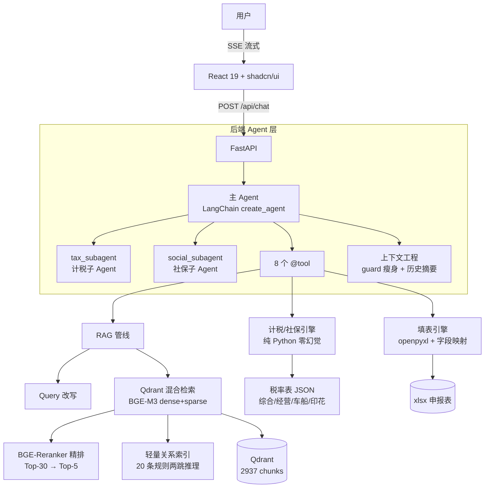

# 财务 RAG Agent · 技术架构文档

> **文档定位**：本文件由 5 份来源文档中的「架构级」内容打散重排而成，作为全系统技术架构的单一自洽视图。架构决策、技术选型依据、数据流、检索链路参数、评测指标、接口契约**全量保留**；同一信息多份来源重复时保留最完整一份，并标注来源文档名。
>
> **来源覆盖**：`财务RAG-技术架构与Agent方案.md`（主源：技术栈定案、三层召回+第4层知识图谱、7 工具设计、UX 规范、评测 60 条）· `README.md`（2026-08-05 重写版：架构图、四层分层召回、8 @tool、双子 Agent、上下文工程、四层评测数据、Roadmap）· `财务RAG-Context Engineering 集成设计文档.md`（压缩主战场假设、6 大设计原则、三模块架构）· `财务RAG-Multi-Agent 集成设计文档.md`（双子 Agent 架构、14 条设计原则 P1-P14、路由三道防线、双层评测）· `财务RAG-前后端对照表.md`（完整接口对照表、SSE 事件 9 种、TypeScript 契约、请求-响应时序图、联调检查清单）

---

## 1. 架构总览

> 来源：`README.md`（架构图、四层分层召回）+ `财务RAG-技术架构与Agent方案.md`（整体数据流、项目结构）

### 1.1 系统定位

一套自建的 **RAG + Agent + 上下文工程 + Multi-Agent** 全链路方案：DeepSeek 负责理解与调度，税率计算走纯代码引擎（零幻觉），法律知识来自税总法规库清洗后的 115+ 份文档。面向零财务基础大众用户，以自然语言对话替代复杂税务软件——让每个人都能 **看懂自己的税、算对自己的钱、填对申报表**。（来源：`README.md`）

### 1.2 系统分层图

> 原样复述自 `README.md` 的 mermaid 架构图（React 前端 / FastAPI 后端 Agent 层 / RAG 管线与引擎 / 数据层四层）：



### 1.3 整体数据流（检索链路 · 四层分层召回）

> 来源：`README.md` 检索链路 + `财务RAG-技术架构与Agent方案.md` 检索链路图（含 Layer 4 知识图谱框）。

```
用户提问 → Query 改写（口语→术语映射）
        → Layer 1 元数据预过滤（relevance_tier 分层）
        → Layer 2 BGE-M3 双向量编码（稠密 1024d + 稀疏词汇）
        →      Qdrant 混合检索（RRF 融合 → Top-30）
        → Layer 3 BGE-Reranker-v2-m3 精排 → Top-5
        → Layer 4 轻量关系索引二次检索（两跳推理）
        → 拼接上下文 + System Prompt
        → DeepSeek 流式输出（SSE）
```

主源 `财务RAG-技术架构与Agent方案.md` 中该链路的 Layer 4 展开形态（Qdrant RRF 粗排参数主源早期写作 Top-20，后续 3.1 节与 README 均统一为 Top-30，以 Top-30 为准）：

```
用户提问
  ↓
Layer 1: 元数据预过滤（payload filter）
  根据意图分类 → 限定 category（tax_law / qa / operations / rates）
  ↓
Layer 2: Qdrant 混合检索（粗排 Top-30）
  BGE-M3 双向量编码（dense 1024d + sparse 词汇权重）
  → Qdrant RRF 融合 → 召回 Top-30
  ↓
Layer 3: BGE-Reranker-v2-m3 精排（精筛 Top-5）
  Cross-encoder 逐对打分 → 取 Top-5
  ↓
┌─ 知识图谱扩展（Layer 4）────────────────┐
│ 命中 relations.json → 双向遍历+两跳推理  │
│ 例: 汇算办法 →(逆向) 个税法 →(2跳) 实施条例 │
│     → 补充关联文档到检索结果              │
└────────────────────────────────────────┘
  ↓
拼接 System Prompt + RAG 上下文 + 用户提问
  ↓
DeepSeek V4 Flash → StreamingResponse 流式输出
```

### 1.4 项目结构（当前形态）

> 来源：`README.md`（项目结构，v1 早期结构见 `财务RAG-技术架构与Agent方案.md` §七，已演进）。

```
├── backend/
│   ├── agent/           # Agent 大脑（create_agent + prompts + 历史摘要 middleware）
│   ├── context/         # 上下文工程（guard 瘦身 + history_summarizer）
│   ├── rag/             # RAG 检索引擎（retriever + query_rewriter）
│   ├── routers/         # FastAPI 路由（chat/tax/social/form，SSE 8 种事件）
│   ├── services/        # 计税/社保引擎（纯 Python，零幻觉）
│   ├── tools/           # 8 个 @tool + subagents.py 双子 Agent
│   └── eval/            # 四层评测（eval / agent_eval / multi_agent_eval / context_eval）
├── frontend/
│   └── src/
│       ├── components/chat/        # 对话视图（SSE 流式 + 结果卡片 + 溯源）
│       ├── components/calculator/  # 税率计算器（分步明细）
│       ├── components/form/        # 申报材料生成（A 表/B 表）
│       └── components/layout/      # 布局（Sidebar + TopBar）
├── rag-data/
│   ├── processed/national/rates/   # JSON 税率表 + 行业基准
│   ├── processed/national/templates/ # 申报表字段映射
│   └── processed/cities/zhengzhou/ # 郑州社保+公积金数据
├── scripts/            # 数据工具链（清洗/切分/向量化/评测）
└── docs/               # 工程文档
```

> 注：`README.md` 中 `routers/` 备注"SSE 8 种事件"为 2026-08-04 之前计数；上下文工程落地后 SSE 事件为 **9 种**（新增 `context`，详见第 8 章）。

---

## 2. 技术选型决策表

> 来源：`财务RAG-技术架构与Agent方案.md` §一（主源，含关键细节）+ `README.md`（技术栈表）+ `财务RAG-技术架构与Agent方案.md` §八（开发环境依赖）。

### 2.1 技术栈定案表

| 层级 | 选型 | 关键细节 |
|------|------|---------|
| **LLM** | DeepSeek V4 Flash | `deepseek-v4-flash`，LangChain `create_agent`，流式 SSE，$0.14/$0.28 /百万token（README 已同步为 `deepseek-v4-flash`） |
| **Embedding** | BGE-M3（FlagEmbedding） | GPU fp16 加速，稠密 1024维 + 稀疏词汇权重 双输出，GPU/CPU 自动切换（`EMBEDDING_DEVICE=cpu` 回退） |
| **向量库** | Qdrant Docker | 原生混合检索（RRF 融合），`docker compose up -d`，Web UI :6333；编排文件在项目根目录 |
| **重排器** | BGE-Reranker-v2-m3（BAAI） | 三层分层召回：元数据过滤 → Qdrant RRF 粗排 Top-30 → Cross-encoder 精排 Top-5 |
| **后端** | FastAPI | `StreamingResponse` SSE 流式输出，OpenAI 兼容 SDK，Python 3.13 |
| **前端** | React 19 + shadcn/ui | monorepo `frontend/`，纯 CSR；TypeScript + Tailwind CSS |
| **PDF 转换** | Microsoft MarkItDown v0.1.6 | 申报表模板 PDF→MD 转换 |
| **部署** | Docker | Qdrant 容器化（Docker Desktop）；`docker compose` 编排 |
| **硬件** | RTX 4060 8GB / 16GB RAM | Qdrant 答辩时启动，日常关后台释放内存 |
| **MCP 封装** | tax-calc | 个税/经营所得/社保 3 工具，WorkBuddy 宿主实测通过 |

> 注：主源技术栈表重排器行写作"粗排 Top-20"，与 §2 检索链路及 README 的 **Top-30** 不一致；后续章节（3.1 工具定义、README 检索链路、评测数据）均以 **Top-30 → Top-5** 为准。

### 2.2 开发环境依赖（主源 §八）

**已就绪**：

| 工具 | 版本/状态 |
|------|---------|
| Python | 3.13.12 (managed venv) |
| Node.js | 22.22.2 |
| MarkItDown | v0.1.6 ✅ |
| NVIDIA Driver | 560.94 / CUDA 12.6 ✅ |
| RTX 4060 | 8GB VRAM ✅ |

**需安装**：

| 工具 | 安装方式 |
|------|---------|
| Docker Desktop | https://docs.docker.com/desktop/setup/install/windows-install/ |
| Qdrant 镜像 | `docker pull qdrant/qdrant` |

**Python 依赖**：

```bash
pip install fastapi uvicorn[standard]    # 后端框架
pip install FlagEmbedding                # BGE-M3 + Reranker
pip install qdrant-client                # Qdrant SDK
pip install openai                       # DeepSeek（OpenAI 兼容 SDK）
pip install sse-starlette                # SSE 流式
```

**需注册**：

| 平台 | 用途 |
|------|------|
| DeepSeek API Key | https://platform.deepseek.com |

> 依赖版本实测（来源：`财务RAG-Multi-Agent 集成设计文档.md` §2.3）：langchain 1.3.14（`create_agent` 可用，返回 `CompiledStateGraph`，支持嵌套 Agent 作为 tool）· langgraph 1.2.10 · langgraph-prebuilt 1.1.0（`create_react_agent` ✅；`create_supervisor` ❌ 导入失败）· langchain-openai 1.4.1。transformers 5.14.1 需 `TRANSFORMERS_OFFLINE=1` 且必须在任何第三方 import 之前设置（huggingface_hub 在 import 时快照 env）。

### 2.3 核心设计决策（README）

- **准确性优先于速度**：财税场景错不起
- **金额计算不走 LLM**：税率/社保全部 JSON + Python 公式，零幻觉
- **语义边界切分**：税法按 `### 第X条`、问答按 `## 问句` 切分，不硬按字符数（800/80 窗口 + 15% 重叠）
- **先跑通再评测收敛**：建 bad case 评测集，逐轮优化避免过拟合
- **AI 嵌入 vs AI 原生**：核心逻辑代码化，AI 负责调度和理解层
- **评测驱动落地**：每个新模块（上下文工程/Multi-Agent）先设计验收指标，再编码、再评测闭环

---

## 3. 检索架构

> 来源：`财务RAG-技术架构与Agent方案.md` §二/§3.1/§9.5 + `README.md` 检索链路 + `财务RAG-Context Engineering 集成设计文档.md`（chunk 规模实测）。

### 3.1 混合检索机制（Query 改写 → RRF 融合 → Reranker）

四层分层召回链路（详见 1.3）的核心参数：

| 环节 | 机制 | 参数 |
|------|------|------|
| **Query 改写** | `backend/rag/query_rewriter.py`：口语→术语映射 | 解决"怎么退税""五险一金"与法律文本的语义鸿沟 |
| **Layer 1 元数据预过滤** | payload filter 限定 category（tax_law / qa / operations / rates） | 支持按 relevance_tier / category / city 过滤 |
| **Layer 2 混合检索** | BGE-M3 双向量编码（dense 1024d + sparse 词汇权重）→ Qdrant RRF 融合 | 粗排 **Top-30** |
| **Layer 3 精排** | BGE-Reranker-v2-m3 Cross-encoder 逐对打分 | 精筛 **Top-5** |
| **Layer 4 知识图谱** | relations.json 双向遍历 + 两跳推理 | 见第 4 章 |

### 3.2 Reranker 权重公式与 relevance_weight

精排阶段将相关性层级权重乘入最终分数（来源：`财务RAG-技术架构与Agent方案.md` §3.1）：

```
final_score = rerank_score × weight / 10.0
```

其中 `weight` 为 relevance_tier 对应的整数权重，按层级取 10/8/6/3：

| relevance_tier | weight（整数） | 换算系数 |
|---|---|---|
| tax_law | 10 | ×1.0 |
| regulation | 8 | ×0.8 |
| qa_corpus | 6 | ×0.6 |
| general_law | 3 | ×0.3 |

### 3.3 文档级去重

`backend/rag/retriever.py` 内置文档级去重（来源：`财务RAG-技术架构与Agent方案.md` §9.5）：

> **文档级去重**：Reranker 精排放宽 `top_k*2` → 同一 `doc_title` 只保留最高分 chunk → 截断至 Top-5。

背景：超长法规多 chunk 挤占 top-k 槽位。2026-08-05 评测集扩展后首跑 Recall@5 曾降至 72.5%，经两处修复回升至 85%——其中之一即为文档级去重。

### 3.4 向量化与切分策略

- **Embedding 模型**：BGE-M3，稠密 1024 维 + 稀疏词汇权重双输出，GPU fp16 加速（来源：主源技术栈表）
- **切分策略**：`MarkdownHeaderTextSplitter`（来源：`财务RAG-技术架构与Agent方案.md` §3.1 + README 核心设计决策）
  - 税法：`### 第X条` 边界，800字上限 / 80字下限 / 120字重叠（15%）
  - QA：`## 问句` 边界，同上参数
- **库规模演进**：BGE-M3 向量化入库从早期 **2419 chunks** 扩展至当前 **2937 chunks**（README 架构图标注）
- **chunk 长度实测**（来源：`财务RAG-Context Engineering 集成设计文档.md`）：2937 个 chunk 中位数仅 **181 字**，单轮压缩无意义 → 上下文压缩主战场转移到多轮对话历史累积（详见第 6 章）
- **索引文件**：`scripts/embed_and_upsert.py`（向量化入库，首次 ~15min GPU / ~1h CPU，来源：README 快速开始）

### 3.5 检索相关优化机制清单（评测驱动产出）

来源：`财务RAG-技术架构与Agent方案.md` §9.5（优化方法论表）：

| 机制 | 文件 | 解决问题 |
|---|---|---|
| **Query 改写层** | `backend/rag/query_rewriter.py` | 用户口语"怎么退税""五险一金"与法律文本的语义鸿沟 |
| **DOC_KEYWORDS 注入** | `scripts/embed_and_upsert.py` | 特定文档在向量空间中与同质文档距离过近 |
| **DOC_KEYWORDS 存内容** | 同上 | Reranker 无法感知向量增强词（仅影响检索不影响重排） |
| **WEIGHT_OVERRIDES** | 同上 | 关键文档在 Reranker 阶段权重不足（如法规条文 vs Q&A） |
| **QA 结构修复** | `scripts/fix_qa_headings.py` | MarkdownHeaderTextSplitter 无法识别无 `##` 的 QA 边界 |
| **文档级去重** | `backend/rag/retriever.py` | 超长法规多 chunk 挤占 top-k 槽位 |

---

## 4. 知识图谱

> 来源：`财务RAG-技术架构与Agent方案.md` §2.1（全量）+ `README.md`（特性/架构图中 Layer 4）。

### 4.1 设计动机

财税法规存在密集交叉引用。纯向量检索命中"个税法"，但"实施条例""专项附加扣除细则"等关联文档需要二次查询。（来源：主源 §2.1）

**方案**：20 条精选关联规则 JSON + 双向遍历 + 两跳推理，**零数据库依赖**。README 特性表述为"轻量知识图谱：20 条关联规则 JSON 驱动，两跳推理，零数据库依赖"。

### 4.2 relations.json（20 条关系规则）

索引文件 `rag-data/relations.json`（20 条规则）：

| 关系类型 | 数量 | 示例 |
|---|---|---|
| implemented_by / detailed_by | 7 | 个税法 → 实施条例、专项附加扣除暂行办法 |
| administered_by / guide_doc | 3 | 汇算管理办法 → 年度汇算公告 |
| extended_by / special_case | 4 | 个税法 → 婴幼儿照护通知、年终奖百问百答 |
| related_law / companion_tax | 3 | 社保法 ↔ 劳动合同法、车辆购置税法 ↔ 车船税法 |
| penalty_detail / special_income | 3 | 税收征管法 → 虚开发票犯罪决定、个税法 → 股权激励QA |

### 4.3 检索增强流程（已集成到 `retriever.retrieve()`）

```
Layer 1-3: 元数据过滤 → 混合检索 → Reranker 精排 → Top-5
Layer 4: 知识图谱扩展
  ├─ 正向: 主结果文档作为 source → 拉 target
  ├─ 逆向: 主结果文档作为 target → 反推 source
  └─ 两跳: 一阶 target 再作为 source → 拉二阶关联
```

**实测示例**：

```
输入: "个税汇算清缴怎么操作"
├─ 主检索: 汇算清缴管理办法 + 2023年度汇算公告
├─ 1跳(逆向): 汇算办法 → 个人所得税法 🔗
├─ 2跳: 个税法 → 实施条例 🔗 + APP操作指南 🔗
└─ 输出: 10条结果(主5 + 图5)，完整关联链
```

### 4.4 关键设计

- 每条关系含 `trigger_keywords` 避免过度触发（如"交社保"才触发社保→劳动合同法关联）
- 关系结果标记 `relation_source: "知识图谱（N跳）"` + `relation_desc` 语义描述
- 前端可在来源链接中区分展示为"关联法规"

---

## 5. Agent 架构

> 来源：`财务RAG-技术架构与Agent方案.md` §三/§四/§五/§六（单 Agent 形态 + 7 工具 + UX 规范）+ `README.md`（8 工具 + 双子 Agent）+ `财务RAG-Multi-Agent 集成设计文档.md`（P1-P14、双子 Agent 全量设计）。

### 5.1 调度架构与意图路由

LLM（DeepSeek V4 Flash）根据用户意图自动选择工具。工具返回结构化结果后，由 LLM 组织语言流式输出。（来源：主源 §三）

**Agent 调度架构**（来源：主源 §五）：

```
用户提问
  ↓
LLM（DeepSeek V4 Flash）判断意图 → 选择工具
  ├── 通用财税问答        → search_knowledge
  ├── 时效性/最新政策      → search_tax_website
  ├── "个税怎么算"         → calculate_income_tax
  ├── "工资扣了多少社保"    → query_social_insurance
  ├── "帮我生成申报表"     → fill_tax_form
  ├── "怎么退税/报税"      → get_filing_guide (+ search_knowledge)
  └── 复杂交叉问题         → 多工具并行调用
  ↓
工具返回结构化结果 + RAG 检索上下文
  ↓
LLM 组织语言 → StreamingResponse 流式输出（SSE）
```

**Agent 实现方式**：LangChain `create_agent` + `MemorySaver`，`@tool` 通过 Function Calling 自动路由（来源：主源 §五）。

**RAG vs 实时搜索调度逻辑**（来源：主源 §四）——LLM 根据问题是否涉及时效性（"最新""今年""最近"等关键词）自动路由：

| 用户问 | 走 RAG | 走 Web Search |
|--------|:--:|:--:|
| "租房扣除标准是多少" | ✅ | — |
| "今年出台了哪些新税政" | — | ✅ |
| "社保基数调整了吗" | ⚠️ 可能过期 | ✅ |
| 复杂问题 | ✅ | ✅ 交叉验证 |

### 5.2 当前工具注册表（8 个 @tool）

> 来源：`README.md` 工具表（功能描述）+ `财务RAG-Multi-Agent 集成设计文档.md` §2.2（类型与结构化字段）。

| 工具 | 功能 | 类型 | 返回中带结构化字段 |
|------|------|------|---|---|
| `search_knowledge` | RAG 知识库检索（三层分层召回 + 关系图谱扩展） | RAG 检索 | sources |
| `calculate_income_tax` | 综合所得个税计算（工资/劳务/稿酬 + 年终奖择优） | 计税（工资/劳务/年终奖） | result_card + disclaimer |
| `calculate_business_income_tax` | 经营所得个税计算（个体户，5%-35% 五级超额累进） | 计税（个体户 B 表） | result_card + disclaimer |
| `query_social_insurance` | 社保+公积金计算（郑州，灵活就业/职工双模式） | 社保查询 | result_card + disclaimer |
| `fill_tax_form` | 申报表自动填写（A 表/B 表），字段映射 + openpyxl 导出 xlsx | 填表 | result_card + sources |
| `filing_guide` | 申报流程指引（个税 APP 汇算清缴/个体户季度申报） | 申报指引 | sources |
| `get_user_context` | 对话上下文记忆（城市/收入/扣除项/亏损，跨轮复用） | 记忆读取 | — |
| `update_user_context` | 保存用户上下文信息 | 记忆写入 | — |

### 5.3 早期 7 工具形态定义（主源 §三，演进基线）

> 主源 `财务RAG-技术架构与Agent方案.md` 定义的是 7 工具形态；README 8 工具为演进后形态：新增 `calculate_business_income_tax`、`get_user_context`、`update_user_context`，`get_filing_guide`→`filing_guide` 更名；`search_industry_benchmark`、`search_tax_website` 未列入 8 工具注册表。以下为 7 工具完整定义（含未进 8 工具表者），全量保留：

| # | 工具名 | 输入 | 数据源 | 对应功能 |
|:--:|--------|------|------|:--:|
| 1 | `search_knowledge` | 用户问题原文 | Qdrant 向量库（115个文件，四层relevance_tier分层） | 智能问答 |
| 2 | `calculate_income_tax` | 收入类型、金额、扣除项、城市 | `tax_rate_tables.json`（综合/经营/年终奖/累计预扣） | 税率计算 |
| 3 | `query_social_insurance` | 城市、就业类型、工资 | `cities/zhengzhou/social_insurance.json` | 社保计算 |
| 4 | `fill_tax_form` | 申报表类型、用户信息 | `form_field_map.json` + openpyxl 填表 | 申报材料生成 |
| 5 | `get_filing_guide` | 申报场景 | `operations/个税操作指南.md` | 申报指引 |
| 6 | `search_industry_benchmark` | 行业名称/门类 | `industry_benchmark.json`（97行业×10指标） | 行业参照 |
| 7 | `search_tax_website` | 搜索关键词 | Web Search（白名单域名） | 实时政策 |

**3.1 `search_knowledge` — RAG 检索**：

```
输入: query (用户问题原文)
检索链路:
  Layer 1: 元数据预过滤（relevance_tier 分层，支持按 category/city 过滤）
  Layer 2: BGE-M3 双向量编码 → Qdrant 混合检索 → RRF 融合 → Top-30
  Layer 3: BGE-Reranker-v2-m3 Cross-encoder 精排 → Top-5
         → relevance_weight 乘入最终分数（tax_law×1.0, regulation×0.8,
            qa_corpus×0.6, general_law×0.3）
输出: [{content, source_url, doc_title, relevance_tier, score}, ...]

切分策略: MarkdownHeaderTextSplitter
  - 税法: ### 第X条 边界, 800字上限/80字下限/120字重叠(15%)
  - QA:   ## 问句 边界, 同上参数
```

**3.2 `calculate_income_tax` — 个税计算**：

```
输入: income_type, incomes[{type, amount}], special_deductions[], city, bonus
数据源: tax_rate_tables.json（含综合所得税率表、经营所得税率表、年终奖月度税率表、
        专项附加扣除标准、收入类型计入规则、累计预扣法流程、汇算清缴流程）
动作: 读取 JSON → 按 formula 字段的步骤计算（不经过 LLM）
输出: {taxable_income, tax_amount, marginal_rate, brackets_used, breakdown[]}
```

**3.3 `query_social_insurance` — 社保公积金**：

```
输入: city, employment_type (employee/flexible), salary
数据源: cities/zhengzhou/social_insurance.json
        含: 职工社保(养老/医疗/失业/工伤/生育) + 住房公积金(5%-12%)
            灵活就业(养老20%/医疗10%) + 灵活就业公积金(20%)
            缴费基数上下限 + 2个计算示例
动作: 读取 JSON → 按 salary 匹配基数 → 计算个人/单位应缴
输出: {breakdown: {养老:{单位,个人}, 医疗:{...}, ...}, total_personal, total_employer}
```

**3.4 `fill_tax_form` — 申报材料生成**：

```
输入: form_type (A表/B表), user_profile {name, id_card, incomes, deductions, ...}
数据源: templates/form_field_map.json（字段→单元格坐标映射）
        templates/个人所得税基础信息表（A表）/（B表）/*.xlsx
工具:  scripts/fill_tax_form.py（openpyxl 填表）
流程:
  1. Agent 调 get_required_fields(form_type) → 获知必填/可选字段
  2. Agent 对话收集用户信息（一次只问1-2个，已有上下文自动复用）
  3. Agent 调 fill_form(form_type, user_data) → openpyxl 填表
  4. 返回填好的 xlsx + 空白原表路径
输出: {success, file_path, filled_fields, skipped_fields}
```
> ⚠️ 不走 LLM，纯字段映射 + openpyxl 代码。保留空白原件供下载。

**3.5 `get_filing_guide` — 申报流程指引**：

```
输入: scenario (个税年度汇算/个体户B表/小规模增值税)
数据源: operations/个税操作指南.md（个税APP 5步操作流程）
动作: RAG 检索操作指引 → 分步骤输出 + 官方入口链接
输出: {steps: [{step_number, description}], 官方入口_url, 咨询热线}
```

**3.6 `search_tax_website` — 税务官网白名单搜索**：

```
输入: query (搜索关键词)
白名单（仅允许以下域名）:
  chinatax.gov.cn         # 国家税务总局及各地子站
  gov.cn                   # 中国政府网
  mohrss.gov.cn            # 人社部
  nhsa.gov.cn              # 国家医保局
  henan.chinatax.gov.cn    # 河南省税务局
  zhengzhou.gov.cn         # 郑州市政府
  zzgjj.zhengzhou.gov.cn   # 郑州公积金

动作: 限定域名的 Web Search → 返回摘要+链接
输出: [{title, snippet, url, domain}, ...]
```
> ⚠️ **严格限制**：不可搜索白名单以外的任何网站，保证信息来源权威可靠。

**3.7 `search_industry_benchmark` — 行业财务基准参照**：

```
输入: industry_name (行业名称), metric (指标名,可选)
数据源: industry_benchmark.json（20门类×97行业×10项指标，含中文标签+单位）
动作: 精确匹配行业 → 读取各项指标 {low, high} 范围
      如指标为 null → 提示该指标不适用此行业
输出: {industry, category, metrics:{vat_burden:{low,high,label}, ...}}
```
> ⚠️ 结构化数据走精确匹配，不走向量检索。

### 5.4 双子 Agent 架构（Multi-Agent 化）

> 来源：`财务RAG-Multi-Agent 集成设计文档.md`（全量）。主源 §五标注演进：**2026-08-04 Multi-Agent 化（P1 设计完成，待编码）**——计税/社保拆为双子 Agent（Tool-as-Subagent），`AGENT_MODE` 模式开关 + prompt 双版本 + 失败降级 + 绕过检测；原单 Agent 架构为 `AGENT_MODE=tools` 形态，仍是回退保底路径。

**架构演进叙事**（来源：来源文档 §3.2）：lest 从"单 Agent + 8 工具"升级为"协调 Agent + 领域子 Agent"。计税子 Agent 是将来 MCP Server 封装的自然宿主。

#### 5.4.1 现状盘点（单 Agent 的三个"增长痛点"）

| 痛点 | 具体表现 |
|---|---|
| ① System Prompt 膨胀 | `prompts.py` 已 46 行：计税规则（B 表/A 表）、社保、填表、检索、记忆、免责全挤在一个 prompt，规则互相干扰 |
| ② 工具选择压力 | 主 LLM 每次都要从 8 个工具里选，计税类（3/4）与检索类（1/2）行为模式差异大 |
| ③ 上下文混装 | 计税的中间步骤（查画像 → 计算 → 更新画像）与其他任务的历史混在一条消息链，压缩/检索都要面对噪声 |

> 结论：**计税类任务（工具 3/4 + 记忆 1/6）是天然的独立子 Agent 候选**——它们自成闭环（画像 → 计算 → 回写），领域规则密集，且与检索/填表/指引任务解耦度最高。

#### 5.4.2 两阶段架构

**阶段一：轻量版 — Tool-as-Subagent（推荐落地）**：把计税、社保两个领域子 Agent 用 `create_agent` 构建（与主 Agent 同构），再各包成一个 `@tool` 挂回主 Agent 的 `ALL_TOOLS`——主 Agent 视角它们只是两个工具，**现有链路零结构改动**。

```
backend/tools/ 新增两个子 Agent 包装工具（替代原 calculate_* / query_social_insurance 的注册）
┌────────────────────────────┐
│ 主 Agent (create_agent)    │
│  tools = [..., tax_subagent, social_subagent, ...]   ← 只是多了两个"工具"
└──────────┬──────────┬──────┘
           │ tool 调用 │ tool 调用
           ▼          ▼
┌─────────────────────┐  ┌──────────────────────────┐
│ tax_subagent        │  │ social_subagent          │
│ (create_agent)      │  │ (create_agent)           │
│ 独立 prompt：计税规则 │  │ 独立 prompt：社保规则      │
│ tools = [get_user_context,  │ tools = [get_user_context,   │
│          update_user_context, │          update_user_context,│
│          calculate_income_tax, │          query_social_insurance]│
│          calculate_business_income_tax]│                          │
└─────────────────────┘  └──────────────────────────┘
```

**为什么拆两个子 Agent**（v1.1 grill 决策，否决"合并计算专家"）：
1. 计税 = **画像→计算→回写**闭环（get → calculate → update），规则密集，独立 prompt 收益最大
2. 社保 = **查表直答**（无回写链），规则短但仍是独立领域，与计税/检索/填表混在主 prompt 会互相干扰（agent_eval 里"缴费比例"与"增值税税率"是历史易混点）
3. 合并成"计算专家"反而稀释各自领域聚焦；分开拆 prompt 隔离最彻底
4. 面试叙事更饱满："我把两个高频计算领域拆成了独立子 Agent，主 Agent 专注路由"

**阶段二：完整版 — Supervisor 自建（可选）**：⚠️ 版本事实：`langgraph-prebuilt 1.1.0` 无 `create_supervisor`，官方 API 不可用。自建方案（纯 langgraph，无新依赖）：

```
StateGraph（state: {task, result})
  ├─ supervisor 节点：LLM 判断任务类型 → 路由给 worker
  ├─ tax_worker / rag_worker / form_worker：各自调子 Agent 或工具
  └─ 汇总节点：拼装最终答案
```

工作量 2-3 天；风险：路由准确率需要评测集。答辩演示用阶段一已足够，阶段二作为论文"架构演进展望"章节素材。

#### 5.4.3 职责边界（主 Agent / 计税子 Agent / 社保子 Agent）

| 维度 | 主 Agent | 计税子 Agent | 社保子 Agent |
|---|---|---|---|
| 职责 | 意图识别、路由、汇总、检索/填表/指引 | 只处理计税类（工资/劳务/稿酬/特许权/个体户/年终奖） | 只处理社保/公积金查询（比例/基数/灵活就业） |
| System Prompt | 精简：计算类两段下沉为一句"交给对应专家" | 计税规则全量下沉 | 社保规则全量下沉 |
| 工具集 | 8 个（计税/社保各替换为子 Agent） | 4 个（画像读写 ×2 + 计税 ×2） | 3 个（画像读写 ×2 + 社保 ×1） |
| 记忆 | InMemorySaver + HistorySummarizer | **无 checkpointer、无历史**（每次独立） | 同左 |
| 画像来源 | — | 只用 `get_user_context`（contextvar 传 thread_id，同进程内传播） | 同左 |
| middleware | ToolError + ModelCallLimit(25) + 摘要 | ToolError + ModelCallLimit(8)（防子 Agent 死循环） | 同左 |

**子 Agent System Prompt 设计**（来源：§5.2/§5.3，全量）：

```python
TAX_SUBAGENT_PROMPT = """你是"个税计算专家"，只负责计税类问题（工资薪金/劳务报酬/稿酬/特许权使用费/年终奖/个体工商户经营所得）。

核心规则：
1. **先查画像再计算**：调用 get_user_context 检查是否已有城市、工资、收入类型、扣除项；
   用户没给完整信息时，用默认值补全（income_type 默认 salary，city 默认 zhengzhou，social_insurance 默认 0）。
2. **计算必须走工具**：绝不用 LLM 心算税率，一律调用 calculate_income_tax / calculate_business_income_tax。
   - 个体户/经营所得 → calculate_business_income_tax（5%-35% 五级累进）
   - 工资/劳务/稿酬/特许权 → calculate_income_tax
   - 年终奖单独计税对比 → calculate_income_tax 的 bonus 参数
3. **把用户新提供的信息用 update_user_context 回写**（城市/工资/扣除项），供后续复用。
4. **输出 = 工具 answer 原样透传 + 简短解读**：工具已生成分步推导和结果卡片，
   你只需补充 1-2 句通俗解释，不要重复计算过程。
5. **只回答计税问题**：非计税问题（社保缴费比例、申报流程、填表、政策条文）直接回答
   "这不是计税问题，请交给主助手处理"，不要尝试用计算工具硬算。
"""
```

```python
SOCIAL_SUBAGENT_PROMPT = """你是"社保公积金查询专家"，只负责社保/公积金相关问题（缴费比例、缴存基数、五险一金、灵活就业缴费）。

核心规则：
1. **先查画像再查询**：调用 get_user_context 检查是否已有城市；城市缺失时默认 zhengzhou（郑州）。
2. **查询必须走工具**：一律调用 query_social_insurance，绝不用 LLM 心算比例。
3. **回写新信息**：用户新提供的城市/缴费基数等用 update_user_context 保存。
4. **输出 = 工具 answer 原样透传 + 简短解读**：工具已生成结果卡片，你只需补充 1-2 句通俗解释。
5. **只回答社保问题**：计税、申报流程、填表、税法条文等问题直接回答
   "这不是社保查询问题，请交给主助手处理"，不要用查询工具硬答。
"""
```

> 设计要点：**子 Agent 的 answer = 工具 answer 原样透传**——这是 P2（协议不变）的关键：result_card 由包装层从子 Agent 消息链中确定性提取，不依赖 LLM 复述。

#### 5.4.4 代码骨架（backend/tools/subagents.py — 双子 Agent 统一模块）

```python
"""双子 Agent（计税 + 社保）— 包装成 tool 挂回主 Agent

v1.1 设计：两个子 Agent 统一放 subagents.py，模块级懒加载单例
（与 engine.get_agent() 同模式：threading.Lock 双检，构建一次复用）。
子 Agent 无 checkpointer、无历史，每次调用独立；
画像通过 get_user_context 读取（contextvar 传 thread_id，同进程传播）。
返回遵循 tools/base.py JSON 五字段协议 → SSE 解包零改动。
"""
import json
import threading
from langchain.agents import create_agent
from langchain.agents.middleware import ToolErrorMiddleware, ModelCallLimitMiddleware
from langchain_core.tools import tool

from agent.prompts import TAX_SUBAGENT_PROMPT, SOCIAL_SUBAGENT_PROMPT
from tools import get_user_context, update_user_context
from tools.calculate_income_tax import calculate_income_tax, calculate_business_income_tax
from tools.query_social_insurance import query_social_insurance
from tools.base import AI_DISCLAIMER


def _build_subagent(llm, system_prompt, tools):
    return create_agent(
        model=llm,
        tools=tools,
        system_prompt=system_prompt,
        middleware=[
            ToolErrorMiddleware(on_error=_on_tool_error),
            ModelCallLimitMiddleware(run_limit=8),   # 子 Agent 防死循环
        ],
        # 不传 checkpointer → 无状态，每次独立；全局单例共享安全
    )


# ── 全局单例（懒加载 + 双检锁，与 get_agent() 模式一致）──
_tax_subagent = None
_social_subagent = None
_lock = threading.Lock()


def get_tax_subagent(llm):
    global _tax_subagent
    if _tax_subagent is None:
        with _lock:
            if _tax_subagent is None:
                _tax_subagent = _build_subagent(
                    llm, TAX_SUBAGENT_PROMPT,
                    [get_user_context, update_user_context,
                     calculate_income_tax, calculate_business_income_tax])
    return _tax_subagent


def get_social_subagent(llm):
    global _social_subagent
    if _social_subagent is None:
        with _lock:
            if _social_subagent is None:
                _social_subagent = _build_subagent(
                    llm, SOCIAL_SUBAGENT_PROMPT,
                    [get_user_context, update_user_context, query_social_insurance])
    return _social_subagent


def _extract_fields(messages) -> tuple:
    """遍历子 Agent 消息链，确定性提取最后一个非空 result_card / sources（不靠 LLM 复述）"""
    answer = ""
    result_card = None
    sources = None
    for msg in messages:
        content = getattr(msg, "content", "")
        if isinstance(content, str) and content.startswith("{"):
            try:
                parsed = json.loads(content)
                if parsed.get("result_card"):
                    result_card = parsed["result_card"]
                if parsed.get("sources"):
                    sources = parsed["sources"]
            except json.JSONDecodeError:
                pass
        if getattr(msg, "type", "") == "ai":
            answer = content  # 子 Agent 最终回答
    return answer, result_card, sources


@tool
async def tax_subagent(query: str) -> str:
    """计算个人所得税（工资/劳务/年终奖/个体户经营所得）。当用户需要算税时调用，
    内部由计税专家 Agent 处理：先查用户画像，再用法定税率表精确计算，最后回写画像。
    参数: query — 用户原始计税问题"""
    from agent.engine import get_llm  # 复用主 Agent 的 llm 单例
    sub = get_tax_subagent(get_llm())
    result = await sub.ainvoke({"messages": [{"role": "user", "content": query}]})
    answer, result_card, sources = _extract_fields(result["messages"])
    return json.dumps({
        "answer": answer,
        "result_card": result_card,
        "sources": sources,
        "disclaimer": AI_DISCLAIMER,
    }, ensure_ascii=False)


@tool
async def social_subagent(query: str) -> str:
    """查询社保公积金（缴费比例/缴存基数/五险一金/灵活就业）。当用户需要查社保时调用，
    内部由社保专家 Agent 处理：先查用户画像，再查询官方缴费比例，最后回写画像。
    参数: query — 用户原始社保问题"""
    from agent.engine import get_llm
    sub = get_social_subagent(get_llm())
    result = await sub.ainvoke({"messages": [{"role": "user", "content": query}]})
    answer, result_card, sources = _extract_fields(result["messages"])
    return json.dumps({
        "answer": answer,
        "result_card": result_card,
        "sources": sources,
        "disclaimer": AI_DISCLAIMER,
    }, ensure_ascii=False)
```

**实现注意（全量保留）**：
> 1. **全局单例（v1.1 决策）**：两个子 Agent 无状态，`CompiledStateGraph` 并发 `ainvoke` 安全 → 模块级懒加载单例，省每次 `create_agent` 编译开销（约 1s）；llm 由 `get_llm()` 共享（engine.py 提取，主/子 Agent 共用一个 ChatOpenAI）
> 2. 提取 result_card 时遍历消息链，**只取最后一个非空 result_card**（避免旧工具结果误取）
> 3. `get_user_context` 依赖 contextvar `_current_thread_id`——子 Agent 与主 Agent 同进程同事件循环，**传播正常**（与 `search_knowledge` 用 `asyncio.to_thread` 的跨线程场景不同，无需额外处理）
> 4. `LLM 单例`：engine.py 里 `build_agent()` 内部创建的 llm 需提出来做模块级单例（`get_llm()`），否则主/子 Agent 各建一个 ChatOpenAI
> 5. ✅ **结构验证已通过（2026-08-04 实测）**：用真实 DeepSeek `ChatOpenAI` 构建"子 Agent（create_agent + add 工具）→ @tool 包装 → 主 Agent 挂载"三层结构，构建成功无报错——嵌套方案可行（fake 模型因不支持 `bind_tools` 会报 NotImplementedError，属测试工具限制，与方案无关）

#### 5.4.5 主 Agent 接入与 `AGENT_MODE` 一键回退（v1.2）

```python
# config.py 新增（v1.2 模式开关）
AGENT_MODE = "multi"   # "multi"=子 Agent 形态（默认）| "tools"=纯工具形态（回退/演示）

# engine.py 本地组装（推荐，避免 tools/__init__ 循环导入）
# v1.3：prompt 与工具列表同源分支——两形态各自成对，永不同步错位
from agent.prompts import SYSTEM_PROMPT_MULTI, SYSTEM_PROMPT_TOOLS
from tools.subagents import tax_subagent, social_subagent

if config.AGENT_MODE == "multi":
    ALL_TOOLS = [get_user_context, search_knowledge, tax_subagent, social_subagent,
                 update_user_context, fill_tax_form, filing_guide]
    SYSTEM_PROMPT = SYSTEM_PROMPT_MULTI   # 工具名 = tax_subagent / social_subagent
else:  # tools 形态 = 原单 Agent（回退/演示）
    ALL_TOOLS = [get_user_context, search_knowledge,
                 calculate_income_tax, calculate_business_income_tax, query_social_insurance,
                 update_user_context, fill_tax_form, filing_guide]
    SYSTEM_PROMPT = SYSTEM_PROMPT_TOOLS   # 工具名 = calculate_* / query_social_insurance（现有原样）
```

> 注意：`tools/__init__.py` 的 `ALL_TOOLS` 导入链会循环依赖（subagents.py 导入 tools.*）→ **建议在 `engine.py` 本地组装列表**（如上），不在 `tools/__init__.py` 维护 ALL_TOOLS。
> **不并存原则（P11）**：同一时刻只有一套工具列表——并存注册会导致 `agent_eval` 评测歧义（同一 query 命中谁都对）且 LLM 大概率选旧工具、子 Agent 变死代码。
> **prompt 同步原则（P12，v1.3）**：**prompt 里出现的每个工具名必须真实注册在当形态的 ALL_TOOLS 里**——残留原工具名会诱导 LLM 调用未注册工具，触发 ToolNode 报错（"Tool X is not registered with ToolNode"，源码 `tool_node.py:949`）→ 先失败一轮再被错误信息纠正，浪费轮次且前端可见报错。

**模式开关说明**（`AGENT_MODE` 只影响 `engine.py` 里 `ALL_TOOLS` 的组装，其余代码两形态共用）：

| 形态 | ALL_TOOLS | 用途 |
|---|---|---|
| `multi`（默认） | 计税/社保 → 两个子 Agent | 多 Agent 演示 / 答辩主形态 |
| `tools` | 原 8 工具 | 回退保底 / 演示"单 Agent vs 多 Agent"对比 / 异常时快速降级 |

- 评测：两形态各跑一遍（tools 形态 = 现状基线，已有数据；multi 形态 = 本设计验收）
- 切换粒度：进程级（config 启动时读），不做请求级切换（保持简单）

**回退方案（v1.2 升级）**：`AGENT_MODE = "tools"` 一行切换回纯工具形态（原 8 工具，与现状完全一致）——不需要改代码、不需要删文件，进程级生效。multi 形态出任何问题，改配置即还原；原文件（`calculate_income_tax` 等）始终保留，子 Agent 内部继续复用。

#### 5.4.6 B 表双工具链路（v1.1 决策：主 Agent 协调）

个体户申报场景（"先填表再计税"）**顺序协调归主 Agent**，子 Agent 不集成 `fill_tax_form`：
- 主 prompt 保留并强化该规则（原文 `prompts.py:25`）："**若用户提'B表'或'个体户申报'，先调 `fill_tax_form(B表)` 填基础信息，再调 `tax_subagent` 计税，顺序不可颠倒**"
- 子 Agent 职责纯粹：只算税，不填表；填表结果卡片与计税卡片由主 Agent 依次触发下发
- 两个工具间**无数据通道**（填表结果与计税输入各自独立），符合现状（现链路本来也是两次独立工具调用）

#### 5.4.7 前端与 SSE：零改动

子 Agent 返回的 JSON 五字段与 `tools/base.py` 协议一致，`routers/chat.py` 的 `on_tool_end` 解包逻辑原样工作（result 卡片 / source 链接 / disclaimer 照常下发）。

#### 5.4.8 v1.4 降级：子 Agent 失败降级（复用 `AIMessage.tool_calls` 直调原工具）

**问题**：子 Agent 内部可能"多轮未计算出结果"——参数缺失反复追问、工具选错、或 `ModelCallLimit(8)` 触达。**关键事实**：`ModelCallLimitMiddleware` 默认 `exit_behavior="end"`（源码 `model_call_limit.py:131`）→ 超限**正常结束不抛异常**，所以"未计算出结果"的检测信号 = **消息链里没有 result_card**，不是异常捕获。

**降级设计**（包装层兜底，零改动子 Agent）：

```
子 Agent ainvoke 结束
  └─ _extract_fields() 提取 result_card
       ├─ 有 result_card → 正常返回（现状）
       └─ 无 result_card → 降级路径（新增 _fallback_reuse_args）：
            ① 遍历消息链 AIMessage.tool_calls，找最后一个 calculate_* 的 args
               （LLM 已生成好的结构化参数，直接复用！结构已验证 ✅）
            ② 找到 → 直调原工具 calculate_income_tax(**args) → 返回 result_card
            ③ 没找到（LLM 绕圈没尝试）→ 返回错误消息给主 Agent，主 Agent 反问用户
```

**为什么复用 tool_calls 参数**：不是"重新让 LLM 算一次"（可能再绕圈），而是**捡起 LLM 已生成但未执行成功的参数直接喂确定性引擎**——参数提取靠 LLM（准确）、计算靠引擎（可靠），各取所长。

```python
def _fallback_reuse_args(messages, calc_tool_names) -> tuple:
    """降级：从消息链复用 LLM 已生成的 calculate 参数直调原工具。
    返回 (answer, result_card, sources, used)"""
    # ① 找最后一个 calculate 工具调用（LLM 已生成参数）
    for msg in reversed(messages):
        for tc in getattr(msg, "tool_calls", []) or []:
            if tc.get("name") in calc_tool_names:
                args = tc.get("args", {})
                # ② 直调原工具（确定性引擎）
                from tools.calculate_income_tax import calculate_income_tax, calculate_business_income_tax
                fn = calculate_business_income_tax if tc["name"] == "calculate_business_income_tax" else calculate_income_tax
                try:
                    raw = fn.invoke(args) if hasattr(fn, "invoke") else fn(**args)
                    parsed = json.loads(raw)
                    return parsed.get("answer", ""), parsed.get("result_card"), parsed.get("sources"), True
                except Exception:
                    break  # 参数不全 → 落到 ③
    return "", None, None, False  # ③ 未找到/失败 → 主 Agent 反问
```

**三档触发条件**：

| 档 | 条件 | 动作 |
|---|---|---|
| 正常 | 消息链有 calculate ToolMessage | 透传 result_card |
| 降级 | 无 ToolMessage，但 `AIMessage.tool_calls` 有 calculate args | `_fallback_reuse_args` 复用参数直调原工具 |
| 放弃 | 连 tool_calls 都没有 | 错误消息 → 主 Agent 反问用户补信息 |

> **边界**：`ModelCallLimit=8` 触达时若最后一步是"LLM 生成了调用但图提前 end"，tool_calls 可能已消费 → 降级①容忍 args 缺失，落到③。降级结果与正常路径**同一引擎，数值必然一致**（对拍天然成立）。

#### 5.4.9 v1.5 绕过检测（LLM "心算"强制重算）

**问题**：`create_agent` 的循环里，**LLM 每轮自主决定是否声明 `tool_calls`**——它可能觉得"我能直接答"，于是**不调工具直接输出文本**（如"月薪 8000 个税大概 90 元"）。这是"心算"绕过：没走 `tax_subagent` → 没走 `calculate_income_tax` → 数字不可信（税率表、专项附加扣除全靠 LLM 记忆）。

**防线（强制重算，P14）**：

```python
@tool
async def tax_subagent(query: str) -> str:
    result = await sub.ainvoke(...)
    answer, result_card, sources = _extract_fields(result["messages"])

    if result_card is None:
        # v1.4 降级：复用 tool_calls 参数直调原工具
        answer2, card2, src2, used = _fallback_reuse_args(result["messages"], CALC_TOOL_NAMES)
        if used:
            answer, result_card, sources = answer2, card2, src2
        # v1.5 新增：answer 含税额数字但无 result_card → 判定"心算绕过" → 强制重算
        elif _contains_tax_amount(answer):
            answer, result_card, sources = _forced_recalc(query)   # 强制走引擎，LLM 数字作废
    ...
```

```python
def _contains_tax_amount(text: str) -> bool:
    """检测文本中是否出现疑似税额数字（"元/块"或"税 xxx 元"模式）"""
    return bool(re.search(r"(税|应纳税额)[^\d]{0,6}(\d[\d,，.]*)\s*(元|块)", text or ""))

def _forced_recalc(query: str) -> tuple:
    """强制重算：与降级同源——优先复用 tool_calls 参数，否则返回"需补充信息"错误，
    由主 Agent 反问用户，绝不采用 LLM 心算数字。"""
    ...
```

**三层"不准绕过"防线**（叠加后，架构上不可能产出不可信结果）：

| 层 | 机制 | 兜什么 |
|---|---|---|
| ① prompt 软约束 | `SYSTEM_PROMPT_MULTI` 第 3 条"计算必须走工具，LLM 只解释" | 引导为主 |
| ② v1.4 降级 | 无 result_card 但 tool_calls 有参数 → 复用参数直调引擎 | 绕圈/中断 |
| ③ **v1.5 强制重算** | answer 含税额数字但无 result_card → 强制走引擎，LLM 数字作废 | **心算绕过（最隐蔽）** |

#### 5.4.10 路由三道防线（v1.1 决策，P10）

| 防线 | 内容 | 验收 |
|---|---|---|
| ① 子 Agent 拒答 | 双子 Agent prompt 第 5 条：非本领域问题明确返回"交给主助手" | 子层评测加 2 条拒答用例（"个税APP怎么退税"→ tax 子 Agent 应拒答） |
| ② 主层回归硬门槛 | 20 条迁名后重跑 ≥90%；不达标 = 主 prompt 精简过度，回滚计税/社保规则 | 回归不降 |
| ③ 邻域混淆用例 | 主层补 4 条边界用例：`"个税APP怎么退税"`→`filing_guide`；`"租房扣除标准"`→`search_knowledge`；`"工资8000交多少税"`→`tax_subagent`；`"社保缴费比例"`→`social_subagent` | 全部命中 |

#### 5.4.11 改动文件清单（不改动项）

| 文件 | 操作 | 说明 |
|---|---|---|
| `backend/config.py` | 修改 | 新增 `AGENT_MODE = "multi"`（v1.2 模式开关） |
| `backend/agent/prompts.py` | 修改 | 新增 `TAX_SUBAGENT_PROMPT` + `SOCIAL_SUBAGENT_PROMPT`；**`SYSTEM_PROMPT` 拆两版**：`SYSTEM_PROMPT_MULTI`（工具名换子 Agent）+ `SYSTEM_PROMPT_TOOLS`（现有原样）；保留 B 表"先填表再计税"顺序规则 |
| `backend/agent/engine.py` | 修改 | `get_llm()` 单例提取；`build_agent` 复用；**`ALL_TOOLS` 按 `AGENT_MODE` 两形态组装** |
| `backend/tools/subagents.py` | **新增** | 双子 Agent 构建 + `@tool` 包装 + 消息链提取 + 全局单例 + **`_fallback_reuse_args` 失败降级 + `_contains_tax_amount`/`_forced_recalc` 绕过检测** |
| `backend/tools/__init__.py` | 修改 | 导出 `tax_subagent` / `social_subagent`；**ALL_TOOLS 移出（改由 engine.py 本地组装）** |
| `backend/eval/multi_agent_eval.py` | **新增** | **双层评测**：主层对拍 + 子层内部选工具 |
| `backend/eval/agent_eval.py` | 修改 | 26 条评测集（按 AGENT_MODE 动态迁名 + 补 B 表双工具用例 + 4 条邻域混淆用例 + 一致性硬校验） |
| `docs/财务RAG-项目补充与添加实施规划.md` | 修改 | §4.1 勾选状态 + 实测数据回填 |

**不改动**：`routers/chat.py`、前端全部文件、`services/tax_engine.py`、`rag/`、`context/`。

#### 5.4.12 风险与回退（全量）

| 风险 | 等级 | 应对 |
|---|---|---|
| 子 Agent 延迟增加（多 2-3 轮 LLM，+20-40%） | 🟡 | **已接受（v1.1 决策）**：全局单例省编译开销 + 主 prompt 精简抵消 + 答辩话术兜底；实测超预算再评估 |
| token 成本 1.5-2×（子 Agent system prompt + 中间推理） | 🟡 | 子 Agent prompt 精简（规则下沉但不冗余）；答辩环境本地 API 成本可忽略 |
| 循环导入（subagents ↔ tools） | 🟡 | engine.py 本地组装 ALL_TOOLS，避免 tools/__init__ 深层导入 |
| contextvar 传播失效 | 🔴 | 子 Agent 用 `ainvoke` 与主 Agent 同事件循环，理论传播正常；步骤⑥ 加断言测试画像回写 |
| 路由误判（主 Agent 错派） | 🟡 | **三道防线（v1.1）**：子 Agent 拒答兜底 + 20 条回归硬门槛 + 邻域混淆用例 |
| 主 prompt 精简过度导致工具选择退化 | 🟡 | 20 条回归不达标 = 回滚主 prompt 计税/社保规则，保留精简失败的证据 |
| **prompt 残留工具名 → 主 Agent 调不到子 Agent**（v1.3 修复） | 🔴 | **根因**：prompt 写死原工具名而 multi 形态未注册 → LLM 按 prompt 调用 → ToolNode 报 "not registered"（源码 `tool_node.py:949`）→ 先失败一轮再纠正。**修复**：prompt 拆两版与 ALL_TOOLS 同源分支 + 一致性硬校验 |
| **子 Agent 多轮未计算出结果**（v1.4 修复） | 🟡 | **根因**：参数缺失绕圈 / 工具选错 / ModelCallLimit(8) 触达（`exit_behavior="end"` 正常结束，无异常可捕获）。**修复**：降级——复用消息链 `AIMessage.tool_calls` 里 LLM 已生成的 calculate 参数直调原工具，连 tool_calls 都没有才返回错误让主 Agent 反问 |
| **LLM 心算绕过子 Agent**（v1.5 修复） | 🔴 | **根因**：create_agent 循环中 LLM 每轮自主决定是否声明 tool_calls，可能不调工具直接输出文本（税率靠 LLM 记忆，不可信）。**修复**：强制重算——answer 含税额数字但无 result_card → 判定心算 → 强制走引擎、LLM 数字作废 |
| B 表链路断裂（先填表再计税顺序错） | 🟡 | 主 prompt 保留原顺序规则 + 主层补 B 表双工具用例 |
| 多 Agent 收益被质疑（"不更准何必做"） | 🟢 | 叙事转向解耦/可扩展/架构演进 |

### 5.5 14 条设计原则总纲（P1-P14）

> 来源：`财务RAG-Multi-Agent 集成设计文档.md` §1（全量）。

| # | 原则 | 含义 | 影响 |
|---|---|---|---|
| P1 | **轻量先行** | 先做"子 Agent 作为工具"（Tool-as-Subagent），零结构改动跑通，再谈 Supervisor | 阶段一 = 轻量版，阶段二 = 完整版（可选） |
| P2 | **协议不变** | 子 Agent 返回仍遵循 `tools/base.py` 的 JSON 五字段（answer/result_card/sources/disclaimer） | `routers/chat.py` SSE 解包零改动，前端零改动 |
| P3 | **记忆隔离** | 子 Agent **不挂 checkpointer、不带对话历史**，每次独立计算；用户画像一律走 `get_user_context` | 子 Agent 无状态 → 天然防上下文混装 |
| P4 | **复用引擎** | 子 Agent 内部继续调 `services/tax_engine.py`，不重复实现计税逻辑 | 对拍一致性的前提 |
| P5 | **评测闭环** | 改动必须过两道关：对拍 N 条 + agent_eval 20 条回归 ≥90% | 验收标准 |
| P6 | **版本约束** | 已实测 `langgraph-prebuilt 1.1.0` **无 `create_supervisor`**，`create_react_agent` 可用 | 完整版需自建 StateGraph，不自造官方 API |
| P7 | **v1.1 拆分粒度** | 拆**两个**子 Agent（计税 + 社保），各领域独立 prompt，不合并 | 双子 Agent 结构 |
| P8 | **v1.1 成本可接受** | 接受 +20-40% 延迟 / 1.5-2× token，补三项补偿（子 Agent 全局单例 / 主 prompt 精简抵消 / 答辩话术兜底） | 单例设计 + 话术 |
| P9 | **v1.1 双层评测** | 主层测路由（20 条迁名）+ 子层测内部选工具（subagent_eval.py） | 评测体系改造 |
| P10 | **v1.1 路由三道防线** | 子 Agent 拒答兜底 + 主层回归 ≥90% 硬门槛 + 邻域混淆用例 | 三道防线 + 风险 |
| P11 | **v1.2 模式开关** | `AGENT_MODE` 配置切换：`multi`（子 Agent 形态，默认）/ `tools`（纯工具形态，回退与演示）——**同一时刻只有一套工具列表**，不并存注册（并存导致评测歧义 + 子 Agent 死代码） | 模式开关 + 回退 |
| P12 | **v1.3 prompt 与工具列表同步** | **`SYSTEM_PROMPT` 也按 `AGENT_MODE` 拆两版**——multi 版工具名全部换成子 Agent 名，tools 版为现有 prompt 原样；prompt 里写到的工具名必须与 ALL_TOOLS 完全一致，**杜绝"prompt 诱导调用未注册工具"** | prompt 双版本 + 一致性校验 |
| P13 | **v1.4 子 Agent 失败降级** | 子 Agent 未计算出结果（无 result_card）时，**复用消息链 `AIMessage.tool_calls` 里 LLM 已生成的 calculate 参数，直调原工具兜底**——参数提取靠 LLM（准确）、计算靠引擎（可靠），各取所长；连 tool_calls 都没有才返回错误让主 Agent 反问 | 降级机制 + 降级指标 |
| P14 | **v1.5 绕过检测（强制重算）** | 子 Agent 最终 answer **含税额数字但 result_card 为空** = LLM "心算"绕过了确定性引擎 → **强制用工具重算，LLM 数字作废**；"绕过"在架构上不可能产出不可信结果 | 强制重算 + 心算诱导用例 |

### 5.6 当前 Agent 编排（现状盘点 · 来源：来源文档 §2.1）

```
主 Agent（backend/agent/engine.py: build_agent）
  ├─ create_agent(model=DeepSeek, tools=ALL_TOOLS(8个), system_prompt, checkpointer=InMemorySaver)
  ├─ middleware: [ToolErrorMiddleware, ModelCallLimitMiddleware(25), HistorySummarizer(40K/20)]
  └─ 每次请求: routers/chat.py → agent.astream_events → 9 种 SSE 事件
```

> 注：来源文档 §2.1 原写"8 种 SSE 事件"，上下文工程落地后为 9 种（第 8 章）。

### 5.7 UX 行为约束（Agent 行为设计）

> 来源：`财务RAG-技术架构与Agent方案.md` §六（面向零财务基础大众用户，直接影响 Agent 行为与前端交互设计）。

#### 5.7.1 引导式追问机制

**原则**：当用户问题缺少计算所需的关键信息（收入类型、金额、城市等），Agent 必须**先反问 1-2 个澄清问题**，而非猜测后直接执行。

```
❌ 用户："我要交多少税？"
   Agent 直接猜 → 错误风险高

✅ 用户："我要交多少税？"
   Agent："你是上班拿工资，还是自己开店/接活？"
   → 用户："上班"
   Agent："在哪个城市？月薪大概多少？"
   → 继续引导，直到信息完整
```

System Prompt 硬约束：

> "如果用户的问题缺少税率计算或社保计算所需的关键信息（收入类型、金额、城市），先友好地反问 1-2 个问题收集信息，再执行计算。每次只问 1-2 个问题，不要一次性追问过多。"

#### 5.7.2 双入口设计：对话引导 + 快捷表单

| 入口 | 适用用户 | 实现方式 |
|------|---------|---------|
| **对话引导** | 零基础新用户 | Agent 逐字段反问，渐进式收集信息 |
| **快捷表单** | 有经验用户 | 前端独立表单页面（醒目入口按钮），一次性填写，即时生成结果 |

两者不冲突——表单提交后也可以进入对话查看详细解释，对话中也可以随时跳转到表单"一键填完"。

#### 5.7.3 结果可信度：分步计算 + 法律引用 + AI 免责

**分步计算明细**：计算结果必须附带每一步的取值、来源和运算过程。

```
✅ 输出示例：
你的应纳税所得额 = 年收入120000 - 起征点60000 - 社保扣除12480 - 住房租金扣除18000 = 29520元
29520元落在第1级税率区间（0-36000），适用税率3%，速算扣除数0
应纳税额 = 29520 × 3% - 0 = 885.6元

📎 依据：《个人所得税法》附表一；国发〔2023〕13号（专项附加扣除标准）
```

**法律依据引用**：税率和社保计算结果必须附带法规名称+文号。

**AI 免责提醒**：涉及金钱计算时，必须在结果末尾附加：

> ⚠️ 本结果由 AI 辅助计算，仅供参考。实际应纳税额以税务机关最终核定为准。如有疑问，请拨打 12366 税务咨询热线。

#### 5.7.4 对话级上下文记忆

同一会话中，用户提供的个人信息（城市、工资、收入类型、扣除项）自动复用，不需要重复输入。

```
用户："我在郑州，月薪8000，社保扣多少？"
Agent：[计算郑州社保] → 记忆: {city: "郑州", salary: 8000}

用户："那我个税要交多少？"
Agent：[自动使用记忆的城市和工资计算个税，无需追问]

用户："帮我生成个税申报表"
Agent：[自动使用记忆的所有信息填入表单]
```

实现方式：工具返回时，将提取到的用户关键信息写入对话历史的 `user_context` 字段。后续每次工具调用时，优先读取 `user_context` 中已有的信息，仅追问缺失字段。

---

## 6. 上下文工程架构

> 来源：`财务RAG-Context Engineering 集成设计文档.md`（v2.0 全量）+ `README.md`（上下文工程模块表、SSE context 事件）。

### 6.1 压缩主战场假设（核心决策）

**核心假设变更（2026-08-04，v1.0 → v2.0）**：压缩主战场从"单轮检索 chunk"改为"多轮对话历史累积"。**实测 2937 个 chunk 中位数仅 181 字，单轮压缩无意义**。

> 基线采集重大发现：工具返回拼接总长（5×800≈4K 字≈7K token/次检索）是历史膨胀主因（s3 单轮 +12.6K 的元凶）→ guard.py 从"保障"升级为"主力"。

### 6.2 六条设计原则（P1-P6）

| # | 原则 | 含义 | 影响 |
|---|---|---|---|
| P1 | **无侵入集成** | 不改 `create_agent` 组装逻辑 | 落点：middleware / 工具层 / 离线脚本 |
| P2 | **主战场 = 多轮历史** | chunk 中位数 181 字，单轮无需压缩；真正吃预算的是多轮累积 | 核心模块 = 历史摘要器 |
| P3 | **画像独立兜底 → 激进压缩** | 用户画像由 `get_user_context` 独立存储，不依赖对话历史 | 历史摘要可激进压（token 降幅 ≥70%），字段自动校验兜底 |
| P4 | **官方能力优先复用** | langchain 1.3.14 自带 `SummarizationMiddleware`（已查证 API） | 继承扩展，不重复造轮子 |
| P5 | **用户可感知** | 压缩不得静默发生 | 新增 SSE `context` 事件 + 前端提示条 |
| P6 | **参数化 + 评测闭环** | 阈值全部可配置，效果有数字证据 | 先采集基线，再实现，再评测 |

### 6.3 三模块架构（v2 模块重组）

```
backend/
├── context/                    # 上下文工程模块（新增）
│   ├── __init__.py
│   ├── types.py                # BudgetAllocation / 事件常量
│   ├── token_est.py            # 中文字符 ↔ token 估算
│   ├── budget.py               # TokenBudget：预算参数计算（核心决策源）
│   ├── history_summarizer.py   # 历史摘要器：包装官方 SummarizationMiddleware + 扩展
│   ├── guard.py                # 工具返回瘦身（主力，已实现）：search_knowledge 拼接文本提取式压缩
│   └── judge.py                # 摘要保真 judge + 画像字段自动校验
├── eval/
│   ├── context_eval.py         # 评测主脚本（长对话场景集）
│   └── dialog_scenarios.json   # 长对话场景评测集（5-10 场景 × 20 轮）
├── agent/engine.py             # 集成：middleware 链挂 HistorySummarizer（修改）
├── routers/chat.py             # SSE：新增 context 事件（修改）
└── tools/search_knowledge.py   # 保障压缩调用点（修改）
```

**模块职责边界（v1 → v2 变化）**：

| v1 模块 | v2 去向 |
|---|---|
| ContextCompressor（独立，压 top-5 chunk） | ⤵ 拆解：提取式算法 → `guard.py` **工具返回瘦身**（已实现：部署在 search_knowledge 返回前，单条超 400 字才压缩，必保句保留）；两级压缩思路 → `history_summarizer.py` 预处理 |
| TokenBudget（五区预算） | ⬆ 升级为**核心决策源**：触发阈值 / keep 值 / 预算参数，由基线采集数据决定 |
| ContextEvaluator（query 集） | 🔄 评测对象改为**历史摘要**：长对话场景集 + 自动字段校验 |
| —（新增） | **HistorySummarizer**：继承官方 SummarizationMiddleware，扩展两级压缩 + 字段校验 + context 事件 |

### 6.4 HistorySummarizer（官方能力复用 + 扩展）

#### 6.4.1 为什么复用官方中间件

`venv/Lib/site-packages/langchain/agents/middleware/summarization.py` 已实现：`before_model`/`abefore_model` 钩子（模型调用前改消息）、token 触发条件（AND/OR 组合）、保留策略、摘要调用。**历史裁剪落点确认可行**，且官方实现处理了 AI/Tool 消息配对等细节，自研成本高且易错。

**官方能力 vs 我们的扩展（HistorySummarizer 继承）**：

| 能力 | 官方 | 我们的扩展（HistorySummarizer 继承） |
|---|---|---|
| 触发（trigger） | ✅ `("tokens", N)` / `("fraction", 0.2)` / 消息数，支持组合 | 阈值由基线采集定 |
| 保留（keep） | ✅ 默认最近 20 条消息 | keep 值由基线数据定 |
| token 计数 | ✅ `count_tokens_approximately` | 可换 `token_est.py` 估算 |
| 摘要 prompt | ✅ 可自定义 `summary_prompt` | **自定义**：强制保留画像字段 + 两级压缩预处理 |
| 画像字段校验 | ❌ | ✅ **新增**：摘要前后 get_user_context 字段完整率自动校验 |
| 用户提示事件 | ❌ | ✅ **新增**：摘要发生时置标志 → 路由层发 SSE `context` 事件 |
| 提取式预过滤 | ❌（直接摘要全部旧消息） | ✅ **新增**：摘要前先提取式丢弃纯闲聊/低价值轮 |

#### 6.4.2 配置基线（✅ 已实现 2026-08-04，参数已定稿）

```python
# context/history_summarizer.py（✅ 已实现，集成在 agent/engine.py middleware 链）
class HistorySummarizer(SummarizationMiddleware):
    """官方摘要中间件 + lest 扩展：清单式 prompt + context 事件标志"""

    def __init__(self, model: BaseChatModel, trigger_tokens: int = 40_000,
                 keep_messages: int = 20):
        super().__init__(
            model=model,                                   # DeepSeek 实例
            trigger=[("tokens", trigger_tokens)],          # 基线实测：40_000
            keep=("messages", keep_messages),              # 基线实测：20
            summary_prompt=CUSTOM_SUMMARY_PROMPT,          # 清单式
            token_counter=_count_tokens_zh,                # ⚠️ 必须中文口径
        )

    async def abefore_model(self, state, runtime):
        result = await super().abefore_model(state, runtime)
        if result is not None:                             # 发生了摘要 → 置标志
            # 置 _summarized_flags[thread_id]（供路由层 pop → context 事件）
            ...
```

> ⚠️ **必须传 `trim_tokens_to_summarize=None`**（踩坑 #11）：官方默认 `trim_tokens_to_summarize=4000` 且 `strategy="last"`（保留最近消息）——信息密度高的对话会砍掉最早的画像轮（城市/工资/扣除项），摘要 LLM 根本看不到（s1/s2/s3 评测全中招）。传 None 跳过 trim 全量喂摘要（保真优先，输入 ~40K token ≈ ¥0.04/次）。

> ⚠️ **token_counter 必须传中文口径**（踩坑 #6）：官方默认 `count_tokens_approximately` 是英文口径（4 字符/token），中文被低估约 2.3 倍，导致 trigger=40K 永不触发（实测 20 轮 70K 真实 token 官方只算 ~10K）。`_count_tokens_zh` = 消息内容字符数 × 1.75，**与基线 est_tokens 完全一致**，否则 trigger/keep 阈值全部失真。

#### 6.4.3 自定义摘要 prompt（CUSTOM_SUMMARY_PROMPT）

> 两轮实测迭代（2026-08-04）：v1 宽松式 prompt 漏扣除金额（s1 children_edu/elderly_support 三档全败）→ 清单式；v2 300 字上限 + 清单式仍丢字段（评测 s3 第一次摘要丢城市/工资/收入类型）→ **上限 500 字 + "宁删背景不删数值"最高优先级规则**（当前实现版本）。

```text
你是对话历史摘要器。将以下多轮对话压缩为 500 字以内的摘要。

【最高优先级 - 必须完整出现（一个都不能漏）】以下字段若在对话中出现过，
必须原样保留其数值或名称：城市（如"郑州"）、收入类型（如"工资"/"经营"）、
月薪/年薪（如"12000"）、住房租金、子女教育、赡养老人、大病医疗、
住房贷款利息、婴幼儿照护、上年亏损、个体户名称/信用代码、
社保公积金缴费基数与比例、已办理或询问过的业务。
规则：宁删背景描述与寒暄，绝不删数值/名称；输出前逐项自查清单。

其余内容按信息价值取舍，闲聊与寒暄一律删除。
只输出摘要正文，不要任何解释。
<messages>
{messages}
</messages>
```

#### 6.4.4 两级压缩（提取式预过滤 → LLM 摘要）

官方直接对全部旧消息做摘要；lest 扩展在摘要前**先提取式过滤低价值轮**：

| 轮次类型 | 处理 |
|---|---|
| 含数字/金额/画像字段（city/salary/扣除项关键词）的轮次 | **必保**，进入摘要候选 |
| 纯闲聊/寒暄/重复轮次 | **直接丢弃**（提取式），不喂给摘要 LLM |
| 工具调用与结果（calculate/tax JSON） | 保留结果数字，丢弃过程性长文本 |

判定复用 v1 的必保正则（数字+单位 / 文号 / 百分比），字段集合用 `CONTEXT_KEYS`。

### 6.5 guard.py — 工具返回瘦身（✅ 已实现 2026-08-04）

**定位升级**：基线采集证明——单条 chunk 中位数仅 181 字，但 `search_knowledge` 把 top-5 拼接成 ≈4K 字 ≈7K token 进入历史，**工具返回的拼接总长才是历史膨胀主因**（s3 单轮 +12.6K 的元凶）。因此本模块从"极端保障"升级为**每次检索都生效的主力瘦身**。

**实现**（`backend/context/guard.py`，已集成到 `tools/search_knowledge.py` 替换 `content[:800]`）：
- 单条超 **400 字**才压缩（chunk 中位数 181 字，正常 99.9% 原样返回，零损失）
- 提取式：必保句（数字+单位 / 文号〔〕号 / 百分比 / 生效时间 / 限值表述）强制保留，只删句不改写
- **软上限设计**：必保句本身超预算时宁超 max_chars 也不丢数字（保真优先）
- 溯源不受影响：sources 仍用压缩前完整结果构建

```python
# context/guard.py
def guard_compress(content: str, max_chars: int = 400) -> str:
    """提取式瘦身：未超长原样返回；超长则必保句全保留 + 其余按序补到预算。"""
```

### 6.6 TokenBudget（v2 职责：核心决策源）

**职责变化**：v1 是五区预算分配（给 Compressor 算 budget_chars）；v2 提供历史摘要的全部参数——触发阈值、keep 值、token 估算接口；无检索轮让渡等策略保留但降级为次要。

**参数（基线采集后校准）**：

```python
# context/budget.py
class TokenBudget:
    WINDOW = 64_000            # deepseek-v4-flash 上下文（可配置）
    RESERVED_OUTPUT = 4_000    # 输出预留（硬性）
    def __init__(self, trigger_tokens: int = 40_000, keep_messages: int = 20,
                 summary_target_tokens: int = 1_500): ...
    def should_summarize(self, history_tokens: int) -> bool:   # history_tokens ≥ trigger_tokens
    def adjust(self, baseline: dict) -> None:                  # 基线采集数据回填
```

**估算口径（token_est.py）**：中文 1 字 ≈ 1.75 token；1 token ≈ 0.5 字（保守）；`tiktoken` 仅可选校准，不引入硬依赖。

### 6.7 基线采集（✅ 已完成 2026-08-04，参数最终确认）

**最终参数（四场景完整数据复核后定稿）**：
- **trigger = 40_000**（窗口 63%）——**否决脚本启发式建议的 52K**：s3 第 11 轮 64.4K 已爆窗，52K 触发时模型输入已 ~60K 无余量；40K 时 s1 第 10 轮（41K）、s3 第 7 轮（43K）触发，摘要后 ~16-21K，余量 19K ≈ 5-8 轮
- **keep = 20**（摘要后保留最近 20 条消息，上下文 16-21K token）——s2/s4 三档全 100%；s1 三档同败是摘要缺陷非档位问题；keep=10 更省 token 但容错低，留作备选
- **摘要缺陷实证**（字段校验的价值）：s1 的 `children_edu=1000`（轮6）、`elderly_support=2000`（轮8）在 keep=10/20/30 **三档全败**——因为它们都落在"被摘要化的 older 部分"，模拟摘要 LLM 漏掉了这两个金额 → **CUSTOM_SUMMARY_PROMPT 必须改为"逐字段清单核对"式**（列出 CONTEXT_KEYS 12 字段逐一确认保留），ContextEvaluator 的字段校验正是为此把关
- **token 曲线（工具全成功）**：s1 20轮→64.9K（第 19 轮 64.3K 已超窗）、s3 15轮→71.0K（第 11 轮 64.4K 超窗）、s2 15轮→43.2K、s4 12轮→37.4K → **无摘要管理时 11-19 轮必爆窗，摘要必要性铁证**
- **重大发现**：工具返回拼接总长（5×800≈4K 字≈7K token/次检索）是膨胀主因 → guard.py 从"保障"升级为"主力"
- 采集链路坑（已修）：`agent.invoke` 同步 vs async @tool 全失败 → `await agent.ainvoke`；transformers 5.14.1 需 `TRANSFORMERS_OFFLINE=1` **且必须在任何第三方 import 之前设置**（huggingface_hub 在 import 时快照 env，retriever.py 内设置太晚）→ collect_baseline.py 顶部设置 + HF_ENDPOINT 镜像兜底 + 预加载检索器

**五步采集流程（留档）**：`scripts/gen_long_dialogues.py`（4 场景 61 轮 + facts 清单）+ `scripts/collect_baseline.py`（自动执行：逐轮曲线 → trigger 建议 → 摘要模拟 → probe 判定 → keep 对比 → 输出 `eval/dialog_baseline.json`）。

**场景脚本结构（示例）**：

```python
# scripts/gen_long_dialogues.py（构造数据，不入运行时）
SCENARIOS = [
    {
        "id": "s1",
        "desc": "郑州打工人年度个税咨询",
        "facts": {"city": "郑州", "salary": "12000", "income_type": "salary",
                  "housing_rent": "1500", "children_edu": "1000"},   # 关键事实清单
        "turns": [
            "我在郑州，月薪12000，社保一年大概交多少？",
            "我租房，每月租金1500，能扣除吗？",
            "有个孩子上小学，子女教育怎么扣？",
            "帮我算一下我一年要交多少税",
            ...   # 20+ 轮，含闲聊与重复
        ],
    },
    ...
]
```

### 6.8 context 事件传递（middleware → SSE）

middleware 是进程内组件，SSE 事件由路由层 `_agent_stream` 生成。传递方案：

```
HistorySummarizer 摘要发生时：contexts_archived[thread_id] = timestamp（模块内 dict，带锁）
路由层 _agent_stream 开头：检查 contexts_archived[thread_id]
  → 有 → 先发一次 SSE context 事件，再清标记
  → 无 → 不发
```

**SSE 事件格式**（新增第 8 种事件，前端 `types.ts` / `useChat.ts` / `ChatMessage.tsx` 三处小改；事件总数 8 → 9 种）：

```json
event: context
data: {"type": "history_archived",
       "message": "较早的对话已归档为摘要，您的城市、工资、扣除项等关键信息已保留"}
```

### 6.9 数据流总图（v2）

**生产链路**：

```
POST /api/chat ──→ _agent_stream
  ├─ (摘要标志检查) → 有 → 先发 SSE context 事件（提示归档）
  └─→ agent.astream_events
        └─→ create_agent
              └─→ HistorySummarizer(before_model)   # 历史超 trigger → 提取式过滤 → LLM 摘要 → 置标志
              └─→ search_knowledge → guard_compress  # 仅超长文本触发（关系扩展文档）
              └─→ LLM 生成（上下文 = 摘要 + 最近 keep 条消息）
```

**评测链路（离线）**：

```
dialog_scenarios.json → 真实 Agent 20 轮 → 触发摘要 → 自动字段校验 + judge 抽查 → 报告
```

### 6.10 测试计划与验收

**单测（backend/tests/test_context.py）**：

| 模块 | 用例 | 期望 |
|---|---|---|
| token_est | 空串 / 纯中文 / 中英混合 | 估算非 0、单调递增 |
| budget | trigger 边界（history==N / N+1） | 正确判断 |
| guard | ≤1.2K 字 | 原样返回 |
| guard | >1.2K 含必保句 | 必保句 100% 保留 |
| summarizer | 摘要后字段完整率（mock LLM） | 100% |
| summarizer | 纯闲聊轮预处理 | 不进入摘要候选 |

**集成测试**：
1. `agent_eval.py` 20 条 ≥ 90%（摘要器不影响工具选择）
2. `eval.py` 40 条 recall@5 不降（guard 只动超长文本）
3. 手工 20 轮长对话：context 事件出现且仅出现一次/摘要动作
4. 前端：context 事件渲染提示条

**验收（新四指标）**：字段完整率 100% / 摘要忠实度 ≥90% / token 降幅 ≥70% / 事件触发率 100% / 双回归通过

### 6.11 风险与取舍（v2）

| 风险 | 说明 | 缓解 |
|---|---|---|
| 官方 middleware 黑盒 | 升级 langchain 可能破坏行为 | 记录当前版本 1.3.14；升级前跑回归 |
| 两级压缩复杂度 | 提取式过滤 + LLM 摘要两段逻辑 | 过滤规则只做"闲聊丢弃 + 必保句"两档，不做精细打分 |
| context 事件与 SSE 时序 | 摘要发生在流中间，提示条插在开头 | 标志位方案：下一条 SSE 流开始时补发，语义可接受 |
| 摘要 LLM 成本 | 每触发一次多一次 DeepSeek 调用 | trigger 阈值让正常短对话永不触发（基线采集保证） |
| 激进压缩丢临时信息 | 摘要后对话外的临时细节丢失 | 画像字段独立存储兜底（P3）；golden 字段自动校验 |

### 6.12 编码 Checklist（进度全量）

- [x] ① 基线采集（脚本 + 数据，trigger=40K / keep=20 已定）
- [x] ② TokenBudget 简化（参数固化在 HistorySummarizer 默认值，独立 budget.py 省略）
- [x] ③ history_summarizer.py（继承官方 + 清单式 prompt + 中文 token_counter + 摘要标志）
- [x] ④ guard.py + search_knowledge 集成（自检通过）
- [x] ⑤ SSE context 事件（后端 + 前端三处小改，tsc 通过）
- [x] ⑥ context_eval.py + 四指标报告（✅ 2026-08-04 验收：judge 100% / 事件 100% / probe 92% / 峰值 <41K）
- [x] ⑦ 集成测试验收（2026-08-04 实测：摘要触发 2 次 / context 事件 2 次 / 峰值 41.3K < 64K ✅）

> **集成测试实测（scripts/test_summarizer.py，s1 场景 20 轮）**：trigger=40K 生效（39.1K / 41.3K 触发），摘要后消息 43→23、token 27.4K/25.5K，20 轮触发 2 次间隔 6 轮，context 事件链路完整（摘要后下一轮 pop 到标志），全程未爆窗。

---

## 7. 持久化架构

> 来源：`财务RAG-前后端对照表.md`（计划新增备注）+ `README.md`（Roadmap 落地项）+ `财务RAG-技术架构与Agent方案.md` §6.4（user_context 字段机制）+ `财务RAG-Multi-Agent 集成设计文档.md`（contextvar/thread_id 机制）。

### 7.1 存储层设计目标

对话上下文由 Agent 内部管理，`user_context` / 消息需落盘持久化，使**浏览器刷新、进程重启后对话可回显**（来源：`财务RAG-前后端对照表.md` 计划新增备注，2026-08-05 grill 定案"用户上下文持久化 §5.1"；`README.md` Roadmap 已落地："用户上下文持久化（SQLite + 自建消息表 + 历史回显，已实施）"）。

### 7.2 MemoryStore 抽象层

- 后端 `user_context`/消息落 SQLite，通过 **MemoryStore 抽象层**访问，**工具接口不变**（来源：`财务RAG-前后端对照表.md`）
- 抽象层隔离存储实现细节，为后续存储后端替换（如 MongoDB 文档型存储）预留平滑迁移通道
- 存储视图（按来源信息组织）：**threads**（会话 thread 维度，`thread_id` 为主键维度）· **messages**（自建消息表，历史回显的数据来源）· **user_context**（用户画像字段，city/salary/扣除项等）

### 7.3 thread_id 机制

- 前端每次对话携带 `thread_id`（`POST /api/chat` 请求体 `{message, thread_id}`，来源：`财务RAG-前后端对照表.md`）
- 后端 Agent 侧 `get_user_context` 依赖 contextvar `_current_thread_id` 传播 thread_id——主 Agent 与子 Agent 同进程同事件循环，**传播正常**（来源：`财务RAG-Multi-Agent 集成设计文档.md` §5.4 实现注意 ③）
- 历史摘要标志 `contexts_archived[thread_id]`、SSE `context` 事件消费均以 thread_id 为键（来源：`财务RAG-Context Engineering 集成设计文档.md` §3.6）

### 7.4 前端 localStorage 持久化

- 前端 `thread_id` 改为 **localStorage 持久化**（单会话模型：一浏览器 = 一会话），前端挂载时读取以回显历史对话（来源：`财务RAG-前后端对照表.md` 计划新增备注）

### 7.5 对话级上下文记忆（user_context 字段机制）

实现方式（来源：`财务RAG-技术架构与Agent方案.md` §6.4）：工具返回时，将提取到的用户关键信息写入对话历史的 `user_context` 字段；后续每次工具调用时，优先读取 `user_context` 中已有的信息，仅追问缺失字段。双子 Agent 场景下，画像一律走 `get_user_context` 读取（P3 记忆隔离），子 Agent 无历史、不挂 checkpointer。

---

## 8. 前后端契约

> 来源：`财务RAG-前后端对照表.md`（全量）。

### 8.1 接口对照表（全量）

| 前端操作 | HTTP | 后端路由 | 请求 | 响应 |
|---------|:--:|---------|------|------|
| 对话发送消息 | POST | `/api/chat` | `{message, thread_id}` | SSE 流（9 种事件） |
| 旧版直连问答 | POST | `/chat` | `{query}` | SSE 流（旧格式，token/done/error） |
| 税率计算器提交 | POST | `/api/tax/calculate` | `{annual_income, income_type, social_insurance?, housing_rent?, children_edu?, elderly_support?, bonus?}` | JSON |
| 社保计算器提交 | POST | `/api/social/calculate` | `{salary, employment_type, housing_fund_ratio?, flexible_base_level?}` | JSON |
| 历史会话回显（🔲 计划新增） | GET | `/api/chat/history` | `{thread_id}` | JSON 消息数组（按时间升序） |
| 法规列表（资料库） | GET | `/api/library/documents` | `category, keyword, limit, offset` | JSON `{total, items:[{id,title,category,level,updated,source}]}` |
| 法规正文（资料库） | GET | `/api/library/documents/{id}` | — | JSON `{id,title,category,html_content}`（后端转 HTML） |
| 行业基准查询（资料库） | GET | `/api/library/benchmark` | `category, keyword` | JSON `{total, industries:[{category,sub_industry,indicators:{10项}}]}` |
| 城市列表（资料库，预留） | GET | `/api/library/cities` | — | JSON 城市数组（MVP 仅郑州） |

> **备注**：对话上下文由 Agent 内部管理（`get_user_context` / `update_user_context` @tool），前端不需要传递 `context` 参数。申报表生成已融入 Agent 通路（`fill_tax_form` @tool），无独立 REST 端点。

> **计划新增（2026-08-05，grill 定案：用户上下文持久化 §5.1）**：`GET /api/chat/history` 用于前端挂载时回显历史对话；前端 thread_id 改为 localStorage 持久化（单会话模型，一浏览器 = 一会话）；后端 `user_context`/消息落 SQLite（`MemoryStore` 抽象层，工具接口不变）。详见《项目补充与添加实施规划》§5.1。

> **计划新增（2026-08-06，设计稿落地 §4）**：资料库三接口（`/api/library/documents` 列表 / `/api/library/documents/{id}` 正文(HTML) / `/api/library/benchmark` 行业基准）+ 预留 `/api/library/cities`。实现见《设计稿落地实施规划》§4，新文件 `backend/services/library_engine.py` + `backend/routers/library.py`。

### 8.2 SSE 事件对照（9 种，含 confirm 降级说明）

| 事件类型 | 后端何时发送 | 数据 payload | 前端收到后做什么 |
|---------|------------|-------------|----------------|
| `thinking` | Agent 开始处理 / 工具调用中 / **工具错误（非致命）** | `{"message": "正在为您处理……"}` 或 `{"tool": "工具名"}` 或 `{"tool_error": "..."}` | 显示加载提示 / 工具执行中动画。工具错误不中断流式 |
| `step` | LLM 逐 token 生成 | `{"content": "你好"}` | 追加流式文字到 AI 气泡 content（字符串累加） |
| `result` | 计算/填表完成 | `{"type": "tax_result\|social_result\|form_result", "data": {...}}` | 插入结果卡片（蓝色左边条 + 数据） |
| `source` | RAG 检索返回来源 | `{"title": "...", "url": "...", "tier": "...", "relation": "..."}` | 折叠显示来源链接 |
| `disclaimer` | AI 免责声明 | `{"text": "本结果由 AI 辅助……"}` | 灰色小字追加到回复末尾 |
| `context` | **历史摘要归档提示**（middleware 摘要后下一轮流开始时发送） | `{"type": "history_archived", "message": "较早的对话已归档为摘要……"}` | AI 气泡顶部显示 📦 提示条（primary 色背景） |
| `error` | **致命**处理失败（Agent 无法继续） | `{"content": "错误消息"}` | 红色边框气泡 + `[🔄 重试]` 按钮。**若 content 已有文本则不覆盖** |
| `done` | 回复完成 | `{}` | 恢复输入框可用，停止闪烁光标 |

> **关键变更（2026-07-31）**：
> - `on_tool_error` 不再发送 `error` 事件，改为 `thinking` 事件（工具错误非致命，Agent 会自行处理并继续）
> - 前端 `error` 事件处理：若消息已有内容则不覆盖（保留 Agent 已生成的回答），仅空内容时显示错误
>
> **新增（2026-08-04，P0 上下文工程）**：
> - `context` 事件：历史摘要发生时由 middleware 置标志，路由层在**下一轮流开始时**补发（时序语义：本轮触发摘要 → 下次提问先看到"已归档"提示）。前端 `SSEEventType` + `Message.contextNotice` 字段 + 提示条渲染（types.ts / useChat.ts / ChatMessage.tsx 三处）。**事件总数：8 → 9 种**。

> **注意**：原设计中的 `confirm` 事件已降级为 LLM 自然反问（通过 `step` 事件承载），Agent 反问"请问你的收入类型是工资还是劳务报酬？"以普通流式文本呈现。

**SSE 格式**：

```
event: {event_type}
data: {json_payload}\n\n
```

所有 JSON 使用 `ensure_ascii=False`（中文不被转义）。

### 8.3 TypeScript 契约（全量）

#### Message

```typescript
interface Message {
  id: string;
  role: 'user' | 'assistant';
  content: string;
  resultCard?: {
    type: 'tax_result' | 'social_result' | 'form_result';
    data: Record<string, unknown>;
  } | null;
  steps?: string[];
  sources?: Source[];
  isStreaming?: boolean;
  isError?: boolean;
}
```

#### Tax Result（`result` 事件 data）

```typescript
// event: result → {"type": "tax_result", "data": {...}}
{
  type: "tax_result",
  data: {
    annual_income: number;       // 年收入
    income_type: string;         // salary|labor_service|manuscript|royalty
    taxable_basis: number;       // 计税基数（比例换算后）
    taxable_income: number;      // 应纳税所得额
    tax_amount: number;          // 应纳税额
    marginal_rate: string;       // 边际税率（如 "3%"）
    bracket_level: number;       // 税率级数
    formula: string;             // 计算公式
    breakdown: {
      annual_deduction: number;  // 起征点 60000
      social_insurance: number;  // 社保年扣除
      special_deductions: number;// 专项附加扣除
    };
    legal_basis: string;         // 法规依据
    bonus?: {                    // 年终奖（如有）
      amount: number;
      separate_tax: number;
      recommendation: string;
      saving: number;
    };
  }
}
```

#### Social Result（`result` 事件 data）

```typescript
// event: result → {"type": "social_result", "data": {...}}
{
  type: "social_result",
  data: {
    city: string;                // zhengzhou
    employment_type: string;     // employee | flexible
    salary: number;              // 月工资
    social_insurance: {          // 职工社保
      base: number;
      breakdown: Record<string, {base, rate_company, rate_personal, company, personal}>;
      total_personal: number;
      total_company: number;
    };
    housing_fund: {              // 公积金
      base, ratio, personal, company
    };
    total_personal: number;      // 个人月缴合计
    total_company: number;       // 单位月缴合计
    legal_basis: string;
  }
}
```

#### Form Result（`result` 事件 data — fill_tax_form）

```typescript
// event: result → {"type": "form_result", "data": {...}}
{
  type: "form_result",
  data: {
    form_type: string;           // "A表" | "B表"
    file_path: string;           // 生成的 xlsx 文件路径
    filled_fields: number;
    skipped_fields: string[];
  }
}
```

#### Source（`source` 事件 data）

```typescript
{
  title: string;     // 文档标题（如 "个人所得税法"）
  url: string;       // 来源文件名
  tier: string;      // 相关性层级
  relation?: string; // 知识图谱关联标记（如 "知识图谱（1跳）"）
}
```

### 8.4 请求-响应时序（全量）

**对话流（用户问一个问题）**：

```
前端                               后端
───                               ───
ChatInput.onSend()                 
  → POST /api/chat               
    {message, thread_id} ────────→ routers/chat.py
                                    → agent.astream_events(version="v2")
                                    → LLM 选工具 → 工具执行 → 生成回答
                                    
      ←─ event: thinking ────────  {"message": "正在为您处理……"}
      ←─ event: step ×N ─────────  LLM 逐 token 流式
      ←─ event: thinking ────────  {"tool": "get_user_context"}
      ←─ event: thinking ────────  {"tool": "calculate_income_tax"}
      ←─ event: result ──────────  {"type":"tax_result","data":{...}}
      ←─ event: disclaimer ──────  {"text": "本结果由 AI 辅助……"}
      ←─ event: step ×N ─────────  LLM 解释说明
      ←─ event: done ────────────  {}
    → ChatMessage 渲染完成
```

**表单计算流（税率计算器快捷表单）**：

```
前端                               后端
───                               ───
TaxCalculator.onSubmit()
  → POST /api/tax/calculate ───→ routers/tax.py
    {annual_income, income_type,    → services/tax_engine.calculate()
     housing_rent, ...}               → 读取 JSON 税率表 → 公式计算
  ←── JSON ──────────────────────  {taxable_income, tax_amount, rate, ...}
  
  → ResultCard 渲染结果
```

### 8.5 对话上下文管理（Agent 内部管理）

Agent 通过 `get_user_context` / `update_user_context` 两个 @tool 自动管理对话上下文。前端不需要传递或维护上下文。

```
用户说"工资8000郑州"
  → Agent 调 update_user_context("salary", "8000")
  → Agent 调 update_user_context("city", "zhengzhou")
  → 下一轮对话中 Agent 调 get_user_context → 自动读取已有信息
```

### 8.6 联调检查清单

- [ ] **基础联通**：`curl localhost:8000/health` → `{"status": "ok"}`
- [ ] **前端代理**：浏览器 `localhost:5173/api/chat` → POST 请求可达
- [ ] **SSE 流式**：POST `/api/chat` → 看到 `event: thinking` → `event: step` → `event: done`
- [ ] **工具调用**：问"工资 8000 郑州税多少" → Agent 自动调 `calculate_income_tax` → 收到 `result` 事件
- [ ] **结果卡片**：`result` 事件 → 前端渲染蓝色左边条卡片（tax_result / social_result / form_result）
- [ ] **上下文记忆**：先说"我在郑州工资8000" → 再问"我个税多少" → Agent 自动复用信息（不需重复问）
- [ ] **来源引用**：问知识类问题 → 收到 `source` 事件 → 前端可折叠 + 链接可点击
- [ ] **AI 免责**：金额相关回复 → 收到 `disclaimer` 事件 → 回复末尾灰色小字
- [ ] **错误处理**：后端返回 `error` 事件 → 前端红色气泡 + 重试按钮可用

---

## 9. 评测架构

> 来源：`README.md`（四层评测总览）+ `财务RAG-技术架构与Agent方案.md` §九（检索层全量）+ `财务RAG-Multi-Agent 集成设计文档.md` §7/§11.1（工具层 + 多 Agent 层）+ `财务RAG-Context Engineering 集成设计文档.md` §7（生成层）。

### 9.1 四层评测总览（README）

| 层级 | 评测集 | 结果 |
|------|--------|------|
| 检索层 | 60 条 query × 12 类税法场景 | Recall@5 = **85%**（60/60 全通过），MRR 0.84 |
| 工具层 | 26 条主 Agent 路由 | **26/26 = 100%** |
| 生成层 | 长对话场景集（LLM-as-judge） | 忠实度 **100%** / 事件触发率 **100%** / 峰值 <41K 不爆窗 |
| 多 Agent 层 | 主层对拍 8 条 + 子层 10 条 | **8/8 + 10/10** 全绿（含绕过检测 2/2） |

**评测驱动迭代**：**先跑通 → 建 bad case 评测 → 诊断根因 → 修复 → 重测**，防过拟合。RAG Recall@5 从 67.5% 优化至 85%，经历 8 轮迭代（关键提升：检索结果文档级去重 + 评测集扩展至 60 条）。

### 9.2 检索层（60 条全量评测）

#### 9.2.1 评测数据集

位置：`backend/eval/eval_set.json`

- **规模**：60 条 query，覆盖 12 个类别（2026-08-05 由 40 条扩展：新增个体户 B 表、年终奖、汇算清缴案例、专项附加扣除边界值各若干条）
- **标注方式**：每条标注 1-2 个期望命中的文档标题（仅标注文档名，不标分数）
- **类别分布**：

| 类别 | 数量 | 说明 |
|------|:--:|------|
| 个税-基础 | 5 | 起征点、税率、综合所得、预扣预缴 |
| 个税-专项扣除 | 12 | 租房/房贷/子女/赡养/婴幼儿/大病/继续教育 + 边界值 |
| 个税-特殊 | 8 | 年终奖、劳务报酬、股权激励、合伙/个独、平台代扣 |
| 个税-汇算 | 9 | 汇算清缴、退税补税、APP操作、多退少补 |
| 增值税 | 4 | 税率、小规模纳税人、发票犯罪 |
| 社保 | 3 | 五险一金、缴费比例、维权 |
| 契税 | 2 | 买房契税、房产过户 |
| 车辆税 | 2 | 购车税、车船税 |
| 印花税 | 2 | 印花税、合同印花税 |
| 经营主体 | 6 | 个体工商户（建账/定期定额/核定）、企业所得税 |
| 程序法 | 3 | 偷税处罚、欠税、电子发票 |
| 其他税种 | 4 | 环保税、城建税、关税、资源税 |

#### 9.2.2 评测脚本

位置：`backend/eval/eval.py`（检索层）+ `backend/eval/run_all.py`（三层一键）。无外部依赖，直接调用 `retriever.retrieve()` 完成：

```
python eval/run_all.py           # 一键三层评测（检索 + 工具 + 生成，聚合 run_all_report.json）
python eval/eval.py              # 完整评测
python eval/eval.py -v           # 逐条打印详情
python eval/eval.py -o report.json  # 导出 JSON 报告
python eval/eval.py --category 个税  # 按分类评测
```

#### 9.2.3 评测指标

| 指标 | 说明 | 用途 |
|------|------|------|
| **Recall@1/3/5** | 期望文档出现在 top-k 中的比例 | 检索覆盖面 |
| **Precision@5** | top-5 中命中期望文档的比例 | 检索精准度 |
| **MRR** | 第一个命中文档排名的倒数均值 | 排序质量 |
| **NDCG@5** | 考虑排序位置的归一化折损累积增益 | 综合排序质量 |

#### 9.2.4 最终评测结果（数据截至 2026-08-05，60 条全量评测，含文档级去重优化后）

| 指标 | 优化前（40 条） | 最新（60 条） | 提升 |
|---|---|---|---|
| Recall@5 | 77.5% | **85.0%** | +7.5pp |
| Recall@3 | 66.25% | **68.33%** | +2pp |
| Recall@1 | 51.25% | **50.0%** | −1.25pp |
| Precision@5 | 22.5% | **27.0%** | +4.5pp |
| MRR | 0.8329 | **0.8422** | +0.009 |
| NDCG@5 | 0.7115 | **0.7585** | +0.047 |
| 失败 query 数 | 0 条（40/40） | **0 条（60/60 全部命中）** | 🎉 |
| 分类通过率 | 12/12 (100%) | **12/12 (100%)** | 🎉 |

> 说明：2026-08-05 新增 20 条冷门题（个体户 B 表 / 年终奖边界 / 汇算案例）后首跑 Recall@5 曾降至 72.5%，经两处修复回升至 85%：① 修正 3 条评测标注（文档相关性判断失误）；② 检索器新增**文档级去重**（同一 doc_title 多 chunk 挤占 top5 槽位）。指标为修复后全量结果。

**分类得分（Avg R@5，60 条）**：

| 分类 | 数量 | Avg R@5（60 条） |
|---|---|---|
| 个税-专项扣除 | 12 | **83.33%** |
| 个税-基础 | 5 | **100%** |
| 个税-汇算 | 9 | **72.22%** |
| 个税-特殊 | 8 | **87.50%** |
| 其他税种 | 4 | **87.50%** |
| 印花税 | 2 | **100%** |
| 增值税 | 4 | **87.50%** |
| 契税 | 2 | **75.0%** |
| 社保 | 3 | **100%** |
| 程序法 | 3 | **83.33%** |
| 经营主体 | 6 | **75.0%** |
| 车辆税 | 2 | **100%** |

#### 9.2.5 使用场景

- 每次修改检索链路后运行一次，对比指标变化
- 答辩时提供客观数据支撑（如"Recall@5 达 85%，MRR 达 0.76"）
- 失败 case 直接指出薄弱方向（如某类 query 召回率低）

### 9.3 工具层（主 Agent 路由 26 条）

> 来源：`README.md` 快速开始 + `财务RAG-Multi-Agent 集成设计文档.md` §11.1（评测结果）。

```bash
python eval/agent_eval.py       # 工具层：主 Agent 路由 26 条
```

| 评测项 | 分数 | 验收门槛 |
|---|---|---|
| agent_eval 主 Agent 路由 | **26/26 (100%)** | ≥90% |
| 一致性硬校验 | 0 "not registered" | ✅ |

### 9.4 生成层（上下文工程 · 长对话场景集）

> 来源：`财务RAG-Context Engineering 集成设计文档.md` §7（全量）。README 生成层行"忠实度 100% / 事件触发率 100% / 峰值 <41K 不爆窗"即对应下表实测结论。

**评测对象变更**（v1 → v2）：v1 单条 query + expected_facts（测检索上下文压缩）；v2 **长对话场景**（20 轮）→ 测摘要保真、字段校验、用户提示、token 收益。

**评测集 dialog_scenarios.json**：5-10 个场景，每个含 `facts`（关键事实清单 = CONTEXT_KEYS 子集）+ `turns`（20+ 轮真实问答）+ `expected_context_event`（期望摘要发生时触发提示）。

**四项指标（✅ 验收实测 2026-08-04，context_eval.py）**：

| 指标 | 定义 | 计算方式 | 达标线 | 实测 |
|---|---|---|---|---|
| 画像字段完整率 | 摘要后 LLM 能否从历史提取用户字段 | probe 问答（数值词边界正则） | **100%** | **92%**（3/4 场景 100%；s1 2 项为 LLM 提取失败，judge 佐证信息完整） |
| 摘要忠实度 | 摘要后历史是否含全部事实原样值 | judge 严格判定（数值必须原样一致） | ≥90% | **100%**（全部场景 missing=[]） |
| token 收益 | 无摘要 vs 有摘要峰值降幅 | 对比 dialog_baseline.json | 报告如实 | s1 39% / s2 12% / s3 42% / s4 2% |
| context 事件触发率 | 摘要触发 vs 事件 pop | 标志位消费统计 | 100% | **100%**（6 摘要 / 6 事件） |

> 实测结论：**judge 100% + 事件 100% + 峰值全 <41K = P0 验收通过**。probe 92%（s1 的 children_edu/elderly_support 未命中）为 LLM 提取失败而非摘要缺陷（严格 judge 判定历史中存在原样值）。评测驱动迭代三轮回合：prompt 清单化 → 中文 token 口径 → trim=None 全量喂摘要。

**judge prompt（摘要忠实度版）**：

```text
你是严格的评测员。下面给出一段【原始对话摘要】和【原始对话关键事实清单】。
判断摘要是否歪曲了清单中的任何事实（数字/金额/城市/扣除项必须完全一致）。
输出严格 JSON：{"distorted": [true/false], "distorted_facts": ["..."], "missing_facts": ["..."]}
只根据清单判定，摘要遗漏但未歪曲 → 计入 missing_facts，不计 distorted。
```

> judge 自评偏差缓解：字段校验是自动的（主指标），judge 仅抽查忠实度（辅助），不依赖自评可信度。

**评测流程**：

```
1. 加载 dialog_scenarios.json
2. 逐场景跑真实 Agent 链路（agent.invoke 连续 20 轮，thread_id 隔离）
3. 记录：每轮历史 token（曲线）、摘要触发点、context 事件、摘要文本
4. 自动校验：字段完整率 + token 收益 + 事件触发率
5. judge 抽查摘要忠实度
6. 输出报告（含 token 增长曲线数据）
```

### 9.5 Multi-Agent 层（双层评测）

> 来源：`财务RAG-Multi-Agent 集成设计文档.md` §7 + §11.1。

#### 9.5.1 两层三关（P5/P9）

| 层 | 评测 | 门槛 |
|---|---|---|
| **主层·对拍** | 计税 5 条 + 社保 3-4 条，子 Agent vs 原工具直调，比较 `result_card` 数值 | 数值完全一致（同一引擎，验证链路无失真） |
| **主层·路由回归** | `agent_eval.py` 20 条**迁名后**重跑（id 6-10 → `tax_subagent`，id 11-14 → `social_subagent`） | 准确率 ≥90%，计算类不降 |
| **子层·内部选工具** | 新增 `subagent_eval.py`：直接对子 Agent 注入 query，验证内部工具选择与拒答 | 命中率 ≥90%（子 Agent 内部正确性） |

> ⚠️ **关键语义变化（v1.1 审查发现）**：子 Agent 内部工具调用**不进主 Agent 消息链**——`extract_tool_calls` 从主链只能提取到 `tax_subagent`/`social_subagent`（包装名）。所以主层 20 条测的是**"主 Agent 路由正确性"**，子 Agent 内部选工具必须由**子层评测**单独覆盖——这正是双层评测存在的理由。

#### 9.5.2 主层对拍集（multi_agent_eval.py）

```python
PAIR_EVAL = [
    # 计税（5 条）
    {"id": 1, "query": "我年收入96000元工资类型社保年缴9888元租房月扣1500算个税", "subagent": "tax", "expect": "tax_amount"},
    {"id": 2, "query": "年薪12万交多少税", "subagent": "tax", "expect": "tax_amount"},
    {"id": 3, "query": "劳务报酬3万元个税怎么算", "subagent": "tax", "expect": "tax_amount"},
    {"id": 4, "query": "年终奖5万要交多少税（并入综合 vs 单独对比）", "subagent": "tax", "expect": "bonus.saving"},
    {"id": 5, "query": "个体工商户季度收入20万成本8万，算经营所得个税", "subagent": "tax", "expect": "tax_amount"},
    # 社保（3 条）
    {"id": 6, "query": "郑州工资8000社保扣多少", "subagent": "social", "expect": "total_contribution"},
    {"id": 7, "query": "灵活就业社保一个月交多少钱", "subagent": "social", "expect": "total_contribution"},
    {"id": 8, "query": "郑州公积金缴存基数", "subagent": "social", "expect": "base"},
]
```

判定逻辑：子 Agent 返回 JSON → 解析 `result_card.data.<expect字段>` → 与直调原工具同参数结果比对。

#### 9.5.3 子层评测集（subagent_eval.py）

```python
SUBAGENT_EVAL = [
    # 计税子 Agent：内部应选对工具（4 条）
    {"id": 1, "agent": "tax", "query": "年终奖5万要交多少税", "expected": ["calculate_income_tax"]},
    {"id": 2, "agent": "tax", "query": "个体户季度收入20万成本8万算税", "expected": ["calculate_business_income_tax"]},
    {"id": 3, "agent": "tax", "query": "我先查一下我之前填的工资信息", "expected": ["get_user_context"]},
    {"id": 4, "agent": "tax", "query": "我的工资改成12000", "expected": ["update_user_context"]},
    # 社保子 Agent（2 条）
    {"id": 5, "agent": "social", "query": "五险一金缴费比例是多少", "expected": ["query_social_insurance"]},
    {"id": 6, "agent": "social", "query": "郑州公积金基数", "expected": ["query_social_insurance"]},
]
```

#### 9.5.4 一致性硬校验（v1.3）

**prompt ↔ 工具列表一致性**（P12 验收，防"主 Agent 调不到子 Agent"复发）：

| 校验 | 方法 | 门槛 |
|---|---|---|
| 工具名注册检查 | 扫描 `SYSTEM_PROMPT_MULTI` 中出现的工具名（正则 `[a-z_]+(?=\s*[)）])` 或人工清单），断言每个都在 multi 形态 ALL_TOOLS 里 | 100% 注册，零未注册名 |
| 无报错回归 | multi 形态跑 `agent_eval` 20 条，**收集消息链中的 error 状态 ToolMessage**（`"not registered"`），断言为零 | 0 条 not registered |
| tools 形态回归 | `AGENT_MODE=tools` 跑现有 20 条 | 与现状一致（≥90%） |

#### 9.5.5 降级机制评测（v1.4）

| 指标 | 方法 | 门槛 |
|---|---|---|
| 降级触发率 | 子层评测 `subagent_eval.py` 加"绕圈场景"用例（如参数缺失 query），统计降级路径触发次数 | 有 result_card 的用例 0 次降级；**绕圈用例 100% 落到降级②**（复用参数成功） |
| 降级数值一致 | 降级路径结果 vs 直调原工具同参数结果比对 | 数值完全一致（同一引擎，天然成立） |
| 放弃率 | 统计落到③（主 Agent 反问）的次数 | 仅限"LLM 完全没尝试"的极端用例，正常集为 0 |

#### 9.5.6 绕过检测评测（v1.5）

| 指标 | 方法 | 门槛 |
|---|---|---|
| 心算拦截率 | 子层 `subagent_eval.py` 加 2 条"心算诱导"用例（"月薪8000个税大概多少" / "房租1500能省多少税"），断言输出**必须带 result_card** | 100%（必须走工具，LLM 数字作废） |
| 强制重算数值 | 强制重算路径结果 vs 直调原工具同参数比对 | 数值完全一致 |

#### 9.5.7 落地评测结果（2026-08-05）

| 评测层 | 分数 | 验收门槛 |
|---|---|---|
| agent_eval 主 Agent 路由 | 26/26 (100%) | ≥90% |
| 一致性硬校验 | 0 "not registered" | ✅ |
| multi_agent_eval 主层对拍 | 8/8 (100%) | 数值完全一致 |
| multi_agent_eval 子层工具选择 | 6/6 (100%) | ≥90% |
| multi_agent_eval 子层拒答 | 2/2 (100%) | ✅ |
| multi_agent_eval 子层绕过检测 | 2/2 (100%) | ✅ |

### 9.6 评测驱动迭代方法论

#### 9.6.1 "逐条根因诊断 → 分类失配模式 → 针对性机制修复"三步法

来源：`财务RAG-技术架构与Agent方案.md` §9.5。优化过程不依赖调参，而是建立可复用的系统性机制（机制清单见 3.5 表）。

#### 9.6.2 关键迭代轨迹（67.5% → 85%）

- **README**：RAG Recall@5 从 **67.5% 优化至 85%**，经历 **8 轮迭代**（关键提升：检索结果文档级去重 + 评测集扩展至 60 条）
- **主源 §9.4**（后期阶段数据）：40 条基线 Recall@5=77.5%；2026-08-05 扩展至 60 条后首跑降至 72.5%，经"修正 3 条评测标注 + 文档级去重"两处修复回升至 **85.0%**
- 防过拟合方法论：先跑通 → 建 bad case 评测 → 诊断根因 → 修复 → 重测

#### 9.6.3 运行入口汇总

```bash
cd backend
python eval/run_all.py          # 一键三层评测（检索 + 工具 + 生成，聚合报告）
python eval/eval.py             # 检索层：60 条 query，recall@5 / MRR / NDCG
python eval/eval.py -v          # 逐条打印详情
python eval/eval.py --category 个税  # 按分类评测
python eval/agent_eval.py       # 工具层：主 Agent 路由 26 条
python eval/multi_agent_eval.py # 多 Agent 双层评测
```

---

## 10. 部署架构

> 来源：`财务RAG-前后端对照表.md` §六（端口与代理）+ `README.md`（快速开始）+ `财务RAG-技术架构与Agent方案.md` §七/§八（编排文件与依赖）。

### 10.1 三服务拓扑

开发环境三服务：

```
开发环境：
  前端 Vite Dev Server  :5173
  后端 FastAPI          :8000
  Qdrant Dashboard      :6333
```

前端 `vite.config.ts` 代理配置：

```typescript
export default defineConfig({
  server: {
    proxy: {
      '/api': 'http://localhost:8000'  // 前端请求 /api/* 自动转发到后端
    }
  }
})
```

### 10.2 Docker 编排

- **Qdrant 容器**：`docker compose -f docker-compose.qdrant.yml up -d`（来源：README 快速开始；主源 §七项目结构中编排文件写作 `docker-compose.yml` 注释"Qdrant 容器"，为同一部署物不同命名阶段）
- 需要 Docker Desktop；镜像 `docker pull qdrant/qdrant`
- Qdrant 数据目录 `qdrant_data/`：由 Qdrant 容器卷挂载承载（向量库落盘），答辩时启动，日常关闭后台释放内存（RTX 4060 8GB 约束）

### 10.3 本地启动流程（README 快速开始）

```bash
# 1. 配置 API Key
echo 'DEEPSEEK_API_KEY=sk-xxxx' > backend/.env

# 2. 启动 Qdrant（需要 Docker Desktop）
docker compose -f docker-compose.qdrant.yml up -d

# 3. 向量化入库（首次 ~15min GPU / ~1h CPU）
cd scripts && python embed_and_upsert.py

# 4. 启动后端（http://localhost:8000，含 SSE 流式接口）
cd backend
python -m uvicorn main:app --host 0.0.0.0 --port 8000

# 5. 启动前端（http://localhost:5173）
cd frontend
npm install && npm run dev
```

> **无 GPU 用户**：设置环境变量 `EMBEDDING_DEVICE=cpu`，BGE-M3 自动回退 CPU（稍慢但可用）。
> **国内用户**：设置 `HF_ENDPOINT=https://hf-mirror.com` 加速模型下载。

### 10.4 数据目录（rag-data/）

```
rag-data/
├── processed/national/rates/   # JSON 税率表 + 行业基准
├── processed/national/templates/ # 申报表字段映射
└── processed/cities/zhengzhou/ # 郑州社保+公积金数据
```

---

## 11. 架构演进 Roadmap

> 来源：`README.md` Roadmap + `财务RAG-前后端对照表.md` 计划新增接口 + `财务RAG-Multi-Agent 集成设计文档.md`（阶段二 Supervisor、MCP 衔接）。

### 11.1 已落地

- [x] **MCP Server 封装**（tax-calc：个税/经营所得/社保 3 工具，WorkBuddy 宿主实测通过）
- [x] **评测集扩展 40 → 60 条 + 一键评测**（run_all.py，Recall@5 = 85%）
- [x] **用户上下文持久化**（SQLite + 自建消息表 + 历史回显，已实施）
- [x] **上下文工程落地**（guard.py 工具返回瘦身 + HistorySummarizer 历史摘要 + SSE context 事件，P0 验收通过，来源：`财务RAG-Context Engineering 集成设计文档.md`）
- [x] **Multi-Agent 落地**（双子 Agent + 双层评测全绿：agent_eval 26/26、主层对拍 8/8、子层 10/10，来源：`财务RAG-Multi-Agent 集成设计文档.md` §11.1）
- [x] **设计稿落地蓝图定稿**（顶栏 tab 导航 / 侧边栏重构 / 折叠态图标 / 资料库接口，蓝图已定稿，来源：README Roadmap 标注）

### 11.2 未来

- [ ] **设计稿落地实施**（顶栏 tab 导航 / 侧边栏重构 / 折叠态图标 / 资料库接口）——配套**计划新增接口**：`GET /api/chat/history`（历史回显）、`/api/library/documents`、`/api/library/documents/{id}`、`/api/library/benchmark`、预留 `/api/library/cities`（MVP 仅郑州），新文件 `backend/services/library_engine.py` + `backend/routers/library.py`（来源：`财务RAG-前后端对照表.md`）
- [ ] **更多城市扩展**（架构已预留 `cities/`，新城市只需 JSON 配置）
- [ ] **PDF 上传解析、小程序端**
- [ ] **Multi-Agent 阶段二：Supervisor 完整版**（自建 StateGraph：supervisor 路由 + tax/rag/form worker + 汇总节点，工作量 2-3 天；作为论文"架构演进展望"素材，不强制实现，来源：`财务RAG-Multi-Agent 集成设计文档.md` §4.2）
- [ ] **MCP 衔接深化**（计税子 Agent 是将来 MCP Server 封装的自然宿主，来源：`财务RAG-Multi-Agent 集成设计文档.md` §3.2）
- [ ] **持久化存储演进**（MemoryStore 抽象层之上可平滑迁移至 MongoDB 等文档型存储）
- [ ] **轻量关系索引增强**（relations.json 20 条规则可在后续按需扩展关系类型与 trigger_keywords，保持零数据库依赖）

---

## 附：来源文档覆盖清单

| 来源文档 | 覆盖章节 |
|---|---|
| `财务RAG-技术架构与Agent方案.md`（主源） | §1.3 检索链路 / §2 技术栈 / §3 检索架构 / §4 知识图谱 / §5.1-5.3、5.7 Agent 工具与 UX / §6 上下文工程 / §9 评测（检索层）/ §10 部署 |
| `README.md`（2026-08-05 重写版） | §1.1-1.4 架构总览与项目结构 / §2 技术栈与核心决策 / §3 检索链路 / §5.2 8 工具 / §6 上下文工程 / §9.1 四层评测总览与迭代轨迹 / §10 启动流程 / §11 Roadmap |
| `财务RAG-Context Engineering 集成设计文档.md` | §6 全部（压缩主战场假设、P1-P6、三模块、HistorySummarizer、guard、基线、context 事件、测试验收）/ §9.4 生成层评测 |
| `财务RAG-Multi-Agent 集成设计文档.md` | §5.4-5.6（P1-P14、双子 Agent、模式开关、降级、绕过检测、三道防线）/ §9.3 工具层 + §9.5 多 Agent 层 |
| `财务RAG-前后端对照表.md` | §7 持久化 / §8 全部（接口表、SSE 9 种、TS 契约、时序、联调清单）/ §10.1 端口代理 |
